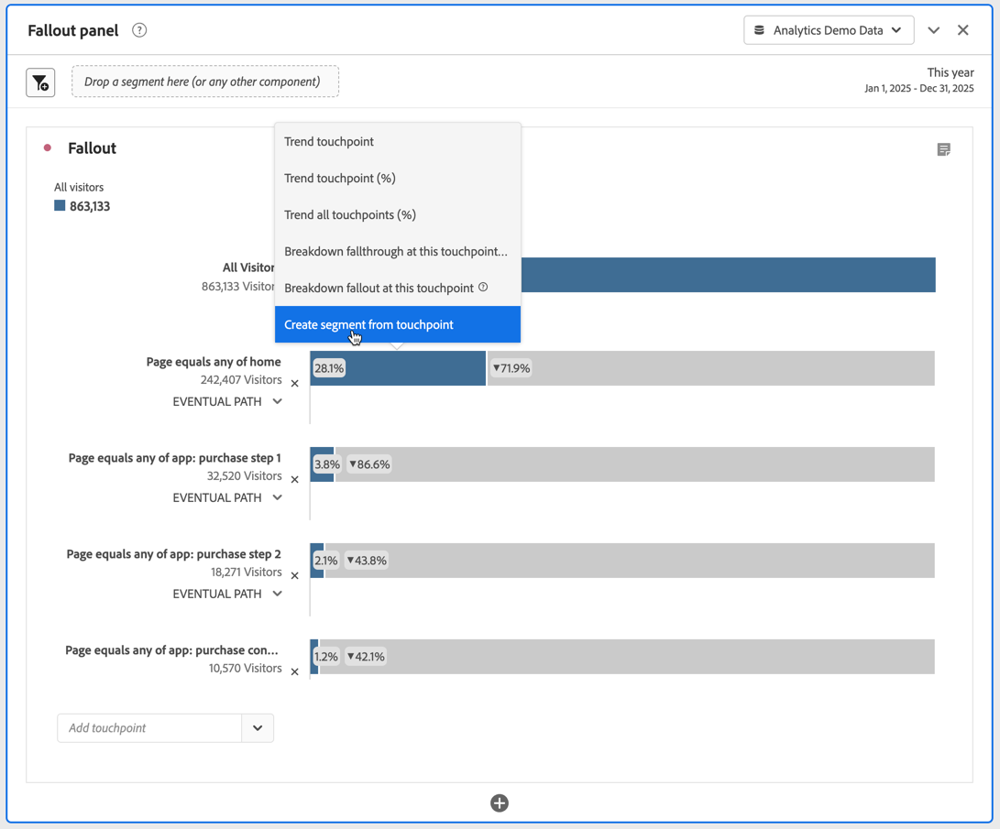

# Aplicar segmentos na análise de fallout

Você pode criar segmentos a partir de um ponto de contato, adicionar segmentos como ponto de contato e comparar fluxos de trabalho principais em vários segmentos no Analysis Workspace.

>[!IMPORTANT]
>
>Os segmentos usados como pontos de verificação no Fallout devem usar um contêiner que esteja em um nível inferior ao contexto geral da visualização do Fallout. Com um Fallout de contexto de visitante, os segmentos usados como pontos de verificação devem ser segmentos baseados em visita ou ocorrência. Com um Fallout de contexto de visita, os segmentos usados como ponto de verificação devem ser segmentos baseados em ocorrências. Se você usar uma combinação inválida, o fallout será de 100%. Você vê um aviso na visualização de Fallout ao adicionar um segmento incompatível como ponto de contato. Determinadas combinações inválidas de contêineres de segmento resultarão em diagramas de Fallout inválidos, por exemplo:
>
>* Usar um segmento com base em visitantes como um ponto de contato dentro de uma visualização de Fallout de contexto do visitante.
>* Usar um segmento com base em visitantes como um ponto de contato dentro de uma visualização de Fallout de contexto de visitas.
>* Usar um segmento com base em visitas como um ponto de contato dentro de uma visualização de Fallout de contexto de visitas.
>

## Criar um segmento a partir de um ponto de contato

1. Crie um segmento a partir de um ponto de contato específico no qual esteja interessado e que possa ser útil para aplicar a outros relatórios. Para fazê-lo, clique com o botão direito no ponto de contato e selecione **[!UICONTROL Criar segmentos a partir do ponto de contato]**.

   

   O Construtor de segmentos abre, pré-preenchido com o segmento sequencial pré-construído que corresponde ao ponto de contato selecionado:

   

1. Atribua um título e uma descrição ao segmento e salve-o.

   Agora é possível usar esse segmento em qualquer projeto.

## Adicionar um segmento como ponto de contato

Se quiser ver, por exemplo, como as ocorrências do aplicativo móvel tendem e afetam o fallout, basta arrastar o segmento de ocorrências do aplicativo móvel para o fallout:

Ou você pode criar um ponto de contato AND arrastando o segmento Ocorrências do aplicativo móvel para outro ponto de verificação.

## Comparar segmentos no fallout

É possível comparar um número ilimitado de segmentos na visualização de Fallout. (Observe que o vídeo abaixo declara que você pode comparar até 3 segmentos, o que está errado.)

>[!BEGINSHADEBOX]

Consulte  [Comparar segmentos em uma visualização de fallout](https://video.tv.adobe.com/v/24046?quality=12&learn=on){target="_blank"} para ver um vídeo de demonstração.

>[!ENDSHADEBOX]

1. Selecione os segmentos que você deseja comparar no painel [!UICONTROL Segmento] à esquerda. No exemplo No exemplo, dois segmentos são selecionados: **[!UICONTROL iOS]** e **[!UICONTROL Android]**.
1. Arraste os três segmentos até a área de soltar Segmentos na parte superior da visualização.

   

1. Opcional: Você pode manter *Todas as Pessoas* como o contêiner padrão ou excluir o contêiner.

1. Agora é possível comparar o fallout nos três segmentos, por exemplo, em que um segmento está com desempenho melhor que outro ou em outros insights.
