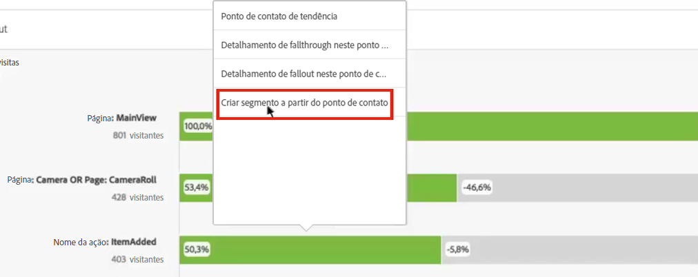
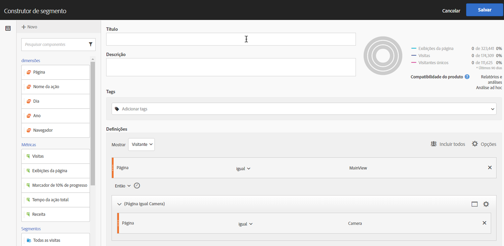
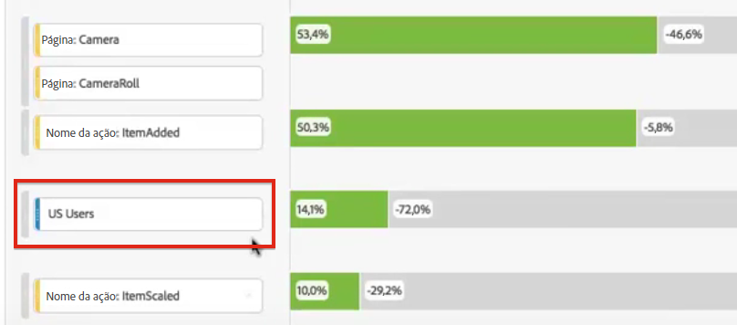
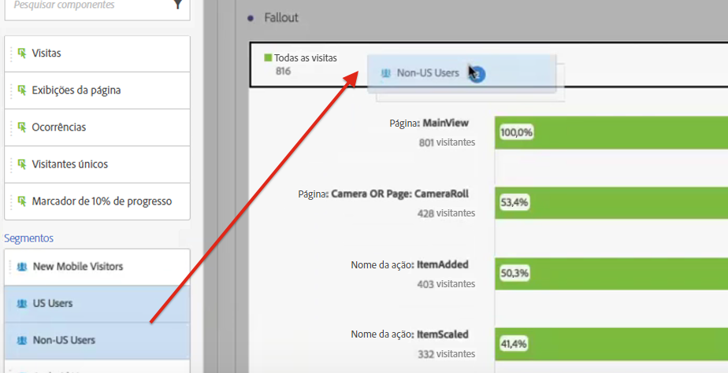
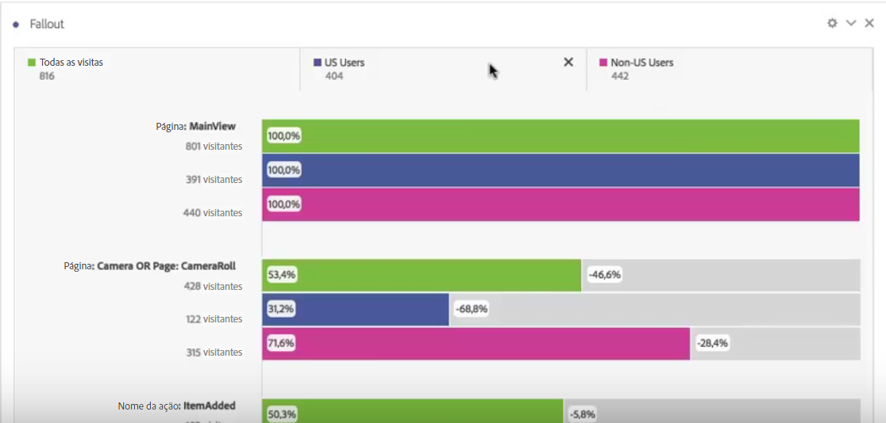

# Aplicar segmentos na análise de fallout

Você pode criar segmentos a partir de um ponto de contato, adicionar segmentos como ponto de contato e comparar fluxos de trabalho principais em vários segmentos no Analysis Workspace.

>[!IMPORTANT] Os segmentos usados como pontos de verificação no Fallout devem usar um contêiner que esteja em um nível inferior ao contexto geral da visualização do Fallout. Com um Fallout de contexto de visitante, os segmentos usados como pontos de verificação devem ser segmentos baseados em visita ou ocorrência. Com um Fallout de contexto de visita, os segmentos usados como ponto de verificação devem ser segmentos baseados em ocorrências. Se você usar uma combinação inválida, o fallout será de 100%. Adicionamos um aviso à visualização de Fallout que será exibida quando você adicionar um segmento incompatível como ponto de contato. Determinadas combinações inválidas de contêineres de segmento resultarão em diagramas de Fallout inválidos, por exemplo:

* Usar um segmento com base em visitantes como um ponto de contato dentro de uma visualização de Fallout de contexto do visitante
* Usar um segmento com base em visitantes como um ponto de contato dentro de uma visualização de Fallout de contexto de visitas
* Usar um segmento com base em visita como um ponto de contato dentro de uma visualização de Fallout de contexto de visitas

## Criar um segmento a partir de um ponto de contato {#section_915E8FBF35CD4F34828F860C1CCC2272}

1. Crie um segmento a partir de um ponto de contato específico no qual esteja interessado e que possa ser útil para aplicar a outros relatórios. Para fazer isso, clique com o botão direito do mouse no ponto de contato e selecione **[!UICONTROL Create segment from touchpoint]**.

   

   O Construtor de segmentos é aberto, pré-preenchido com o segmento sequencial pré-construído que corresponde ao ponto de contato selecionado:

   

1. Dê um título e uma descrição ao segmento e salve-o.

   Agora você pode usar esse segmento em qualquer relatório que desejar.

## Adicionar um segmento como ponto de contato {#section_17611C1A07444BE891DC21EE8FC03EFC}

Se você quiser ver, por exemplo, como seus usuários dos EUA tendem e afetam o fallout, basta arrastar o segmento de usuários dos EUA para o fallout:

Ou você pode criar um ponto de contato AND arrastando o segmento de usuários dos EUA para outro ponto de verificação.

## Comparar segmentos no fallout {#section_E0B761A69B1545908B52E05379277B56}

É possível comparar um número ilimitado de segmentos na visualização de Fallout.

1. Selecione os segmentos que deseja comparar no [!UICONTROL Segments] painel à esquerda. Em nosso exemplo, selecionamos 2 segmentos: Usuários dos EUA e usuários não pertencentes aos EUA.
1. Arraste-os para a área de Segmento na parte superior.

   

1. Opcional: Você pode manter &quot;Todas as visitas&quot; como o container padrão ou excluí-lo.

   

1. Agora você pode comparar o fallout entre os dois segmentos, como onde um segmento supera outro ou outros insights.
