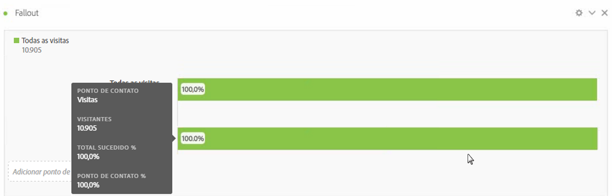
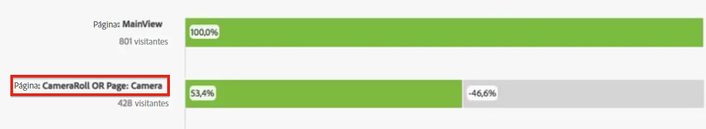
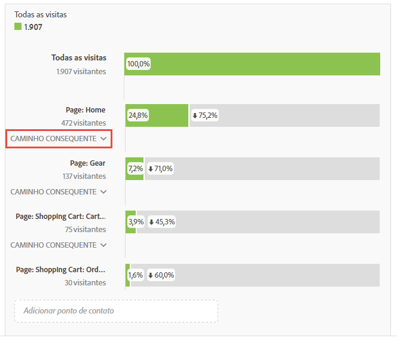

# Configurar uma visualização de fallout

Você pode especificar os pontos de contato para criar uma sequência de fallout multidimensional. Geralmente, um ponto de contato é uma página no seu site. Contudo, pontos de contato não estão limitados a páginas. Por exemplo, você pode adicionar eventos, como unidades, bem como visitantes exclusivos e visitantes que retornam. Você também pode adicionar dimensões, como uma categoria, tipo de navegador ou termo de pesquisa interno.

Você também pode adicionar segmentos em um ponto de contato. Por exemplo, você pode querer comparar segmentos, como usuários de iOS e Android. Arraste os segmentos desejados para o topo do fallout e as informações sobre os segmentos são adicionadas ao relatório de fallout. Se quiser exibir somente esses segmentos, você pode remover a linha de base de Todas as visitas.

Não há limite de número de etapas que você pode adicionar ou do número de dimensões usadas.

Você pode definir o caminho das eVars, incluindo eVars de comercialização e [listVars](https://marketing.adobe.com/resources/help/en_US/sc/implement/listN.html) (variáveis que podem ter vários valores por clique, como produtos, listVars, eVars de comercialização e apoios de listas). Por exemplo, suponha que alguém esteja olhando os sapatos,camisetas em uma página e camisetas,meias em outra. O próximo relatório de fluxo do produto dos sapatos será camisetas e meias, e NÃO camisetas.

1. Arraste uma visualização de [!UICONTROL Fallout] do menu suspenso Visualizações em uma [!UICONTROL Tabela de forma livre].

1. Arraste a dimensão de Página à Tabela de forma livre e arraste uma página de lá (neste caso, Início - JJEsquire) para o campo **[!UICONTROL Adicionar ponto de contato]como o primeiro ponto de contato.**

   

   Passe o mouse sobre um ponto de contato para ver o fallout e outras informações sobre o nível, como o nome do ponto de contato e o número de visitantes no ponto, e ver a taxa de sucesso do ponto de contato (bem como, comparar a taxa de sucesso a outros pontos de contato).

   Os números circulados, na área em cinza da barra, apresentam o fallout entre os pontos de contato (e não o fallout geral daquele ponto). A % de pontos de contato apresenta o fallthrough bem-sucedido da etapa anterior na etapa atual do relatório de fallout.

   É possível adicionar uma única página ao relatório de fallout, ao invés de uma dimensão inteira. Clique a seta da direita "&gt;" na dimensão da página para selecionar a página específica a ser adicionada no relatório de fallout.

1. Continue a adicionar pontos de contato até concluir a sequência.

   Você pode **combinar vários pontos de contato**, arrastando um ou mais pontos em um ponto de contato.

   >[!NOTE]
   >
   >Vários segmentos são unidos com E, mas vários itens como itens de dimensão e métricas são unidos com OR.

   

1. Também é possível **restringir pontos de contato individuais à próxima ocorrência** (em vez de eventualmente) dentro do caminho. Embaixo de cada ponto de contato, há um seletor com as opções “Caminho eventual” e “Próxima ocorrência”, da seguinte forma:

   

<table id="table_A91D99D9364B41929CC5A5BC907E8985"> 
 <tbody> 
  <tr> 
   <td colname="col1"> 
Caminho eventual 
 
(Padrão) 
 </td> 
   <td colname="col2"> 
Visitantes contados que “eventualmente” serão direcionados para a próxima página no caminho, mas não necessariamente na próxima ocorrência. 
 </td> 
  </tr> 
  <tr> 
   <td colname="col1"> 
Próxima ocorrência 
 </td> 
   <td colname="col2"> 
Visitantes contados que serão direcionados para a próxima página no caminho na próxima ocorrência. 
 </td> 
  </tr> 
 </tbody> 
</table>

## Fallout settings {#section_0C7C89D72F0B4D6EB467F278AC979093}

| Configuração | Descrição |
|--- |--- |
| Contêiner de fallout <ul><li>Visita</li><li>Visitante</li></ul> | Permite alternar entre Visita e Visitante para analisar a definição do caminho do visitante. O padrão é Visitante.  Essas configurações ajudam você a entender o envolvimento a nível de visitantes (ao longo das visitas) ou restringir a análise a uma única visita. |
| Mostrar “Todos os visitantes” como o primeiro ponto de contato | Você pode desmarcar isso se não quiser ter “Todos os visitantes” como primeiro ponto de contato. |

When you **right-click a touchpoint**, the following options appear:

| Opção | Descrição |
|--- |--- |
| Executar tendência do ponto de contato | Veja os dados de tendência para um ponto de contato em um gráfico de linha, com alguns dados de detecção de anomalias pré-construídos. |
| Executar tendência do ponto de contato (%) | Executa a tendência da porcentagem total de fallout. |
| Executar tendência de todos os pontos de contato (%) | Executa a tendência de todas as porcentagens de pontos de contato no fallout (exceto “Todas as visitas”, se incluso), no mesmo gráfico. |
| Detalhar o fallthrough neste ponto de contato | Veja o que os visitantes fizeram entre dois pontos de contato e se continuaram para o ponto de contato seguinte. Isso cria uma tabela de forma livre, mostrando suas dimensões. Você pode substituir dimensões e outros elementos da tabela. |
| Detalhar o fallout neste ponto de contato | Veja o que as pessoas que não entraram no funil fizeram imediatamente depois da etapa selecionada. |
| Criar segmentos a partir do ponto de contato | Crie um novo segmento a partir do ponto de contato selecionado. |