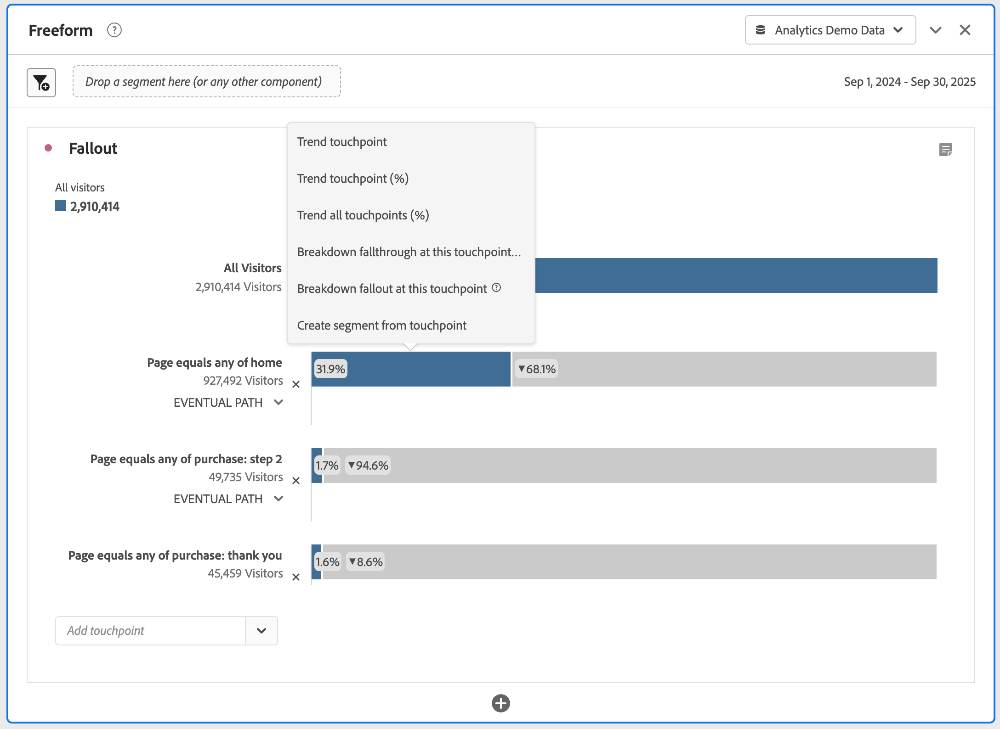

# Configurar uma visualização de fallout

Você pode especificar os pontos de contato para criar uma sequência de fallout multidimensional. Geralmente, um ponto de contato é uma página no seu site. Contudo, pontos de contato não estão limitados a páginas. Por exemplo, é possível adicionar eventos, como unidades, bem como usuários únicos e visitas de retorno. Você também pode adicionar dimensões, como uma categoria, tipo de navegador ou termo de pesquisa interno.

Você também pode adicionar segmentos em um ponto de contato. Por exemplo, você pode querer comparar segmentos, como usuários de iOS e Android™. Arraste os segmentos desejados para o topo do fallout e as informações sobre os segmentos serão adicionadas ao relatório de fallout. Se quiser exibir somente esses segmentos, é possível remover a linha de base Todas as visitas.

Não há limite para o número de etapas que é possível adicionar ou o número de dimensões usadas.

É possível definir o caminho em dimensões, métricas e segmentos. Por exemplo, suponha que alguém esteja pesquisando sapatos e camisetas em uma página e camisetas e meias na página seguinte. O próximo relatório de fluxo do produto para sapatos será camisetas e meias, e NÃO camisetas.

## Usar

1. Adicione uma visualização de  **[!UICONTROL fallout]**. Consulte [Adicionar uma visualização a um painel](../freeform-analysis-visualizations.md#add-visualizations-to-a-panel).
1. Arraste uma página, por exemplo, página inicial, da dimensão Página para o menu suspenso *Adicionar ponto de contato*.

   

   Passe o mouse sobre um ponto de contato para ver o fallout e outras informações sobre o nível, como o nome do ponto de contato e a contagem de pessoas nesse ponto. Veja também a taxa de sucesso desse ponto de contato (ou compare a taxa de sucesso com outros pontos de contato).

   Os números circulados, na área em cinza da barra, apresentam o fallout entre os pontos de contato (e não o fallout geral daquele ponto). A **[!UICONTROL % do ponto de contato]** apresenta o nível de sucesso ao passar da etapa anterior para a etapa atual no relatório de fallout.

   É possível adicionar uma única página ao relatório de fallout, ao invés de uma dimensão inteira. Clique na seta para a direita  na dimensão da página para selecionar uma página específica para adicionar ao relatório de fallout.

1. Continue a adicionar pontos de contato até concluir a sequência.

   É possível **combinar vários pontos de contato** arrastando um ou mais componentes adicionais para um ponto de contato.

   >[!NOTE]
   >
   >Para unir vários segmentos, utilize o operador AND, mas para unir vários itens, como itens de dimensão e métricas, utilize OR.

   

1. Também é possível **restringir pontos de contato individuais ao próximo evento** (em vez de *eventualmente*) no caminho. Embaixo de cada ponto de contato há um seletor com as opções **[!UICONTROL Caminho eventual]** e **[!UICONTROL Próximo evento]**, conforme mostrado aqui:

   

   | Opção | Descrição |
   |---|---|
   | **[!UICONTROL Caminho eventual]** (padrão) | Contagem de pessoas que *eventualmente* chegarão na próxima página do caminho, mas não necessariamente no próximo evento. |
   | **[!UICONTROL Próximo evento]** | Contagem de pessoas que chegarão na próxima página do caminho no próximo evento. |

## Configurações 

Como parte da visualização, há configurações específicas disponíveis.

| Container de fallout | Descrição |
|--- |--- |
| **[!UICONTROL Sessão]** ou **[!UICONTROL Pessoa]** | Alterne entre [!UICONTROL Sessão] e [!UICONTROL Pessoa] para analisar a definição de caminho da pessoa. O padrão é [!UICONTROL Pessoa]. Essas configurações ajudam você a entender o engajamento de pessoas (em sessões) ou restringir a análise a uma única sessão. |

## Menu de contexto

Como parte da visualização, há opções específicas do menu de contexto disponíveis.

| Opção | Descrição |
|--- |--- |
| **[!UICONTROL Tendência de ponto de contato]** | Veja os dados de tendência de um ponto de contato em um gráfico de linha, com alguns dados de detecção de anomalias pré-construídos. |
| **[!UICONTROL Tendência de ponto de contato (%)]** | Calcula a tendência da porcentagem total de fallout. |
| **[!UICONTROL Tendência de todos os pontos de contato (%)]** | Exibe a tendência de todas as porcentagens de pontos de contato do fallout (exceto **[!UICONTROL Todas as pessoas]**, se incluso) no mesmo gráfico. |
| **[!UICONTROL Detalhar o fallthrough neste ponto de contato]** | Visualize o que as pessoas fizeram entre dois pontos de contato (este e o próximo) se continuaram até o próximo ponto de contato. Isso cria uma tabela de forma livre, mostrando suas dimensões. Você pode substituir dimensões e outros elementos da tabela. |
| **[!UICONTROL Detalhar fallout neste ponto de contato]** | Veja o que as pessoas que não entraram no funil fizeram imediatamente depois da etapa selecionada. |
| **[!UICONTROL Criar segmentos a partir do ponto de contato]** | Crie um novo segmento a partir do ponto de contato selecionado. |

>[!MORELIKETHIS]
>
>[Adicionar uma visualização a um painel](/help/analyze/analysis-workspace/visualizations/freeform-analysis-visualizations.md#add-visualizations-to-a-panel)
>[Configurações de visualização](/help/analyze/analysis-workspace/visualizations/freeform-analysis-visualizations.md#settings)
>[Menu de contexto da visualização](/help/analyze/analysis-workspace/visualizations/freeform-analysis-visualizations.md#context-menu)
>

