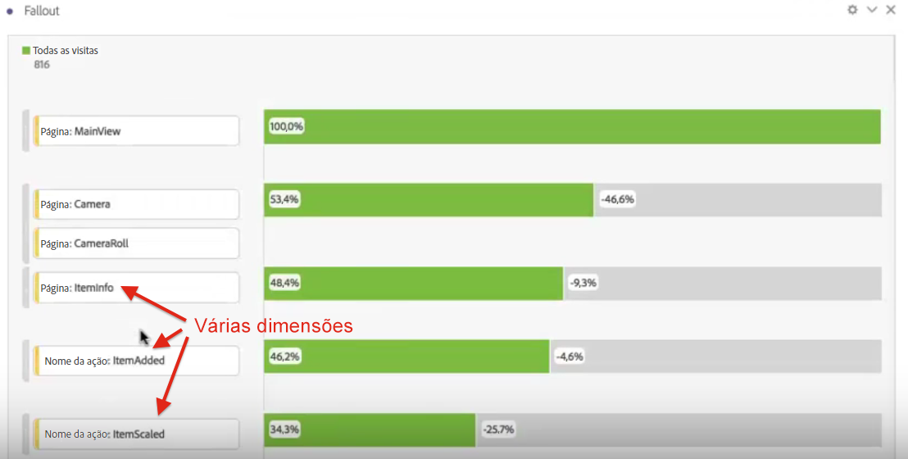
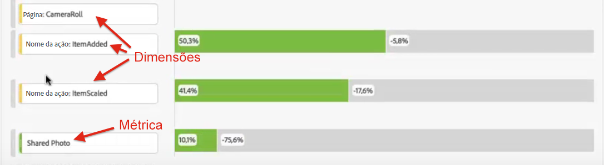
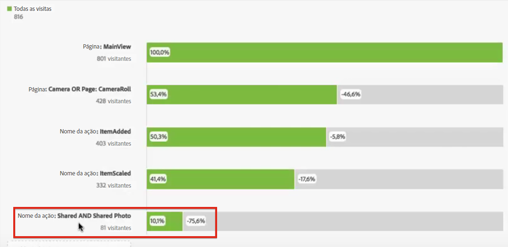

# Fallout interdimensional

O recurso de Fallout na Analysis Workspace permite combinar dimensões e métricas como pontos de contato em funis e fluxos de trabalho. Isso fornece maior flexibilidade ao definir as etapas de usuário que deseja investigar.

**Exemplo**: além de, por exemplo, uma dimensão de página, você pode adicionar itens de dimensão baseados em ação a uma visualização de fallout. Isso permite visualizar como as páginas e determinadas ações interagem nos caminhos dos clientes.

O fallout é atualizado de forma dinâmica e permite ver os fallouts em várias dimensões.

Você também pode adicionar métricas a esta combinação. Neste exemplo, adicionamos a métrica “Foto compartilhada” para desenvolver o caminho tomado pelos clientes:

Além disso, você pode combinar diferentes dimensões e métricas em pontos de verificação AND. Basta arrastar outra dimensão ou métrica sobre uma existente:

