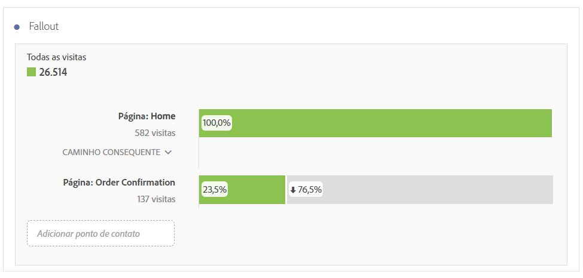
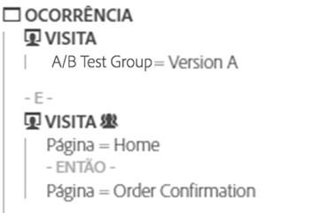
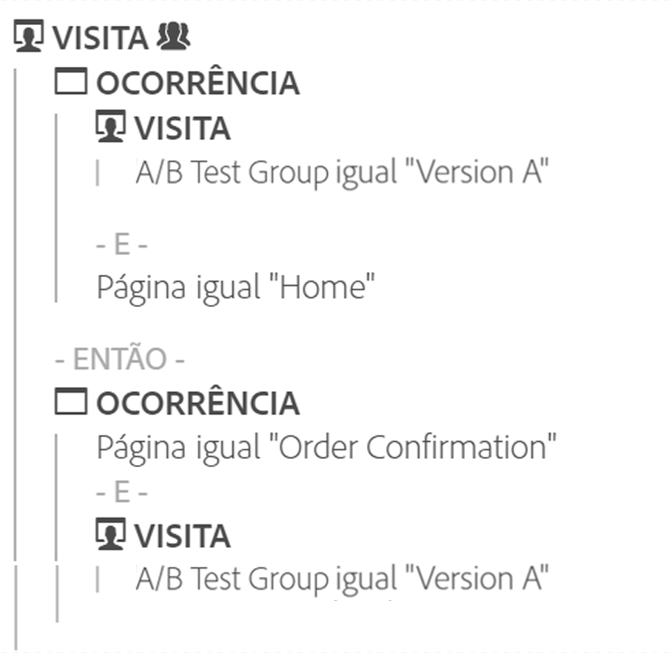

# Visão geral de fallout

As visualizações de Fallout oferecem mais opções para criar relatórios de fallout. Os relatórios de fallout mostram onde os visitantes saíram e continuaram em uma sequência predefinida de páginas.

As visualizações de fallout permitem

* Fazer comparações lado a lado de dois segmentos diferentes no mesmo relatório
* Arrastar, soltar e reorganizar as etapas do funil (pontos de contato).
* Combinar valores de diferentes dimensões e métricas
* Criar um relatório de fallout multidimensional
* Identificar o que os clientes acessam imediatamente depois de sair

O Fallout exibe as taxas de conversão e de fallout entre cada etapa ou ponto de contato em uma sequência.

Por exemplo, você pode acompanhar os pontos de saída de um visitante durante um processo de compra. Selecione um ponto de contato inicial e um ponto de contato final e adicione pontos de contato intermediários para criar um caminho de navegação no site. Mas você também pode executar fallouts multidimensionais.

Uma visualização de fallout é útil para analisar:

* Taxas de conversão por meio de processos específicos no site (como um processo de compra ou registro).
* Fluxos gerais de escopo mais amplo: das pessoas que visualizaram a página inicial, esse fluxo mostra quantas fizeram uma pesquisa e quantas delas eventualmente acessaram um item específico.
* Correlações entre eventos no site. As correlações mostram a porcentagem de pessoas que acessaram sua política de privacidade e que fizeram uma compra.

[Tutorial em vídeo de Visualização de fallout](https://docs.adobe.com/content/help/pt-BR/analytics-learn/tutorials/analysis-workspace/analyzing-customer-journeys/fallout-visualization.html) (4:15)

## Segmentação como base para fluxo e fallout {#section_654F37A398C24DDDB1552A543EE29AA9}

Os segmentos aplicados a painéis do Workspace funcionam de uma forma um pouco diferente que os segmentos aplicados a relatórios de fallout e de fluxo no Reports &amp; Analytics. Na maior parte do tempo, eles fornecem os mesmos resultados. A principal diferença é que o Reports &amp; Analytics aplica o segmento em cada etapa da sequência. Isso pode ter resultados um pouco diferentes.

Veja um exemplo de fallout de duas etapas:

Se você aplicar um segmento no nível do painel do Workspace, o segmento é combinado ao fallout da seguinte forma:

Por outro lado, quando o Reports &amp; Analytics calcula o segmento, ele é combinado da seguinte maneira:

O Reports &amp; Analytics combina o segmento a cada etapa. Quando os contêineres estão no mesmo nível que o fallout (nível de visita ou de visitante, por exemplo), isso resultará na correspondência do nome de visitas ou de visitantes.

Contudo, se o segmento aplicado ao painel for menor que o nível do fallout (nível de ocorrência, por exemplo), o segmento mostrará resultados diferentes devido a como ele é combinado pelo relatório. Para reiterar, na maioria das circunstâncias os números no Analysis Workspace correspondem àqueles no Reports &amp; Analytics. Eles **não** corresponderão somente se todos os casos abaixo forem verdadeiros:

* O segmento não está no mesmo nível do fallout.
* O segmento possui uma variável na qual o visitante/visita pode ter vários valores durante uma visita/visitante.

No raro caso de precisar ter correspondência entre o Analysis Workspace e o Reports &amp; Analytics em relação à forma de aplicar segmentos para fallout/fluxo, basta colocar o segmento em cada etapa do fallout no Workspace e isso resultará nos mesmos números.
