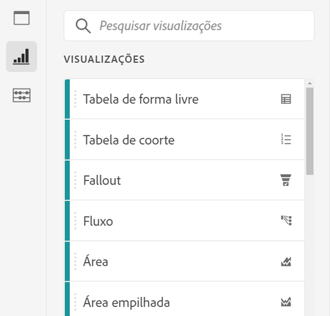
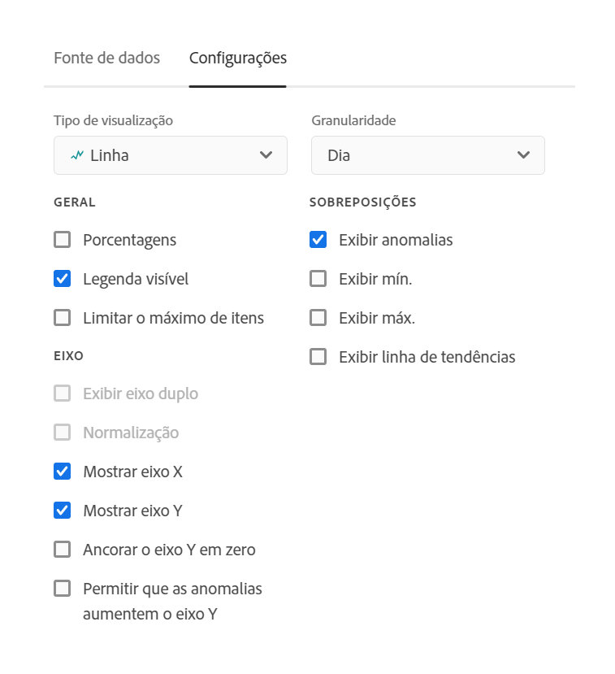
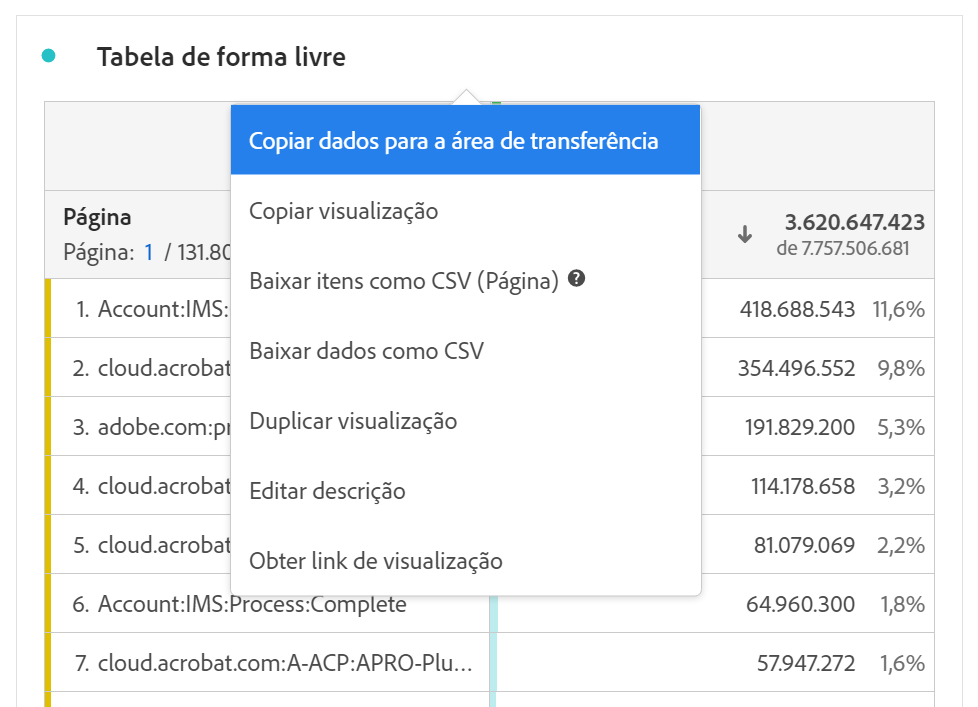

# Visão geral das visualizações

O Workspace oferece várias visualizações que permitem gerar representações visuais de seus dados, como gráficos de barras, gráficos de rosca, histogramas, gráficos de linhas, mapas, gráficos de dispersão e outros. A maioria dos tipos de visualização será familiar se você usar o Adobe Analytics. Contudo, o Analysis Workspace fornece configurações de visualização e muitos tipos de visualizações exclusivos ou novos com recursos interativos.

Você pode acessar as visualizações no ícone superior esquerdo do Workspace, em um [painel em branco](https://experienceleague.adobe.com/docs/analytics/analyze/analysis-workspace/panels/blank-panel.html?lang=pt-BR) ou pelo menu exibido ao clicar com o botão direito em seu fluxo de trabalho.

Os seguintes tipos de visualização estão disponíveis no Analysis Workspace:

| Nome da visualização | Descrição |
| --- | --- |
| [Área](/help/analyze/analysis-workspace/visualizations/area.md) | Semelhante a um gráfico de linhas, mas apresenta uma área colorida abaixo da linha. Use um gráfico de área quando você tiver diversas métricas e desejar visualizar a área expressa pela interseção de duas ou mais métricas. |
| [Barra](/help/analyze/analysis-workspace/visualizations/bar.md) | Mostra barras verticais que representam vários valores de uma ou mais métricas. |
| [Gráfico em marcadores](/help/analyze/analysis-workspace/visualizations/bullet-graph.md) | Mostra a comparação ou a medição de um valor em relação a outros intervalos de desempenho (metas). |
| [Tabela de coorte](/help/analyze/analysis-workspace/visualizations/cohort-table/cohort-analysis.md) | A *`cohort`* é um grupo de pessoas com características comuns em um período específico. A Análise de coorte é útil para análise de retenção, churn ou latência. |
| [Rosca](/help/analyze/analysis-workspace/visualizations/donut.md) | Semelhante ao gráfico de pizza, essa visualização mostra os dados como partes ou segmentos de um todo. |
| [Fallout](/help/analyze/analysis-workspace/visualizations/fallout/fallout-flow.md) | Os relatórios de fallout mostram onde os visitantes saíram e continuaram em uma sequência predefinida de páginas. Pode ser definido como sequências eventuais ou exatas |
| [Fluxo](/help/analyze/analysis-workspace/visualizations/c-flow/flow.md) | Mostra os percursos exatos do cliente pelos sites e aplicativos. |
| [Tabela de forma livre](/help/analyze/analysis-workspace/visualizations/freeform-table/freeform-table.md) | Uma tabela de forma livre não é apenas uma tabela de dados, mas também uma visualização interativa. É a base para a análise de dados no Workspace. |
| [Histograma](/help/analyze/analysis-workspace/visualizations/histogram.md) | Um histograma agrupa visitantes, visitas ou ocorrências em compartimentos com base em um volume de métrica. |
| [Barra horizontal](/help/analyze/analysis-workspace/visualizations/horizontal-bar.md) | Mostra barras horizontais que representam vários valores de uma ou mais métricas. |
| [Linha](/help/analyze/analysis-workspace/visualizations/line.md) | Representa as métricas que usam uma linha para mostrar como os valores são alterados durante um período. Um gráfico de linhas usa o tempo no eixo x. |
| [Mapa](/help/analyze/analysis-workspace/visualizations/map-visualization.md) | Permite criar um mapa visual de qualquer métrica (incluindo métricas calculadas). |
| [Gráfico de dispersão](/help/analyze/analysis-workspace/visualizations/scatterplot.md) | Mostra a relação entre itens de dimensão e até três métricas. |
| [Número do resumo](/help/analyze/analysis-workspace/visualizations/summary-number-change.md) | Mostra a célula selecionada como um número grande. |
| [Alteração de resumo](/help/analyze/analysis-workspace/visualizations/summary-number-change.md) | Mostra a alteração entre as células selecionadas como um número grande/porcentagem. |
| [Texto](/help/analyze/analysis-workspace/visualizations/text.md) | Permite adicionar texto definido pelo usuário à Workspace. Útil para adicionar contexto à análise e aos insights, além de aproveitar as descrições do painel/da visualização |
| [Mapas de árvore](/help/analyze/analysis-workspace/visualizations/treemap.md) | Exibe dados hierárquicos (estruturados em formato de árvore) como um conjunto de retângulos aninhados. |
| [Venn](/help/analyze/analysis-workspace/visualizations/venn.md) | Usa círculos para descrever a sobreposição de métrica de até três segmentos. |

## Configurações {#settings}

Cada visualização tem suas próprias configurações que podem ser gerenciadas. Para acessar [!UICONTROL Configurações de visualização], clique no ícone de engrenagem [!UICONTROL Configurações de visualização].

| Configuração | Descrição |
| --- | --- |
| Tipo de visualização | Altere o tipo de visual usado para descrever os dados. |
| Granularidade | Para visualizações de tendências, você pode alterar a granularidade de tempo (dia, semana, mês etc.) nesta lista suspensa. Essa alteração também se aplica à tabela de fonte de dados. |
| Porcentagens | Exibe os valores em porcentagens. |
| 100% empilhada | Essa configuração de visualizações de área empilhada, barra empilhada ou barra horizontal empilhada transforma o gráfico em uma visualização “100% empilhada”. Exemplo:  |
| Legenda visível | Permite ocultar o texto detalhado da legenda para a visualização Número de resumo/Alteração de resumo. |
| Limite máximo de itens | Permite limitar o número de itens exibidos em uma visualização. |
| Ancorar eixo Y no zero | Se todos os valores exibidos no gráfico forem consideravelmente superiores a zero, o padrão do gráfico tornará a parte inferior do eixo y DIFERENTE DE ZERO. Se marcar esta caixa, o eixo y será forçado a zero (e o gráfico será redesenhado). |
| Normalização | Força as métricas para proporções iguais. Isso é útil quando métricas projetadas têm magnitudes muito diferentes. |
| Exibir eixo duplo | Somente se aplica se você tiver duas métricas. Você pode ter um eixo Y à esquerda (para uma métrica) e outro à direta (para a outra métrica). Isso é útil quando métricas projetadas têm magnitudes muito diferentes. |
| Mostrar anomalias | Melhora os gráficos de linha e tabelas de forma livre exibindo a detecção de anomalias. A detecção de anomalias em visualizações de linha inclui um valor esperado (linha tracejada) e um intervalo esperado (faixa sombreada). |

## Legenda {#legend}

Uma legenda de visualização ajuda a relacionar a data em uma tabela de origem com a série plotada na visualização. A legenda é interativa: você pode clicar em um item de legenda para mostrar/ocultar uma série na visualização. Isso é útil se você quer simplificar os dados que estão sendo visualizados.

Além disso, é possível renomear rótulos de legenda para ajudá-lo a tornar as exibições mais atraentes. Observação: a edição de legendas **não** se aplica a: Treemap, Marcador, Alteração ou Número do resumo, Texto, Forma livre, Histograma, Coorte ou Visualizações de fluxo.

Para editar um rótulo de legenda:

1. Clique com o botão direito do mouse em uma das etiquetas de legenda.
1. Clique em **[!UICONTROL Editar rótulo]**.

   

1. Digite o texto do novo rótulo.
1. Pressione **[!UICONTROL Enter]** para salvar.

Temos um [vídeo](https://docs.adobe.com/content/help/pt-BR/analytics-learn/tutorials/analysis-workspace/visualizations/series-label-editing.html) sobre esse tópico.

## Clique com o botão direito do mouse no menu {#right-click}

A funcionalidade adicional para uma visualização está disponível clicando com o botão direito do mouse no cabeçalho da visualização. As configurações variam de acordo com a visualização. Algumas das configurações disponíveis são:

| Configuração | Descrição |
| --- | --- |
| Inserir visualização/painel copiado | Permite colar (“inserir”) um painel ou visualização copiada em outro lugar no projeto ou em outro projeto completamente diferente. |
| Copiar visualização | Permite clicar com o botão direito do mouse e copiar uma visualização para que você possa inseri-la em outro lugar no projeto ou em um projeto completamente diferente. |
| [Baixar itens como CSV](https://experienceleague.adobe.com/docs/analytics/analyze/analysis-workspace/curate-share/download-send.html?lang=pt-BR#download-data) | Baixe até 50.000 itens de dimensão para a dimensão selecionada como um CSV. |
| [Baixar dados como CSV](https://experienceleague.adobe.com/docs/analytics/analyze/analysis-workspace/curate-share/download-send.html?lang=pt-BR#download-data) | Baixe a fonte de dados da visualização como CSV. |
| Duplicar visualização | Faz uma réplica exata da visualização atual, que você pode modificar. |
| Editar descrição | Adicione (ou edite) uma descrição de texto para a visualização. |
| Obter link da visualização | Permite direcionar alguém a uma visualização específica em um projeto. Quando o link for clicado, o recipient deverá fazer logon antes de ser direcionado para a visualização exata que está vinculada. |
| Recomeçar | (Funciona para Fluxo, Venn, Histograma) Exclui a configuração da visualização atual para que você possa reconfigurá-la do zero. |

## Ícone “Criar visual” {#quick-viz}

Se não tiver certeza sobre qual visualização selecionar, clique no ícone **[!UICONTROL Criar visual]** em qualquer linha da tabela (disponível ao passar o mouse). Essa é a maneira mais rápida de adicionar uma visualização. Ao clicar no ícone, o Analysis Workspace é exibido e recomenda uma visualização que se adequaria ao seus dados. Por exemplo, se você tiver uma linha selecionada, ela criará um gráfico de linhas de tendência. Se você tiver três linhas de segmento selecionadas, ele criará um diagrama Venn.

