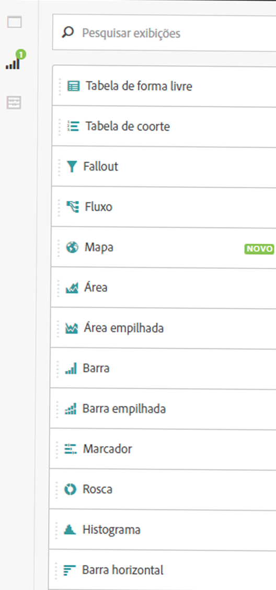
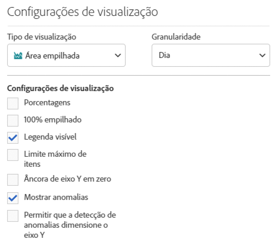
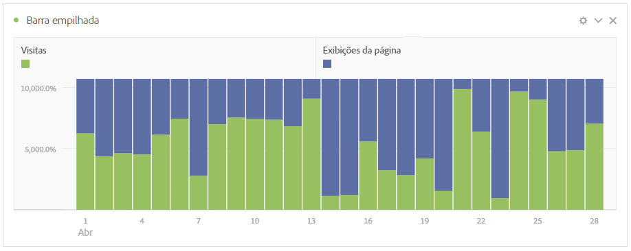
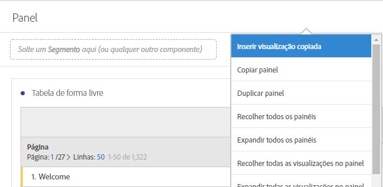
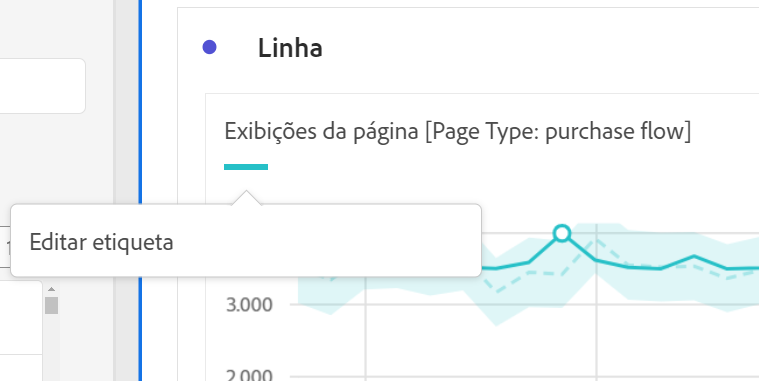

# Visão geral das visualizações

Saiba mais sobre visualizações e configurações de exibição na Analysis Workspace.

[Tipos de visualização na Analysis Workspace no YouTube](https://www.youtube.com/watch?v=b1zLEywRa6w&index=39&list=PL2tCx83mn7GuNnQdYGOtlyCu0V5mEZ8sS) (2:57)

## Visualizations panel {#section_DC07F032FBEF4046A40F7B95C28DA018}

Para exibir o painel Visualizações, clique em **[!UICONTROL Visualizações]no painel lateral.**

A maioria dos tipos de visualização (como gráficos de área, em barras, de rosca e em linha) será familiar se você já conhece o Adobe Analytics. Contudo, a Analysis Workspace fornece configurações de visualização e muitos tipos de visualizações exclusivos ou novos com recursos interativos.

## Visualization settings {#section_D3BB5042A92245D8BF6BCF072C66624B}

Para acessar as [!UICONTROL Configurações de visualização], arraste uma visualização ao [!UICONTROL Painel de forma livre] e clique no ícone de engrenagem das [!UICONTROL Configurações de visualização].

>[!IMPORTANT]
>
>As configurações de visualização que estão visíveis dependem da visualização. Nem todas as configurações se aplicam a todas as visualizações. Além disso, algumas configurações avançadas aparecem **apenas** para visualizações específicas, como as [Configurações de histograma](../../../analyze/analysis-workspace/visualizations/histogram.md#section_09D774C584864D4CA6B5672DC2927477).

<table id="table_E0695243886046979EE609FAE5D6EA00"> 
 <thead> 
  <tr> 
   <th colname="col1" class="entry"> Configuração </th> 
   <th colname="col2" class="entry"> Descrição </th> 
  </tr> 
 </thead>
 <tbody> 
  <tr> 
   <td colname="col1"> 
Porcentagens 
 </td> 
   <td colname="col2"> 
Exibe os valores em porcentagens. 
 </td> 
  </tr> 
  <tr> 
   <td colname="col1"> 
100% empilhada 
 </td> 
   <td colname="col2"> 
Essa configuração de visualizações de área empilhada ou barra empilhada ou barra horizontal empilhada transformam o gráfico em uma visualização “100% empilhada”. Exemplo: 
 
 
 </td> 
  </tr> 
  <tr> 
   <td colname="col1"> 
Legenda visível 
 </td> 
   <td colname="col2"> 
Permite ocultar o texto de detalhes do filtro para a visualização Número de resumo/Alteração de resumo. 
 </td> 
  </tr> 
  <tr> 
   <td colname="col1"> 
Limite máximo de itens 
 </td> 
   <td colname="col2"> 
Permite limitar o número de itens exibidos em uma visualização. 
 </td> 
  </tr> 
  <tr> 
   <td colname="col1"> 
Âncora de eixo Y em zero 
 </td> 
   <td colname="col2"> 
 Se todos os valores exibidos no gráfico forem consideravelmente superiores a zero, o padrão do gráfico tornará a parte inferior do eixo y DIFERENTE DE ZERO. Se marcar esta caixa, o eixo y será forçado a zero (e o gráfico será redesenhado). 
 </td> 
  </tr> 
  <tr> 
   <td colname="col1"> 
Normalização 
 </td> 
   <td colname="col2"> 
Força as métricas para proporções iguais. Consulte <a href="https://marketing.adobe.com/resources/help/en_US/reference/normalization.html" format="https" scope="external"> Normalização</a>. 
 </td> 
  </tr> 
  <tr> 
   <td colname="col1"> 
Exibir eixo duplo 
 </td> 
   <td colname="col2"> 
Only applies if you have two metrics - you can have a y-axis on the left (for one metric) and on the right (for the other metric). 
 </td> 
  </tr> 
  <tr> 
   <td colname="col1"> 
Mostrar anomalias 
 </td> 
   <td colname="col2"> 
Melhora os gráficos de linha e tabelas de forma livre para exibir anomalias de dados. 
 </td> 
  </tr> 
 </tbody> 
</table>

## Create Visual icon {#section_9C11D9DEDC42413AA53E69A71A509DFC}

Se não tiver certeza sobre qual visualização selecionar, clique no ícone **[!UICONTROL Criar visual]em qualquer linha da tabela.** Este ícone será exibido quando você passar o mouse sobre a linha do gráfico. Ao clicar no ícone, a Analysis Workspace é exibida e recomenda uma visualização que se adequaria ao seus dados. Por exemplo, se você tem até três segmentos selecionados, criará um diagrama Venn. Para mais de três segmentos, criará um gráfico de barras. Para outros tipos de dados, ele pode criar um gráfico de linhas, etc.

## Right-click visualization/panel menu {#section_05B7914D4C9E443F97E2BFFDEC70240C}

Configurações contextuais a um gráfico podem ser acessadas ao clicar com o botão direito próximo ao cabeçalho de uma visualização ou painel. Algumas ou todas as seguintes configurações estarão disponíveis:

| Configuração | Descrição |
|--- |--- |
| Inserir cópia de uma visualização/painel | Permite colar (“inserir”) o elemento copiado em outro lugar no projeto, ou em outro projeto. |
| Copiar visualização/painel | Permite clicar com o botão direito do mouse e copiar uma visualização ou painel. |
| Duplicar visualização/painel | Faz uma réplica exata da visualização atual, que você pode modificar. |
| Recolher todos os painéis | Recolhe todos os painéis do projeto. |
| Recolher todas as visualizações no Painel | Recolhe todas as visualizações nesse painel do projeto. |
| Expandir todos os painéis | Expande todos os painéis do projeto. |
| Expandir todas as visualizações no Painel | Expande todas as visualizações nesse painel do projeto. |
| Editar descrição | Adicione (ou edite) uma descrição de texto para a visualização/painel. Esta descrição é exibida em Projeto &gt; Informações e configurações do projeto . |
| Obter link do painel | Permite direcionar alguém a um painel específico em um projeto. |
| Obter link da visualização | Permite copiar e compartilhar este link para direcionar outros usuários para esta visualização. Os usuários serão solicitados a fazer logon. |
| Recomeçar | (Funciona para Fluxo, Venn, Histograma) Exclui a configuração para a visualização atual e abre um novo painel, no qual você pode reconfigurá-la. |

## Edit legend labels {#section_94F1988CB4B9434BA1D9C6034062C3DE}

É possível renomear os nomes de séries nas legendas de visualização (Fallout, Área, Área empilhada, Barra, Barra empilhada, Rosca, Histograma, Barra horizontal, Barra horizontal empilhada, Linha, Dispersão e Venn) para ajudá-lo a tornar as exibições mais consumíveis.

A edição de legenda **não** se aplica a: Treemap, Marcador, Alteração ou Número do resumo, Texto, Forma livre, Histograma, Coorte ou visualizações de Fluxo.

Para editar uma etiqueta de legenda em um gráfico de Linha, por exemplo,

1. Clique com o botão direito do mouse em uma das etiquetas de legenda.
1. Clique em **[!UICONTROL Editar etiqueta]**.

   

1. Digite o texto da nova etiqueta.
1. Pressione **[!UICONTROL Enter]para salvar.**

Disponibilizamos também um [vídeo](https://www.youtube.com/watch?v=mry3vDrTml0&index=61&list=PL2tCx83mn7GuNnQdYGOtlyCu0V5mEZ8sS) sobre este tópico.
