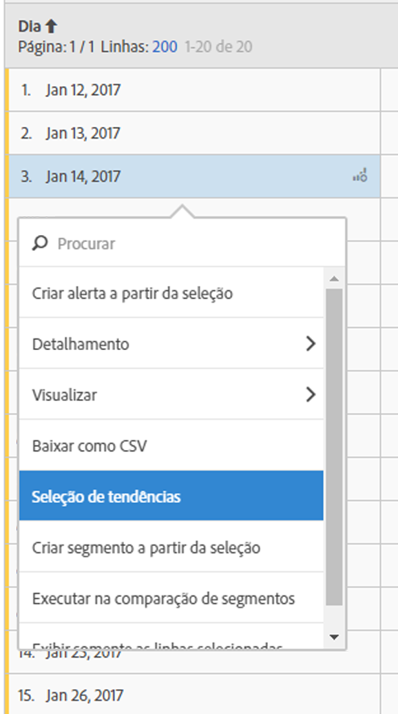

# Tabela de forma livre

No Analysis Workspace, uma tabela de dados (tabela de forma livre) não é apenas uma tabela de relatórios, mas também uma visualização interativa. É possível interagir com linhas individuais, um determinado número de linhas selecionadas ou toda a tabela.

É possível exibir até 400 linhas em uma tabela.

Você pode interagir com a tabela de maneiras únicas:

* [Criar um alerta](/help/components/c-alerts/alert-builder.md) a partir de uma seleção de tabela
* Executar  [detalhamentos](/help/analyze/analysis-workspace/components/dimensions/t-breakdown-fa.md) e criar segmentos em linha (ao clicar com o botão direito do mouse)
* Executar [visualizações](/help/analyze/analysis-workspace/visualizations/freeform-analysis-visualizations.md) em células específicas
* Exportar linhas para [CSV](/help/analyze/analysis-workspace/curate-share/download-send.md)
* Executar visualizações de [Tendência](/help/analyze/analysis-workspace/analysis-workspace-features.md#section_34930C967C104C2B9092BA8DCF2BF81A) das células selecionadas
* Criar [segmentos](/help/analyze/analysis-workspace/components/t-freeform-project-segment.md) a partir da seleção
* Executar uma [Comparação de segmentos](/help/analyze/analysis-workspace/c-panels/c-segment-comparison/segment-comparison.md)
* Exibir somente as linhas selecionadas

Consulte [Criar um projeto do Analysis Workspace](/help/analyze/analysis-workspace/build-workspace-project/t-freeform-project.md) para obter mais informações.
