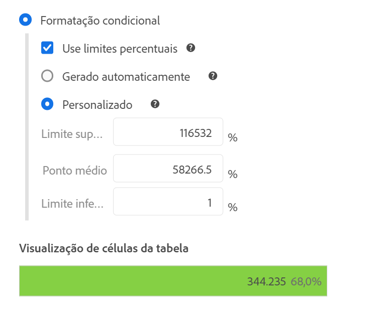
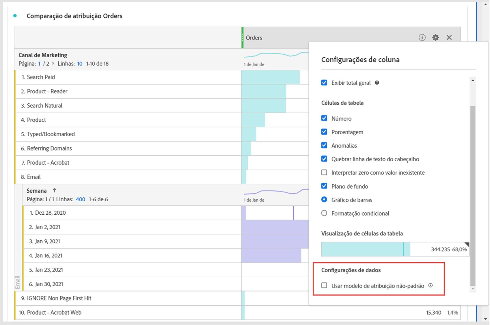
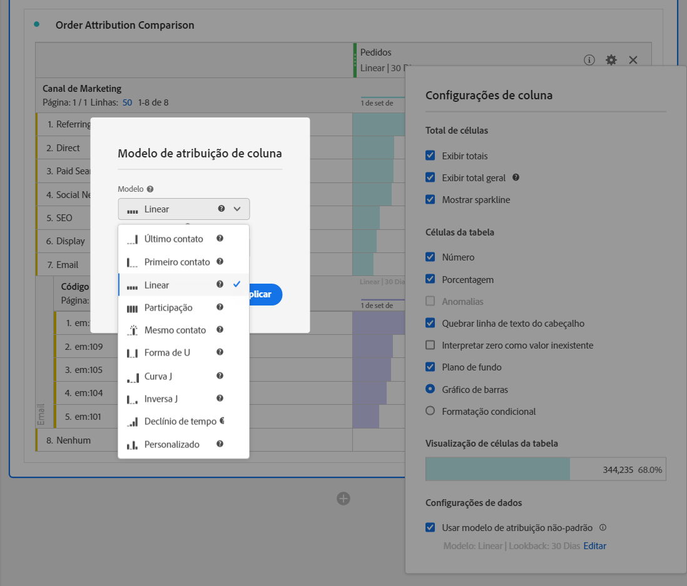

# [!UICONTROL Configurações de coluna]

As [!UICONTROL configurações de coluna] permitem que você configure a formatação da coluna; alguns elementos podem ser condicionais.

>[!BEGINSHADEBOX]

Consulte  [Configurações de linha e coluna em uma tabela de Forma livre](https://video.tv.adobe.com/v/40382/?quality=12&learn=on){target="_blank"} para ver um vídeo de demonstração.

>[!ENDSHADEBOX]

Para acessar [!UICONTROL Configurações de coluna], selecione  no cabeçalho da coluna.

É possível editar configurações para várias colunas de uma só vez. Selecione várias colunas e selecione  em qualquer uma das colunas selecionadas. Qualquer alteração feita se aplica a todas as colunas com células selecionadas.

| Opção | Descrição |
| --- | --- |
| **[!UICONTROL Mostrar total]** | Mostrar uma soma da coluna do lado do cliente. Este total **não** remove a duplicação de métricas como sessões ou pessoas. |
| **[!UICONTROL Mostrar total geral]** | Mostrar uma soma da coluna do lado do servidor. O total geral remove a duplicação de métricas como sessões ou pessoas. |
| **[!UICONTROL Mostrar minigráfico]** | Mostrar um gráfico de linhas no cabeçalho da coluna. |
| **[!UICONTROL Número]** | Determine se uma célula mostra/oculta o valor numérico da métrica. Por exemplo, se a métrica for Exibições de página, o valor numérico será o número de exibições de página para o item da linha. |
| **[!UICONTROL Porcentagem]** | Determine se uma célula mostra/oculta o valor percentual para a métrica. Por exemplo, se a métrica for Exibições de página, o valor percentual será o número de exibições de página para o item da linha, dividido pelo total de exibições de página para a coluna.  Observação: Porcentagens maiores que 100% são possíveis para garantir a precisão. O limite superior pode ser movido para 1.000% para evitar que a largura das colunas fique muito grande. |
| **[!UICONTROL Mostrar anomalias]** | Determine se a detecção de anomalias é executada nos valores desta coluna. |
| **[!UICONTROL Mostrar previsão]** | Determine se os valores de previsão são mostrados nessa coluna. |
| **[!UICONTROL Quebrar linha do texto do cabeçalho]** | Quebre o texto de cabeçalho em tabelas de forma livre para tornar os cabeçalhos mais legíveis e as tabelas mais compartilháveis. A quebra é útil para renderização de PDF e para métricas com nomes compridos. Ativado por padrão. |
| **[!UICONTROL Interpretar zero como nenhum valor]** | Determine, para células com um valor 0, se deseja mostrar um 0 ou uma célula em branco. Essa interpretação é útil quando você observa dados de cada dia de um mês e alguns dias estão no futuro.  Em vez de mostrar 0 para datas futuras, células em branco são exibidas. Os gráficos também respeitam essa configuração (ou seja, os gráficos não mostram uma linha ou barra com valores 0). |
| **[!UICONTROL Histórico]** | Determine se uma célula exibe ou oculta toda a formatação de célula, incluindo o gráfico de barras e a formatação condicional. |
| **[!UICONTROL Gráfico de barras]** | Mostrar um gráfico de barras horizontal que representa o valor da célula relativo ao total da coluna. |
| **[!UICONTROL Formatação condicional]** | Usar formatação condicional. Consulte a [seção](#conditional-formatting) abaixo. |
| **[!UICONTROL Visualização de célula de tabela]** | Uma visualização de como cada célula é exibida com a aplicação das opções de formatação selecionadas no momento. |
| **[!UICONTROL Usar modelo de atribuição não-padrão]** | Use um modelo de atribuição não padrão. Consulte a [seção](#use-non-default-attribution-model) abaixo. |

## Formatação condicional {#conditional-formatting}

A formatação condicional aplica formatação a limites superiores, intermediários e inferiores que você pode definir. A aplicação de formatação condicional nas tabelas de forma livre também é habilitada automaticamente nos detalhamentos, a menos que os limites [!UICONTROL Personalizado] sejam selecionados.

| Opções de formatação condicional | Descrição |
| --- | --- |
| **[!UICONTROL Limites de porcentagem de uso]** | Alterar para que o intervalo limite se baseie em percentagens em vez de valores absolutos. O intervalo de limite de porcentagem funciona para métricas exclusivamente baseadas em porcentagem (como a Taxa de rejeição) e para métricas que têm uma contagem e uma porcentagem (como Exibições de página). |
| **[!UICONTROL Gerado automaticamente]** | Calcular limites superior/médio/inferior automaticamente de acordo com os dados. O limite superior é o valor mais alto na coluna. O limite inferior é o menor valor e o ponto intermediário é a média entre os limites superior e inferior. |
| **[!UICONTROL Personalizado]** | Atribuir manualmente **[!UICONTROL Limite superior]**, **[!UICONTROL Ponto médio]** e **[!UICONTROL Limite inferior]**. Os limites fornecem a flexibilidade para determinar quando um valor de coluna se torna bom, médio ou ruim. |
| **[!UICONTROL Paleta de formatação condicional]** | Aplique um conjunto de cores pré-configurado às células. Dependendo de qual dos quatro esquemas de cores disponíveis você selecionar, cores diferentes serão atribuídas a valores altos, valores de ponto médio e valores baixos.   Substituir uma dimensão na tabela redefine os limites da formatação condicional. Substituir uma métrica recalcula os limites da coluna (na qual haja uma métrica no eixo X e uma dimensão no eixo Y). |

## Usar modelo de atribuição não-padrão {#use-non-default-attribution-model}

<!-- markdownlint-disable MD034 -->

>[!CONTEXTUALHELP]
>id="workspace_freeformtable_column_usenondefaultattributionmodel"
>title="Usar modelo de atribuição não-padrão"
>abstract="Habilite um modelo de atribuição não padrão para as colunas selecionadas."

<!-- markdownlint-enable MD034 -->

<!-- markdownlint-disable MD034 -->

>[!CONTEXTUALHELP]
>id="workspace_freeformtable_column_usenondefaultattributionmodel_disabled"
>title="Usar modelo de atribuição não-padrão"
>abstract="O modo de atribuição não padrão não está disponível para esta métrica."

<!-- markdownlint-enable MD034 -->

>[!NOTE]
>
>Considere o seguinte ao atualizar a atribuição de um componente para um modelo de atribuição não padrão:
>
>* **Ao usar o componente em um relatório com *uma única dimensão*:** a atribuição do componente ignora o modelo de alocação quando um modelo de atribuição não padrão é usado.
>
>* **Ao usar o componente em um relatório com *várias dimensões*:** a atribuição do componente retém o modelo de alocação quando um modelo de atribuição não padrão é usado.
>
>

Para usar um modelo de atribuição não padrão para uma métrica no Analysis Workspace:

1. Selecione **[!UICONTROL Usar modelo de atribuição não padrão]**. Quando já selecionado, use **[!UICONTROL Editar]** para editar o modelo de atribuição. Ou desmarque para retornar ao modelo de atribuição padrão.

   

2. Em **[!UICONTROL Modelo de atribuição de coluna]**, selecione um **[!UICONTROL Modelo]** e uma **[!UICONTROL Janela de pesquisa]**. A janela de retrospectiva determina a janela de atribuição de dados aplicada a cada conversão.

   

### Modelos de atribuição

{{attribution-models-details}}

### Janela de lookback

{{attribution-lookback-window}}

>[!MORELIKETHIS]
>
>* [Gerenciar fontes de dados](/help/analyze/analysis-workspace/visualizations/t-sync-visualization.md)

>[!BEGINSHADEBOX]

Consulte  [Dynamic columns](https://video.tv.adobe.com/v/23138?quality=12&learn=on){target="_blank"} para ver um vídeo de demonstração.

>[!ENDSHADEBOX]

