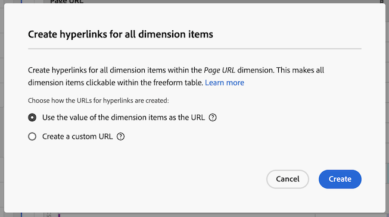

# Criar hiperlinks para dimensões em uma tabela de forma livre

Você pode criar hiperlinks para itens de dimensão para torná-los clicáveis em uma tabela de forma livre no Analysis Workspace.

Essa funcionalidade é particularmente útil ao criar hiperlinks para os seguintes tipos de itens de dimensão:

* Itens Dimension que têm valores de URL para os quais você deseja vincular (por exemplo, uma dimensão URL da página)

* Itens Dimension que contêm detalhamentos que têm valores de URL para os quais você deseja vincular (por exemplo, uma dimensão Nome da página que tem um detalhamento de uma dimensão URL da página)

* Itens de Dimension ou detalhamentos que têm valores que são parte de um URL ao qual você deseja vincular (por exemplo, uma dimensão Nome da página que é parte de um URL)

## Criar hiperlinks para um ou mais itens de dimensão

Considere o seguinte ao criar hiperlinks para itens de dimensão:

* Os hiperlinks criados são armazenados na tabela de forma livre no projeto do Analysis Workspace. Os hiperlinks não persistem ao usar a mesma dimensão ou itens de dimensão em outra tabela ou em outro projeto.

* Se você alterar a visualização de dados da tabela de forma livre, todos os hiperlinks criados para dimensões ou itens de dimensão na tabela ainda estarão disponíveis, desde que a dimensão exista na visualização de dados.

* A validade dos URLs não é verificada ao criar o hiperlink.

  Se você criar um hiperlink com um URL inválido ou criar um hiperlink que faça referência a um item de dimensão que não tem um valor de URL (fazendo referência ao item de dimensão diretamente ou usando a variável `$value` ou `$breakdown` ), os usuários que clicarem no hiperlink verão uma mensagem de erro informando que o URL é inválido.

* Os hiperlinks criados para um único item de dimensão substituem os hiperlinks criados na dimensão.

Para criar hiperlinks para um ou mais itens de dimensão:

1. Em uma tabela de forma livre no Analysis Workspace, siga um destes procedimentos:

   * **Crie um hiperlink para um único item de dimensão:** Clique com o botão direito do mouse no item de dimensão na tabela para a qual deseja criar o hiperlink e selecione [!UICONTROL **Criar hiperlink**].

     

     A variável [!UICONTROL **Criar hiperlink**] será exibida. O nome do item de dimensão para o qual você está criando um hiperlink é mostrado na caixa de diálogo.

     

   * **Criar hiperlinks para todos os itens de dimensão em uma coluna de dimensão:** Clique com o botão direito do mouse no nome da dimensão no cabeçalho da coluna de dimensão e selecione [!UICONTROL **Criar hiperlinks para todos os itens de dimensão**].

     

     A variável [!UICONTROL **Criar hiperlinks para todos os itens de dimensão**] será exibida. O nome da dimensão para a qual você está criando hiperlinks é mostrado na caixa de diálogo.

     

1. Escolha entre as seguintes opções:

   * [!UICONTROL **Usar o valor do item de dimensão como o URL**]: escolha essa opção para itens de dimensão que tenham valores de URL, como uma dimensão de URL de página.

     Por exemplo, se você estiver usando uma dimensão URL de página em que o valor de cada item de dimensão é um URL, selecionar essa opção criará um hiperlink para o URL.

   * [!UICONTROL **Criar um URL personalizado**]: especifique um URL personalizado estático ou dinâmico. Escolha essa opção para criar hiperlinks para itens de dimensão que não têm valores de URL.

     Por exemplo, se estiver usando uma dimensão Nome da página em que o valor de cada item de dimensão é o nome de uma página (e não um URL completo), selecionar essa opção permitirá especificar um hiperlink a ser usado como o link para o item de dimensão.

     Se quiser criar URLs dinâmicos para vários itens de dimensão, você poderá usar o `$value` e `$breakdown` variáveis no URL personalizado. Consulte a tabela abaixo para obter mais informações.

     Para criar um URL personalizado, especifique as seguintes informações:

     | Campo | Descrição |
     |---------|----------|
     | [!UICONTROL **URL personalizado**] | Especifique um URL personalizado que deseja usar para o hiperlink. Os URLs devem ser inseridos como URLs totalmente qualificados. Por exemplo: https://www.example.com
O URL personalizado que você cria pode ser estático ou dinâmico:
 <ul><li>**URLs estáticos:** Se você estiver criando um hiperlink para um item de dimensão individual, um URL estático poderá ser suficiente. 
Considere o exemplo a seguir: por exemplo, se você tiver um item de dimensão Nome da página, poderá criar um URL estático que vincule os usuários à página da Web específica que deseja associar ao nome da página.

Suponha que você queira criar hiperlinks para uma lista de itens de dimensão, cada um vinculando à sua respectiva definição na documentação em uma página wiki interna.

Você pode fazer isso criando um URL estático para cada item de dimensão. Por exemplo:

https://wiki.internal.company_name/page_name#item_definition
</li><li>**URLs dinâmicos:** Se você estiver criando um hiperlink para vários itens de dimensão ou para todos os itens de dimensão em uma coluna de dimensão, um URL dinâmico provavelmente será mais prático. 
Para tornar dinâmicos os URLs personalizados, você inclui variáveis no URL que permitem alterar o URL dinamicamente com base no valor da própria dimensão ou no valor da dimensão de detalhamento.

Ao usar variáveis, todos os itens de dimensão que contêm caracteres inválidos em URLs (como espaços) são codificados por URL.

As seguintes variáveis estão disponíveis: (**Nota**: embora você possa usar essas variáveis no mesmo URL, provavelmente é mais comum usá-las separadamente.)
 <ul><li>**`$value`:** Permite inserir o valor do item de dimensão no URL especificado. 
Considere o seguinte cenário como exemplo:

Suponha que você queira criar hiperlinks para todos os itens de dimensão Nome da página em uma tabela de forma livre, em que o valor de cada item de dimensão faça parte de um URL da página da Web. Nesse caso, é possível construir um único URL personalizado que se ajusta dinamicamente para cada item de dimensão. 

Você pode fazer isso adicionando o `$value` até o final do URL personalizado especificado. Por exemplo:
 
https://company-name.com/browse/product#$value

Quando esse URL personalizado é aplicado aos itens de dimensão de Nome da página cujos valores são &quot;ProductY&quot; e &quot;ProductZ&quot;, os hiperlinks gerados são semelhantes a: 

https://company-name.com/browse/product#ProductY

e

 https://company-name.com/browse/product#ProductZ 

**Dica**: Se você adicionar somente a variável `$value` no campo URL personalizado, seria o mesmo que selecionar a variável [!UICONTROL **Usar o valor do item de dimensão**] ao criar o URL.
</li><li>**`$breakdown`:** Permite inserir o valor do item de dimensão de detalhamento no URL especificado. Isso permite usar uma dimensão com um nome amigável em seu relatório (como uma dimensão Nome do produto) ao criar o hiperlink com base em uma dimensão de detalhamento que pode ser menos amigável ao usuário (como uma dimensão ID de produto ou URL de página).
Ao fazer referência a uma dimensão de detalhamento, é mais comum ter apenas um item de detalhamento para um determinado item de dimensão. Se houver vários itens de detalhamento para um determinado item de dimensão, o valor do primeiro item de detalhamento será usado no URL. Se nenhum item de detalhamento for listado, o URL será inválido. A mesma ordem de classificação é aplicada aos itens de detalhamento como é aplicada à tabela.

Especifique a dimensão de detalhamento na variável [!UICONTROL **Detalhamento da dimensão**] abaixo.
 
Considere o exemplo de cenário descrito para a variável [!UICONTROL **Detalhamento da dimensão**] abaixo.
</li></ul> |
     | [!UICONTROL **Dimensão de detalhamento (opcional)**] | Comece digitando o nome da dimensão de detalhamento que deseja usar e selecione-a na lista suspensa. 
Se você selecionar uma dimensão de detalhamento neste campo, deverá referenciá-la usando o `$breakdown` no URL especificado na variável [!UICONTROL **URL personalizado**] campo.

Considere o seguinte cenário como exemplo:

Suponha que você deseja criar hiperlinks para todos os itens de dimensão de Nome do produto em uma tabela de forma livre. Cada item de dimensão de Nome de produto contém um detalhamento de uma dimensão de ID de produto.

Nesse caso, é possível criar hiperlinks para cada dimensão de Nome do produto que direciona os usuários para a página do produto usando o valor da dimensão de detalhamento ID do produto. 

Você pode fazer isso adicionando o `$breakdown` até o final do URL personalizado especificado na variável [!UICONTROL **URL personalizado**] campo. Por exemplo:

https://company-name.com/browse/product/$breakdown

Quando esse URL personalizado é aplicado aos itens de dimensão de Nome do produto que têm itens de dimensão de detalhamento cujos valores são &quot;ProductY&quot; e &quot;ProductZ&quot;, os hiperlinks gerados são semelhantes a:

https://company-name.com/browse/product/ProductY

e

https://company-name.com/browse/product/ProductZ

Em seguida, você selecionaria a dimensão ID do produto na [!UICONTROL **Detalhamento da dimensão**] campo 

 |

1. Selecione [!UICONTROL **Criar**].

   Os usuários que visualizam a tabela de forma livre veem os itens de dimensão com hiperlink. Ao clicar em um item de dimensão, os usuários são levados às páginas com hiperlink em uma guia do navegador separada.

   <!-- add screenshot of a table with hyperlinks.-->

1. [Salve o projeto](/help/analyze/analysis-workspace/build-workspace-project/save-projects.md) para salvar as alterações.

## Editar hiperlinks

É possível editar hiperlinks que foram criados em dimensões ou itens de dimensão em uma tabela de forma livre.

1. Em uma tabela de forma livre no Analysis Workspace, siga um destes procedimentos:

   * **Editar um hiperlink para um único item de dimensão:** Clique com o botão direito do mouse no item de dimensão na tabela em que deseja editar o hiperlink.

     

   * **Editar hiperlinks para todos os itens de dimensão em uma coluna de dimensão:** Clique com o botão direito do mouse no nome da dimensão no cabeçalho da coluna de dimensão.

     

1. Selecionar [!UICONTROL **Editar hiperlink**] no menu de contexto.

   A variável [!UICONTROL **Editar hiperlinks para itens de dimensão**] será exibida.

1. Para obter informações sobre as opções de configuração para editar o hiperlink, consulte Etapa 3 no [Criar hiperlinks para um ou mais itens de dimensão](#create-hyperlinks-for-one-or-more-dimension-items) acima e selecione [!UICONTROL **Aplicar**] quando terminar as atualizações.

1. [Salve o projeto](/help/analyze/analysis-workspace/build-workspace-project/save-projects.md) para salvar as alterações.

## Remover hiperlinks

Você pode remover hiperlinks que foram criados para itens de dimensão em uma tabela de forma livre.

>[!NOTE]
>
>Em uma tabela de forma livre, se você excluir uma dimensão que contém hiperlinks, os hiperlinks não persistirão se você adicionar a mesma dimensão de volta à tabela de forma livre.

Para remover hiperlinks de itens de dimensão:

1. Em uma tabela de forma livre no Analysis Workspace, siga um destes procedimentos:

   * **Remover um hiperlink de um único item de dimensão:** Clique com o botão direito do mouse no item de dimensão na tabela em que deseja remover o hiperlink.

     

   * **Remover hiperlinks de todos os itens de dimensão em uma coluna de dimensão:** Clique com o botão direito do mouse no nome da dimensão no cabeçalho da coluna de dimensão.

     

1. Selecionar [!UICONTROL **Remover hiperlink**] no menu de contexto.

   O hiperlink é removido do único item de dimensão (se você tiver selecionado um único item de dimensão) ou de todos os itens de dimensão (se você tiver selecionado o nome da dimensão no cabeçalho da coluna de dimensão).

1. [Salve o projeto](/help/analyze/analysis-workspace/build-workspace-project/save-projects.md) para salvar as alterações.

