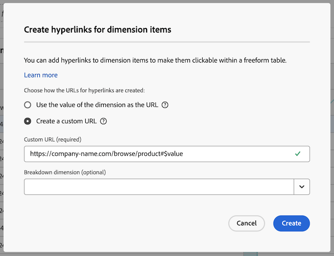
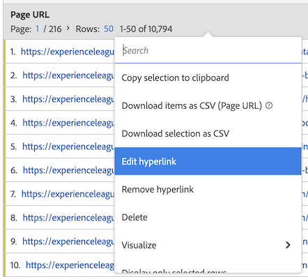
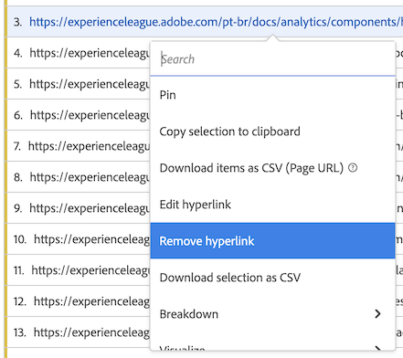

# Criar hiperlinks

Você pode criar hiperlinks para itens de dimensão para torná-los clicáveis em uma tabela de forma livre no Analysis Workspace.

Essa funcionalidade é particularmente útil ao criar hiperlinks para os seguintes tipos de itens de dimensão:

* Itens de dimensão que têm valores de URL (por exemplo, uma dimensão de URL de página).

* Itens de dimensão que contêm detalhamentos que têm valores de URL (por exemplo, uma dimensão Nome da página que tem um detalhamento de uma dimensão URL da página).

* Itens de dimensão ou detalhamentos que têm valores que fazem parte de um URL (por exemplo, uma dimensão Nome de página que faz parte de um URL).

>[!BEGINSHADEBOX]

Consulte  [Hiperlinks para dimensão](https://video.tv.adobe.com/v/3445788?quality=12&learn=on&captions=por_br){target="_blank"} para ver um vídeo de demonstração.

>[!ENDSHADEBOX]

## Criar hiperlinks

Considere o seguinte ao criar hiperlinks para um ou mais itens de dimensão:

* Os hiperlinks criados são armazenados na tabela de forma livre no projeto do Analysis Workspace. Os hiperlinks não persistem ao usar a mesma dimensão ou itens de dimensão em outra tabela ou em outro projeto.

* Se você alterar a exibição de dados da tabela de forma livre, todos os hiperlinks criados para dimensões ou itens de dimensão na tabela ainda estarão disponíveis. Essa funcionalidade pressupõe que a dimensão ainda existe na exibição de dados.

* A validade dos URLs não é verificada ao criar o hiperlink. Se você

   * criar um hiperlink com um URL inválido ou
   * criar um hiperlink que faça referência a um item de dimensão que não tenha um valor de URL (fazendo referência ao item de dimensão diretamente ou usando as variáveis `$value` ou `$breakdown`),

  em seguida, os usuários que clicam no hiperlink veem uma mensagem de erro informando que o URL é inválido.

* Os hiperlinks criados para um único item de dimensão substituem os hiperlinks criados na dimensão.

* Os hiperlinks não são funcionais em [arquivos PDF baixados](/help/analyze/analysis-workspace/curate-share/download-send.md).

Para criar hiperlinks para um ou mais itens de dimensão:

1. Em uma tabela de forma livre no Analysis Workspace, siga um destes procedimentos:

   * **Criar um hiperlink para um único item de dimensão:** clique com o botão direito do mouse no item de dimensão na tabela para o qual deseja criar o hiperlink e selecione [!UICONTROL **Criar hiperlink**].

      1. Abra o menu de contexto do item de dimensão.
      1. Selecione [!UICONTROL **Criar hiperlink**] no menu de contexto.

         A caixa de diálogo [!UICONTROL **Criar hiperlink**] é exibida. O nome do item de dimensão para o qual você está criando um hiperlink é mostrado na caixa de diálogo.

         

   * **Criar hiperlinks para todos os itens de dimensão em uma coluna de dimensão:** clique com o botão direito do mouse no nome da dimensão no cabeçalho da coluna de dimensão e selecione [!UICONTROL **Criar hiperlinks para todos os itens de dimensão**].

      1. Abra o menu de contexto no cabeçalho da coluna de dimensão.
      1. Selecione [!UICONTROL **Criar hiperlink para todos os itens de dimensão**] no menu de contexto.

         <!-- Do we really need a screenshot  -->

         A caixa de diálogo [!UICONTROL **Criar hiperlinks para todos os itens de dimensão**] é exibida. O nome da dimensão para a qual você está criando hiperlinks é mostrado na caixa de diálogo.

         

1. Escolha entre as seguintes opções:

   * [!UICONTROL **Usar o valor do item de dimensão como o URL**]: escolha esta opção para itens de dimensão que tenham valores de URL, como uma dimensão de URL de página.

     Por exemplo, se você estiver usando uma dimensão de URL de página em que o valor de cada item de dimensão é um URL, selecionar essa opção criará um hiperlink para o URL.

   * [!UICONTROL **Criar um URL personalizado**]: especifique um URL personalizado estático ou dinâmico. Escolha essa opção para criar hiperlinks para itens de dimensão que não têm valores de URL.

     Por exemplo: você está usando uma dimensão Nome da página, em que o valor de cada item de dimensão é o nome de uma página (e não um URL completo). Em seguida, selecione essa opção para especificar um hiperlink a ser usado como o link para o item de dimensão.

     Se você quiser criar URLs dinâmicos para vários itens de dimensão, poderá usar as variáveis `$value` e `$breakdown` no URL personalizado. Veja a tabela abaixo para obter mais informações.

     Para criar um URL personalizado, especifique as seguintes informações:

     | Campo | Descrição |
     |---------|----------|
     | [!UICONTROL **URL personalizado**] | Especifique um URL personalizado que você deseja usar para o hiperlink. Os URLs devem ser inseridos como URLs totalmente qualificados. Por exemplo: <https://www.example.com>
O URL personalizado que você cria pode ser estático ou dinâmico:
 <ul><li>**URLs estáticos:** você pode especificar um URL estático para um único item de dimensão ou para todos os itens de dimensão quando quiser que os itens vinculem todos ao mesmo URL. Por exemplo: `https://wiki.internal.company_name/page_name#item_definition`
</li><li>**URLs dinâmicos:** é possível criar um URL dinâmico se você quiser criar hiperlinks exclusivos para vários itens de dimensão ou para todos os itens de dimensão em uma coluna de dimensão.
Para tornar URLs personalizados dinâmicos, inclua uma variável no URL para alterá-lo com base no valor da dimensão ou no valor da dimensão de detalhamento.

Ao usar variáveis, todos os itens de dimensão que contêm caracteres que não são válidos em URLs (como espaços) são codificados por URL.

As seguintes variáveis estão disponíveis: (**Observação**: embora você possa usar essas variáveis no mesmo URL, é mais comum usá-las separadamente.)
 <ul><li>**`$value`:** permite inserir o valor do item de dimensão no URL especificado. 
Suponha que você queira criar hiperlinks para todos os itens de dimensão Nome da página em uma tabela de forma livre, em que o valor de cada item de dimensão é parte do URL de uma página da web. Nesse caso, você pode construir um único URL personalizado que se ajusta dinamicamente para cada item de dimensão.  Por exemplo: `https://company-name.com/browse/product#\$value`

Quando esse URL personalizado é aplicado aos itens de dimensão Nome da página cujos valores são “ProdutoY” e “ProdutoZ”, os hiperlinks gerados têm uma aparência semelhante a esta:  `https://company-name.com/browse/product#ProductY` e `https://company-name.com/browse/product#ProductZ` 

**Dica**: adicionar somente a variável `$value` ao campo URL Personalizado é o mesmo que selecionar a opção [!UICONTROL **Usar o valor do item de dimensão**] ao criar o URL.
</li><li>**`$breakdown`:** permite inserir o valor do item de dimensão de detalhamento no URL especificado. Com `$breakdown`, você pode usar uma dimensão com um nome amigável em seu relatório (como uma dimensão de Nome de produto). E gerar um hiperlink com base em uma dimensão de detalhamento que pode ser menos fácil de usar (como uma ID de produto ou dimensão de URL de página).
Ao fazer referência a uma dimensão de detalhamento, é mais comum ter apenas um item de detalhamento para um determinado item de dimensão. Se houver vários itens de detalhamento para um determinado item de dimensão, o valor do primeiro item de detalhamento será usado no URL. Se nenhum item de detalhamento for listado, o URL será inválido. A mesma ordem de classificação é aplicada aos itens de detalhamento como é aplicada à tabela.

Especifique a dimensão de detalhamento no campo [!UICONTROL **Dimensão de detalhamento**] abaixo.
 
Considere o exemplo de cenário descrito para o campo [!UICONTROL **Dimensão de detalhamento**] abaixo.
</li></ul> |
     | [!UICONTROL **Dimensão de detalhamento (opcional)**] | Comece digitando o nome da dimensão de detalhamento que deseja usar e selecione-a na lista suspensa. 
Se você selecionar uma dimensão de detalhamento neste campo, deverá referenciá-la usando a variável `$breakdown` no URL especificado no campo [!UICONTROL **URL personalizado**].

Suponha que você deseja criar hiperlinks para todos os itens de dimensão de Nome do produto em uma tabela de forma livre. Cada item de dimensão de Nome de produto contém um detalhamento de uma dimensão de ID de produto.

Nesse caso, é possível criar hiperlinks para cada dimensão de Nome do produto que direciona os usuários para a página do produto usando o valor da dimensão de detalhamento ID do produto. 

Adicione a variável `$breakdown` ao final do URL personalizado que você especificar no campo [!UICONTROL **URL personalizado**]. Por exemplo:

`https://company-name.com/browse/product/$breakdown`
Quando este URL personalizado é aplicado aos itens de dimensão de Nome do produto (que têm itens de dimensão de detalhamento cujos valores são “ProductY” e “ProductZ”), os hiperlinks gerados se parecem com: `https://company-name.com/browse/product/ProductY` e `https://company-name.com/browse/product/ProductZ`

Em seguida, você selecionaria a dimensão ID do produto no campo [!UICONTROL **Detalhamento da dimensão**] 

 |

1. Selecione [!UICONTROL **Criar**].

   Os usuários que visualizam a tabela de forma livre veem os itens de dimensão com hiperlink. Ao clicar em um item de dimensão, os usuários são direcionados às páginas com hiperlink em uma guia do navegador separada.

   <!-- add screenshot of a table with hyperlinks.-->

1. [Salve o projeto](/help/analyze/analysis-workspace/build-workspace-project/save-projects.md) para salvar as alterações.

## Editar hiperlinks

É possível editar hiperlinks que foram criados em dimensões ou itens de dimensão em uma tabela de forma livre.

1. Em uma tabela de forma livre no Analysis Workspace, siga um destes procedimentos:

   * **Editar um hiperlink para um único item de dimensão:**

      1. Abra o menu de contexto do item de dimensão.
      1. Selecione [!UICONTROL **Editar hiperlink**] no menu de contexto.

     <!-- Do we really need a screenshot? -->

   * **Editar hiperlinks para todos os itens de dimensão em uma coluna de dimensão:**

      1. Abra o menu de contexto no cabeçalho da coluna de dimensão.
      1. Selecione **[!UICONTROL Editar hiperlink para todos os itens de dimensão]** no menu de contexto.

     <!-- Do we really need a screenshot? -->

1. Selecione [!UICONTROL **Editar hiperlinks para todos os itens de dimensão**] no menu do botão direito.

   A caixa de diálogo [!UICONTROL **Editar hiperlinks para itens de dimensão**] é exibida.

1. Para mais informações sobre as opções de configuração para editar o hiperlink, consulte a etapa 3 na seção [Criar hiperlinks para um ou mais itens de dimensão](#create-hyperlinks-for-one-or-more-dimension-items) acima e selecione [!UICONTROL **Aplicar**] quando terminar de atualizar.

1. [Salve o projeto](/help/analyze/analysis-workspace/build-workspace-project/save-projects.md) para salvar as alterações feitas.

## Remover hiperlinks

Você pode remover hiperlinks criados para itens de dimensão em uma tabela de forma livre.

>[!NOTE]
>
>Em uma tabela de forma livre, se você excluir uma dimensão que contém hiperlinks, os hiperlinks não persistirão se você adicionar a mesma dimensão de volta à tabela de forma livre.

Para remover hiperlinks de itens de dimensão:

1. Em uma tabela de forma livre no Analysis Workspace, siga um destes procedimentos:

   * **Remover um hiperlink de um item de dimensão:**

      1. Abra o menu de contexto do item de dimensão.
      1. Selecione [!UICONTROL **Remover hiperlink**] no menu de contexto.
         <!-- Do we really need a screenshot? -->

   * **Remover hiperlinks de todos os itens de dimensão de uma coluna de dimensão:**

      1. Abra o menu de contexto no cabeçalho da coluna de dimensão.
      1. Selecione **[!UICONTROL Remover hiperlink de todos os itens de dimensão]** no menu de contexto.

     <!-- Do we really need a screenshot? [Remove hyperlink from a dimension](assets/hyperlink-dimension-remove.png)-->

   O hiperlink será removido do item de dimensão, se você tiver selecionado apenas um item de dimensão. Ou de todos os itens de dimensão, se você tiver selecionado o nome da dimensão no cabeçalho da coluna de dimensão.

1. [Salve o projeto](/help/analyze/analysis-workspace/build-workspace-project/save-projects.md) para salvar as alterações feitas.
