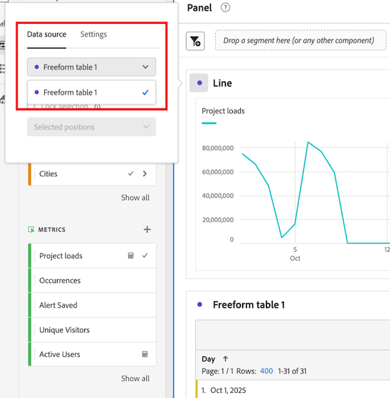

# Exibir dados de tendência para uma tabela de forma livre

Você pode visualizar a tendência dos dados incluídos em uma tabela de forma livre. Esses dados de tendências são mostrados nas seguintes áreas no Analysis Workspace:

* [Minigráficos](#use-sparklines-to-view-trended-data)

* [Visualizações de linha](#use-line-visualizations-to-view-trended-data)

## Usar minigráficos para exibir dados de tendências

Os minigráficos são mostrados no cabeçalho da coluna de métricas das tabelas de forma livre.

Os minigráficos sempre incluem:

* Dados de tendência para todos os dados na coluna

* Qualquer critério de filtro de pesquisa aplicado à dimensão da tabela

  Para obter mais informações, consulte [Filtrar e classificar](/help/analyze/analysis-workspace/visualizations/freeform-table/filter-and-sort.md).

## Usar visualizações de linha para exibir dados de tendências

As visualizações de [Linha](/help/analyze/analysis-workspace/visualizations/line.md) exibem os dados da tabela de forma livre à qual estão conectadas.

### Conectar uma visualização de linha a uma tabela de forma livre

Dependendo de como e quando a visualização de linha foi adicionada ao projeto, ela pode já estar conectada à tabela de forma livre desejada. Use as seguintes etapas para verificar ou conectá-lo manualmente:

1. Adicione uma visualização de linha a um projeto do Analysis Workspace.

1. Selecione o ponto ao lado do nome da visualização, selecione a guia **[!UICONTROL Fonte de dados]** e selecione o nome da tabela de forma livre que você deseja conectar à visualização de linha.

   

### Escolha os dados incluídos na visualização de linha

Os dados incluídos na visualização de linha conectada diferem, dependendo de qual célula é selecionada na tabela de forma livre.

Para exibir uma tendência de todos os dados na tabela de forma livre, selecione a célula de minigráfico na tabela de forma livre.

Quando a célula do minigráfico é selecionada, ela é exibida em cinza escuro.

Quando a célula do minigráfico da tabela conectada é selecionada, as visualizações de linha incluem:

* Dados de tendência para todos os dados na coluna

* Qualquer critério de filtro de pesquisa aplicado à dimensão da tabela

  Para obter mais informações, consulte [Filtrar e classificar](/help/analyze/analysis-workspace/visualizations/freeform-table/filter-and-sort.md).

Quando o minigráfico da tabela conectada não é selecionado, as visualizações de linha incluem:

* Dados da linha selecionada na tabela conectada. Se nenhuma linha for selecionada, serão mostrados os dados somente para a primeira dimensão da tabela conectada.

* Qualquer critério de filtro de pesquisa aplicado à dimensão da tabela é ignorado

  Para obter mais informações, consulte [Filtrar e classificar](/help/analyze/analysis-workspace/visualizations/freeform-table/filter-and-sort.md).

## Incluir critérios de filtro em visualizações de linha conectada

Para obter informações sobre quando os critérios de filtro são incluídos em visualizações de linha conectada, consulte [Incluir critérios de filtro em dados de tendência em minigráficos e visualizações de linha](/help/analyze/analysis-workspace/visualizations/freeform-table/filter-and-sort.md#include-filter-criteria-in-trended-data-in-sparklines-and-line-visualizations)

