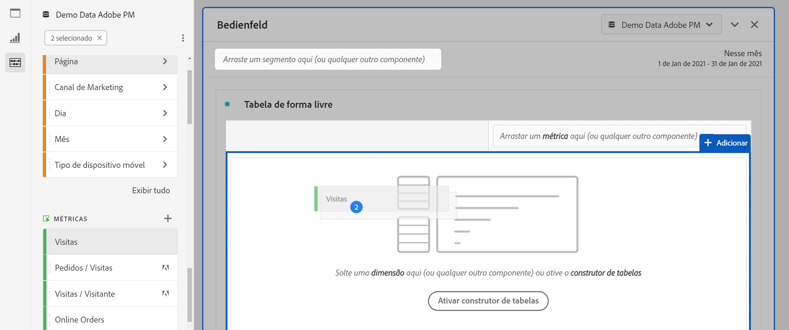

# Tabela de forma livre

No Analysis Workspace, uma Tabela de forma livre é a base para a análise de dados interativa. You can drag and drop a combination of [components](https://docs.adobe.com/content/help/pt-BR/analytics/analyze/analysis-workspace/components/analysis-workspace-components.html) into rows and columns to create a custom table for your analysis. À medida que cada componente é solto, a tabela é atualizada imediatamente para que você possa analisar e pesquisar mais fundo rapidamente.

## Tabelas automatizadas

A maneira mais rápida de criar uma tabela é soltar os componentes diretamente em um projeto, painel ou tabela de forma livre em branco. Uma tabela de forma livre será criada automaticamente para você em um formato recomendado. [Assista ao tutorial](https://experienceleague.adobe.com/docs/analytics-learn/tutorials/analysis-workspace/building-freeform-tables/auto-build-freeform-tables-in-analysis-workspace.html).

## Criador de tabela de forma livre

Se preferir adicionar primeiro vários componentes à tabela e, em seguida, renderizar os dados, ative o Construtor de tabelas de forma livre. Com o construtor ativado, você pode arrastar e soltar em muitas dimensões, detalhamentos, métricas e segmentos para criar tabelas que respondam a perguntas mais complexas. Os dados não serão atualizados dinamicamente, serão atualizados assim que você clicar em **[!UICONTROL Criar]**.

## Interações de tabela

É possível interagir e personalizar uma tabela de forma livre de várias maneiras:

* **Linhas**
   * Você pode ajustar mais linhas em uma única tela ajustando a [densidade de visualização](https://docs.adobe.com/content/help/pt-BR/analytics/analyze/analysis-workspace/build-workspace-project/view-density.html) do projeto.
   * Cada linha da dimensão pode exibir até 400 linhas antes que ocorra paginação. Clique no número ao lado de &quot;Linhas&quot; para mostrar mais linhas em uma página. Navegue até uma página diferente usando a seta de página no cabeçalho.
   * As linhas podem ser detalhadas por componentes adicionais. Para detalhar várias linhas ao mesmo tempo, basta selecionar várias linhas e arrastar o próximo componente na parte superior das linhas selecionadas. Saiba mais sobre [detalhamentos](https://docs.adobe.com/content/help/pt-BR/analytics/analyze/analysis-workspace/components/dimensions/t-breakdown-fa.html).
   * As linhas podem ser [filtradas](https://experienceleague.adobe.com/docs/analytics/analyze/analysis-workspace/visualizations/freeform-table/pagination-filtering-sorting.html?lang=pt-BR) para mostrar um conjunto reduzido de itens. Configurações adicionais estão disponíveis em [Configurações de linha](https://docs.adobe.com/content/help/en/analytics/analyze/analysis-workspace/visualizations/freeform-table/column-row-settings/table-settings.html).

* **Colunas**
   * Os componentes podem ser empilhados dentro de colunas para criar métricas segmentadas, análise entre guias e muito mais.
   * A exibição de cada coluna pode ser ajustada nas [configurações de coluna](https://docs.adobe.com/content/help/pt-BR/analytics/analyze/analysis-workspace/build-workspace-project/column-row-settings/column-settings.html).
   * Várias ações estão disponíveis no [menu acionado via clique com o botão direito do mouse](https://docs.adobe.com/content/help/en/analytics-learn/tutorials/analysis-workspace/building-freeform-tables/using-the-right-click-menu.html). O menu fornece ações diferentes a depender se você clicar no cabeçalho da tabela, nas linhas ou nas colunas.

## Exportar dados da tabela de forma livre

Saiba mais sobre todas as opções [de](https://experienceleague.adobe.com/docs/analytics/analyze/analysis-workspace/curate-share/download-send.html) exportação de dados para Analysis Workspace.

* Clique com o botão direito do mouse em > **[!UICONTROL Copiar dados para a área de transferência]** exporta os dados da tabela exibidos. Se uma seleção de tabela for feita, essa opção indicará **[!UICONTROL Copiar seleção para a área de transferência]**. A tecla de atalho **Ctrl+C** também copia os dados selecionados.
* Clique com o botão direito do mouse em > **[!UICONTROL Baixar dados à medida que o CSV]** baixa os dados da tabela exibidos como um CSV. Se uma seleção de tabela for feita, essa opção indicará **[!UICONTROL Fazer download da seleção como CSV]**.
* Clique com o botão direito do mouse em > **[!UICONTROL Projeto > Baixar itens como CSV]** exportará até 50.000 itens de dimensão para a dimensão selecionada.

Saiba mais sobre todas as opções [de](https://experienceleague.adobe.com/docs/analytics/analyze/analysis-workspace/curate-share/download-send.html) exportação de dados para Analysis Workspace.

