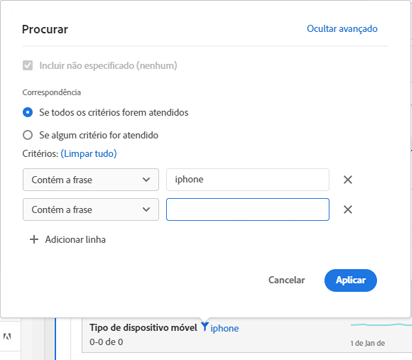

# Paginação, filtragem e classificação de tabelas

Para ter uma visão geral, assista a este tutorial em vídeo:

[Paginação, filtragem e classificação de tabelas no Analysis Workspace](https://docs.adobe.com/help/pt-BR/analytics-learn/tutorials/analysis-workspace/building-freeform-tables/pagination-filtering-sorting-tables.html)

## Opções de filtragem avançadas {#section_36E92E31442B4EBCB052073590C1F025}

Clicar no ícone de filtro e, em seguida, em Mostrar avançado próximo a uma dimensão em uma tabela de forma livre permite filtrar usando os critérios a seguir:

* Contém
* Não contém
* Contém todos os termos
* Contém qualquer termo
* Contém a frase
* Não contém nenhum termo
* Não contém a frase
* Igual a
* Não é igual
* Começa com
* Termina com

