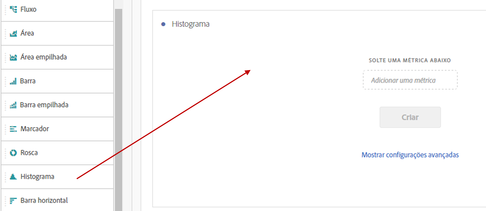
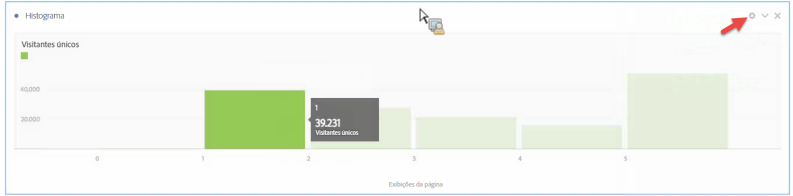
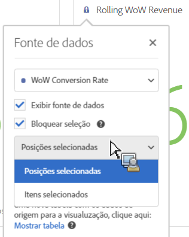
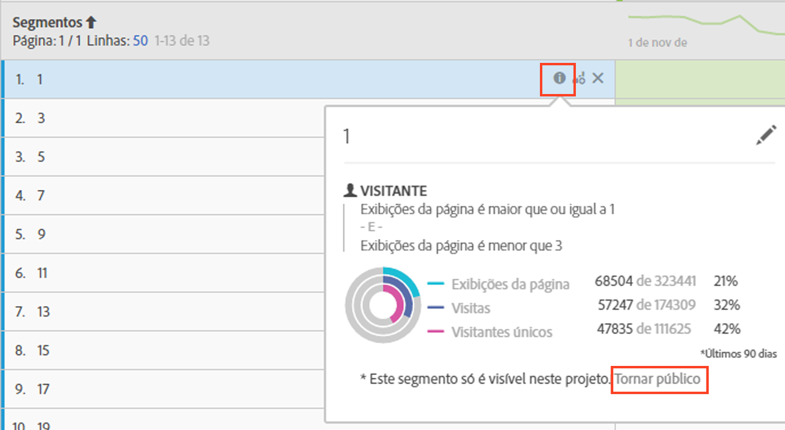

# Histograma

Um histograma é semelhante a um gráfico de barras, mas agrupa os números em intervalos (grupos). O Analytics automatiza o agrupamento de números em intervalos, mas você pode alterar as configurações em [Configurações avançadas](#section_09D774C584864D4CA6B5672DC2927477).

## Build a histogram {#section_74647707CC984A1CB6D3097F43A30B45}

Para criar um histograma:

1. Clique em **[!UICONTROL Visualizações]no trilho à esquerda.**
1. Arraste **[!UICONTROL Histograma]ao painel.**
1. Escolha uma Métrica para arrastar à visualização de Histograma e clique em **[!UICONTROL Criar]**.

>[!NOTE]
>
>Os histogramas oferecem suporte somente a métricas padrão, e não a métricas calculadas.

Aqui, utilizamos a Métrica de exibições de página por visitantes exclusivos. O primeiro grupo (à esquerda) corresponde a uma exibição de página por visitante exclusivo, o segundo grupo, a duas exibições de página, etc.

## Advanced settings {#section_09D774C584864D4CA6B5672DC2927477}

Para ajustar as configurações do histograma, clique no ícone de Configurações (“engrenagem”) no canto superior direito. Estas são as configurações que você pode modificar:

| Configurações do histograma | O que faz |
|---|---|
| Grupo inicial | Determina o grupo inicial do histograma. O valor padrão é “1”. Você pode definir números iniciais de 0 a infinito (nenhum número negativo). |
| Grupos de métricas | Permite aumentar/diminuir o número de intervalos de dados (grupos). O número máximo de grupos é 50. |
| Tamanho do grupo de métricas | Permite definir o tamanho de cada grupo. Por exemplo, você pode alterar o tamanho do grupo de uma exibição de página para duas exibições de página. |
| Método de contagem | Permite escolher entre [Visitante](https://marketing.adobe.com/resources/help/en_US/reference/visitors.html), [Visita](https://marketing.adobe.com/resources/help/en_US/reference/metrics_visit.html) ou [Ocorrência](https://marketing.adobe.com/resources/help/en_US/reference/hit.html). Por exemplo, exibições de página por visita, por visitante ou por ocorrência. Para Ocorrências, "Ocorrências" é usado como a métrica do eixo y na tabela de forma livre. |

**Exemplos**:

* Grupo inicial: 1; Grupos de métricas: 5; Tamanho do grupo de métricas: 2 resultará neste histograma: 1-2, 3-4, 5-6, 7-8, 9-10.
* Grupo inicial: 0; Grupos de métricas: 3; Tamanho do grupo de métricas: 5 resultará neste histograma: 0-4, 5-9, 10-14.

## View and edit histogram data {#section_B2CD7CDF0F6B432F928103AE7AAA3617}

To view or change the data source for the histogram chart, click the dot next to the Histogram header to go to **[!UICONTROL Data Source Settings]** &gt; **[!UICONTROL Show Data Source]**.

Os segmentos pré-construídos exibidos na tabela são segmentos internos e não serão exibidos no seletor de segmentos. Clique no ícone “i” ao lado do nome do segmento e em **[!UICONTROL Tornar público]para tornar o segmento público.**

Para explorar mais formas de gerenciar tabelas de dados de Forma livre e outras visualizações, como detalhamento de dados, acesse [aqui](https://marketing.adobe.com/resources/help/en_US/analytics/analysis-workspace/freeform-analysis-visualizations.html).
