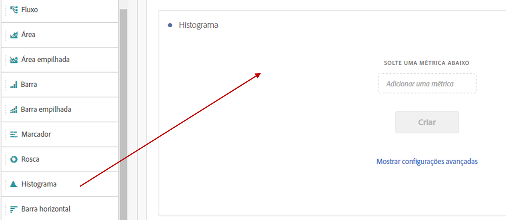
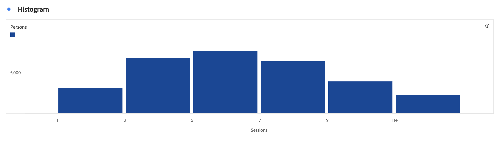

# Histograma {#histogram}

>[!CONTEXTUALHELP]
>id="workspace_histogram_button"
>title="Histograma"
>abstract="Crie uma visualização de histograma para representar a distribuição de dados numéricos em grupos de intervalos."

>[!BEGINSHADEBOX]

_Este artigo documenta a visualização de Histograma no_  _&#x200B;**Adobe Analytics**._ _Consulte o [Histograma](https://experienceleague.adobe.com/pt-br/docs/analytics-platform/using/cja-workspace/visualizations/histogram) da versão_  _&#x200B;**Customer Journey Analytics** deste artigo._

>[!ENDSHADEBOX]

A visualização em  **[!UICONTROL Histograma]** é semelhante à visualização em [!UICONTROL Barras], mas agrupa os números em intervalos (compartimentos). O Analytics automatiza o agrupamento de números em intervalos, mas você pode alterar as configurações em [Configurações avançadas](#advanced-settings).

## Usar

Para criar um histograma:

1. Adicionar uma visualização de  **[!UICONTROL Histograma]**. Consulte [Adicionar uma visualização a um painel](freeform-analysis-visualizations.md#add-visualizations-to-a-panel)
1. Arraste uma métrica da lista de componentes **[!UICONTROL Métricas]** ou selecione uma métrica do menu suspenso [!UICONTROL *Adicionar uma métrica*].
1. Selecione **[!UICONTROL Mostrar configurações avançadas]**. Consulte [Configurações avançadas](#advanced-settings)
1. Selecione **[!UICONTROL Criar]**.

>[!NOTE]
>
>Os histogramas são compatíveis apenas com métricas padrão, não calculadas.

No exemplo abaixo, um histograma é usado para agrupar sessões para o número de pessoas. O histograma mostra que a maioria das pessoas tem entre 16 e 21 sessões para o intervalo de datas selecionado.

## Configurações avançadas

Como parte da visualização, configurações específicas do histograma estão disponíveis.

| Configurações do histograma | Descrição |
|---|---|
| **[!UICONTROL Grupo inicial]** | Determina com qual bloco o histograma começa. &quot;1&quot; é o padrão. Você pode definir números iniciais de 0 até o infinito (sem números negativos). |
| **[!UICONTROL Grupos de métricas]** | Permite aumentar/diminuir o número de intervalos de dados (compartimentos). O número máximo de grupos é 50. |
| **[!UICONTROL Tamanho do grupo de métricas]** | Permite definir o tamanho de cada intervalo. Por exemplo, você pode alterar o tamanho do intervalo de uma exibição de página para duas exibições de página. |
| **[!UICONTROL Método de contagem]** | Selecione de **[!UICONTROL Pessoa]**, **[!UICONTROL Sessão]** ou **[!UICONTROL Evento]**. Por exemplo, exibições de página por visita, por visitante ou por evento. |

<!--Russ or Meike - Check Hit Type link above. -->

**Exemplos**:

| Grupo inicial | Grupos de métricas | Tamanho do grupo de métricas | Resultado |
|:----:|:--:|:--:|:--|
| 1 | 5 | 2 |  |
| 0 | 3 | 5 |  |

>[!MORELIKETHIS]
>
>[Adicionar uma visualização a um painel](/help/analyze/analysis-workspace/visualizations/freeform-analysis-visualizations.md#add-visualizations-to-a-panel)
>[Configurações de visualização](/help/analyze/analysis-workspace/visualizations/freeform-analysis-visualizations.md#settings)
>[Menu de contexto de visualização](/help/analyze/analysis-workspace/visualizations/freeform-analysis-visualizations.md#context-menu)
>[Usando histogramas para identificar valores de dados inesperados](https://experienceleaguecommunities.adobe.com/t5/adobe-analytics-blogs/using-histograms-to-identify-unexpected-data-values/ba-p/596168?profile.language=pt)

