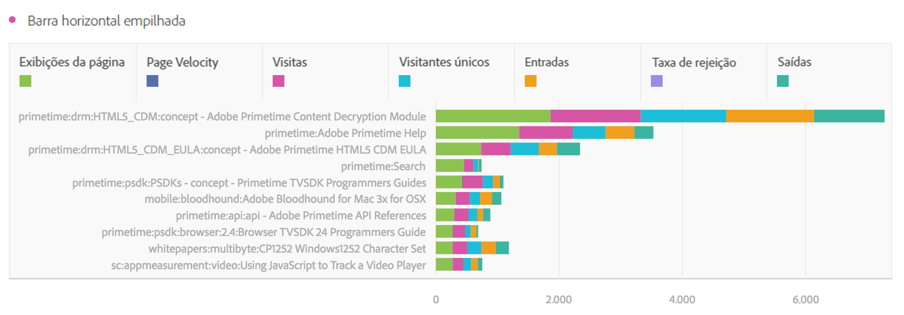

# Barra horizontal (empilhada)

>[!BEGINSHADEBOX]

_Este artigo documenta a barra horizontal e as visualizações de barra horizontal empilhada no_  _**Adobe Analytics**._ _Consulte [Barra horizontal e barra horizontal empilhada](https://experienceleague.adobe.com/pt-br/docs/analytics-platform/using/cja-workspace/visualizations/horizontal-bar) para a versão_  _**Customer Journey Analytics** deste artigo._

>[!ENDSHADEBOX]

A visualização da barra horizontal tem uma opção padrão e empilhada.

## Barra horizontal {#horizontal-bar}

<!-- markdownlint-disable MD034 -->

>[!CONTEXTUALHELP]
>id="workspace_horizontalbar_button"
>title="Barra horizontal"
>abstract="Crie uma visualização de barra horizontal para representar vários valores em uma ou mais métricas."

<!-- markdownlint-enable MD034 -->

A visualização  **[!UICONTROL Barra horizontal]** mostra barras horizontais que representam vários valores em uma ou mais métricas.

## Barra horizontal empilhada {#horizontal-bar-stacked}

<!-- markdownlint-disable MD034 -->

>[!CONTEXTUALHELP]
>id="workspace_horizontalbarstacked_button"
>title="Barra horizontal empilhada"
>abstract="Crie uma visualização de barra horizontal para representar vários valores em uma ou mais métricas empilhadas."

<!-- markdownlint-enable MD034 -->

A visualização  **[!UICONTROL Barra horizontal empilhada]** é como a [!UICONTROL Barra horizontal], mas as barras da série aparecem empilhadas.

Use a opção **[!UICONTROL 100% empilhado]** em  **[!UICONTROL Configurações]** para transformar o gráfico em uma visualização 100% empilhada.

>[!MORELIKETHIS]
>
>[Adicionar uma visualização a um painel](/help/analyze/analysis-workspace/visualizations/freeform-analysis-visualizations.md#add-visualizations-to-a-panel)
>[Configurações de visualização](/help/analyze/analysis-workspace/visualizations/freeform-analysis-visualizations.md#settings)
>[Menu de contexto da visualização](/help/analyze/analysis-workspace/visualizations/freeform-analysis-visualizations.md#context-menu)
>

