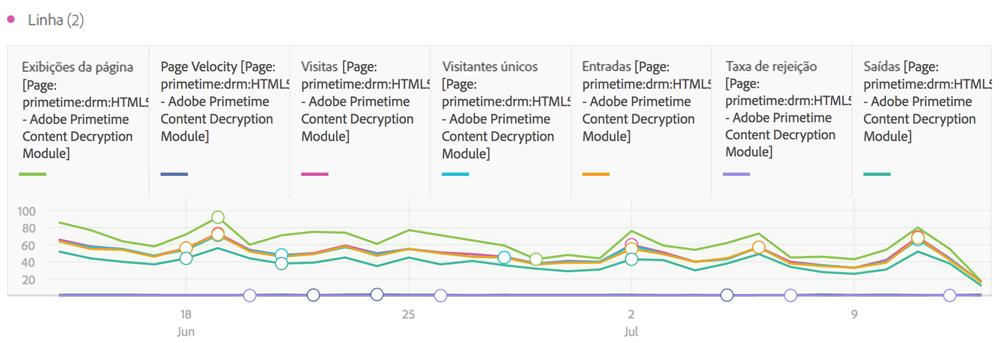

# Linha

Esta visualização representa as métricas que usam uma linha para mostrar como os valores são alterados em um período de tempo. Um gráfico de linha pode ser usado apenas quando o horário for usado como uma dimensão.

Uma opção suspensa de granularidade nas [configurações de visualização](/help/analyze/analysis-workspace/visualizations/freeform-analysis-visualizations.md#section_D3BB5042A92245D8BF6BCF072C66624B) permite alterar uma visualização com tendência (por exemplo, linha, barra) de diária para semanal, mensal etc.

