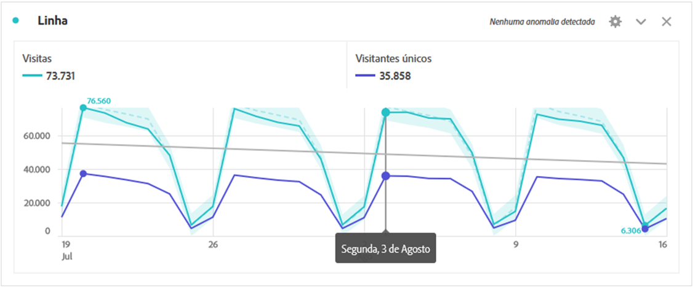
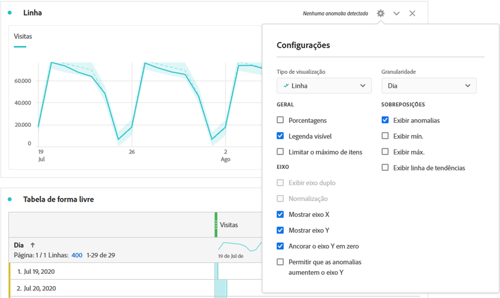
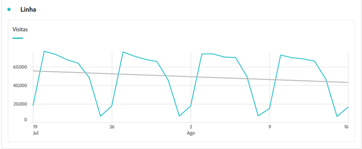

# Linha

A visualização de linha representa as métricas que usam uma linha para mostrar como os valores são alterados em um período. Um gráfico de linha pode ser usado apenas quando o horário for usado como uma dimensão.

Clique no ícone de engrenagem na parte superior direita da visualização de linha para acessar as [**Configurações de visualização**](freeform-analysis-visualizations.md) disponíveis. As configurações são categorizadas em:

* **Geral**: configurações comuns em tipos de visualização
* **Eixo**: configurações que afetam o eixo x ou y da visualização de linha
* **Sobreposições**: opções para adicionar contexto adicional à série mostrada na visualização de linha.

## Alterar granularidade

Uma opção suspensa de granularidade nas [configurações de visualização](freeform-analysis-visualizations.md) permite alterar uma visualização com tendência (por exemplo, linha, barra) de diária para semanal, mensal etc. A granularidade também é atualizada na tabela da fonte de dados.

## Mostrar mín. ou máx.

Em **[!UICONTROL Configurações de visualização]** > **[!UICONTROL Sobreposições]** > **[!UICONTROL Mostrar mín/máx]**, você pode sobrepor um rótulo de valor mínimo e máximo para realçar rapidamente os picos e vales em uma métrica. Observação: Os valores min/max são derivados dos pontos de dados visíveis na visualização, não do conjunto completo de valores dentro de uma dimensão.

## Mostrar sobreposição de linha de tendência

Under **[!UICONTROL Visualization Settings]** > **[!UICONTROL Overlays]** > **[!UICONTROL Show trendline]**, you can choose to add a regression or moving average trendline to your line series. As linhas de tendência ajudam a descrever um padrão mais claro nos dados.

>[!TIP]
>
>Recomendamos que as linhas de tendência sejam aplicadas aos dados que não incluem hoje (dados parciais) ou datas futuras, já que isso distorcerá a linha de tendência. No entanto, se você precisar incluir datas futuras, remova zeros dos dados para evitar inclinações para esses dias. Para fazer isso, vá para a tabela de fonte de dados da visualização e escolha sua coluna de métrica. Em seguida, vá para Configurações [!UICONTROL de] coluna e marque **[!UICONTROL Interpretar zero como nenhum valor]**.)

Todas as tendências do modelo de regressão são são ajustadas usando quadrados mínimos normais:

| Modelo | Descrição |
| --- | --- |
| Linear | Cria uma linha reta de melhor ajuste para conjuntos de dados lineares simples e é útil quando os dados aumentam ou diminuem a uma taxa estável. Equação: `y = a + b * x` |
| Logarítmico | Cria uma linha curva de melhor ajuste e é útil quando a taxa de alteração nos dados aumenta ou diminui rapidamente e, em seguida, nivela. Uma linha de tendência logarítmica pode usar valores negativos e positivos. Equação: `y = a + b * log(x)` |
| Exponencial | Cria uma linha curva e é útil quando os dados aumentam ou caem em taxas constantemente crescentes. Essa opção não deve ser usada se os dados contiverem valores zero ou negativos. Equação: `y = a + e^(b * x)` |
| Potência | Cria uma linha curva e é útil para conjuntos de dados que comparam medidas que aumentam a uma taxa específica. Essa opção não deve ser usada se os dados contiverem valores zero ou negativos. Equação: `y = a * x^b` |
| Quadrático | Encontra o melhor ajuste para um conjunto de dados em forma de parábola (côncavo para cima ou para baixo). Equação: `y = a + b * x + c * x^2` |
| Média móvel | Cria uma linha de tendência suave com base em um conjunto de médias. Os exemplos incluem média móvel de 7 dias ou média móvel de 4 semanas. Também conhecida como uma média móvel, uma média móvel calcula a média de um intervalo anterior, usa isso como ponto de dados da linha de tendência e, em seguida, move para o próximo período para repetir. A entrada &#39;Períodos&#39; define o intervalo para calcular a média. |
