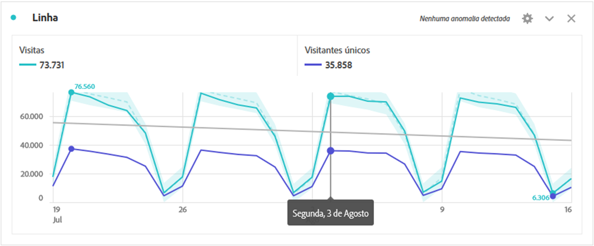
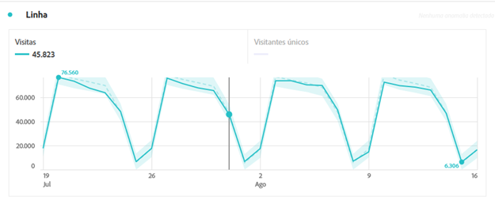
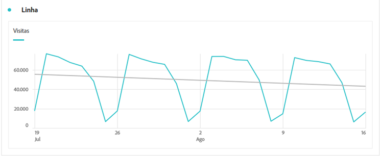

# Linha {#line}

<!-- markdownlint-disable MD034 -->

>[!CONTEXTUALHELP]
>id="workspace_line_button"
>title="Linha"
>abstract="Crie uma visualização de linha que mostre como os valores são alterados durante um período. Uma visualização de linha só pode ser usada quando o tempo é usado como uma dimensão."

<!-- markdownlint-enable MD034 -->

>[!BEGINSHADEBOX]

_Este artigo documenta a visualização de Linha no_  _&#x200B;**Adobe Analytics**._ _Consulte a [Linha](https://experienceleague.adobe.com/pt-br/docs/analytics-platform/using/cja-workspace/visualizations/line) para a versão_  _&#x200B;**Customer Journey Analytics** deste artigo._

>[!ENDSHADEBOX]

A visualização de  **[!UICONTROL Linha]** representa as métricas que usam uma linha para mostrar como os valores mudam em um período. Uma visualização de linha pode ser usada apenas quando o horário é usado como uma dimensão.

## Configurações

Como parte das [configurações de visualização](freeform-analysis-visualizations.md#settings), configurações específicas de visualização de linha estão disponíveis.

| Configuração | Descrição |
|---|---|
| **[!UICONTROL Granularidade]** | Selecione na lista suspensa de granularidade para alterar uma visualização de tendência de diária para semanal, mensal etc. A granularidade também é atualizada na tabela da fonte de dados. |
| **[!UICONTROL Mostrar mín.]**  **[!UICONTROL Mostrar máx.]** | É possível sobrepor um rótulo de valores mínimo e máximo para realçar os valores mínimo e máximo de uma métrica. Observação: os valores mín./máx. são derivados dos pontos de dados visíveis na visualização, não do conjunto completo de valores de uma dimensão.  |
| **[!UICONTROL Mostrar linha de tendências]** | É possível optar por adicionar uma regressão ou linha de tendências de média móvel à sua série de linhas. As linhas de tendências ajudam a descrever um padrão mais claro nos dados. Uma vez selecionadas, escolha um modelo na lista. Consulte [Modelos](#models) para obter uma visão geral e uma descrição dos modelos disponíveis. .
**DICA** Recomenda-se que linhas de tendência sejam aplicadas a dados que não incluem hoje (dados parciais) ou datas futuras. As datas de hoje ou futuras distorcem a linha de tendências. No entanto, se você precisar incluir datas futuras, remova zeros dos dados para evitar distorções nesses dias. Para isso, acesse a tabela de fontes de dados da visualização, escolha a coluna de métrica e habilite a opção **[!UICONTROL Configurações de coluna]** > **[!UICONTROL Interpretar zero como nenhum valor]**.
 |

### Modelos

Todas as linhas de tendência do modelo de regressão são ajustadas usando mínimos quadrados comuns:

| Modelo | Descrição |
| --- | --- |
| **[!UICONTROL Linear]** | Cria uma linha reta de melhor ajuste para conjuntos de dados lineares simples e é útil quando os dados aumentam ou diminuem a uma taxa estável. Equação: `y = a + b * x` |
| **[!UICONTROL Logarítmico]** | Cria uma linha curva de melhor ajuste e é útil quando a taxa de alteração dos dados aumenta ou diminui rapidamente, e então fica nivelada. Uma linha de tendência logarítmica pode usar valores negativos e positivos. Equação: `y = a + b * log(x)` |
| **[!UICONTROL Exponencial]** | Cria uma linha curva e é útil quando os dados aumentam ou caem a taxas constantemente crescentes. Essa opção não deve ser usada se os dados contiverem valores zero ou negativos. Equação: `y = a + e^(b * x)` |
| **[!UICONTROL Potência]** | Cria uma linha curva e é útil para conjuntos de dados que comparam medidas que aumentam a uma taxa específica. Essa opção não deve ser usada se os dados contiverem valores zero ou negativos. Equação: `y = a * x^b` |
| **[!UICONTROL Quadrático]** | Encontra o melhor ajuste para um conjunto de dados em forma de parábola (côncavo para cima ou para baixo). Equação: `y = a + b * x + c * x^2` |
| **[!UICONTROL Média móvel]** | Cria uma linha de tendências suave com base em um conjunto de médias. Também conhecida como média variável, uma média móvel usa uma quantidade específica de pontos de dados (determinada pela seleção de [!UICONTROL Granularidade]), calcula a média entre eles e usa essa média como um ponto na linha. Os exemplos incluem média móvel de sete dias ou uma média móvel de quatro semanas. |

>[!MORELIKETHIS]
>
>[Adicionar uma visualização a um painel](/help/analyze/analysis-workspace/visualizations/freeform-analysis-visualizations.md#add-visualizations-to-a-panel)
>[Configurações de visualização](/help/analyze/analysis-workspace/visualizations/freeform-analysis-visualizations.md#settings)
>[Menu de contexto da visualização](/help/analyze/analysis-workspace/visualizations/freeform-analysis-visualizations.md#context-menu)
>

