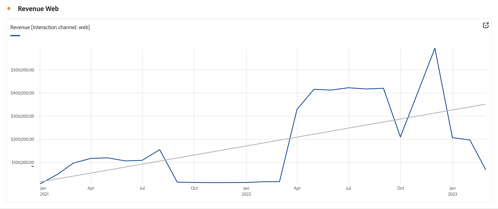

# Linha {#line}

<!-- markdownlint-disable MD034 -->

>[!CONTEXTUALHELP]
>id="workspace_line_button"
>title="Linha"
>abstract="Crie uma visualização de linha que mostre como os valores são alterados durante um período. Uma visualização de linha só pode ser usada quando o tempo é usado como uma dimensão."

<!-- markdownlint-enable MD034 -->

>[!BEGINSHADEBOX]

_Este artigo documenta a Visualização de linha no_  _**Adobe Analytics**._ _Consulte a [Linha](https://experienceleague.adobe.com/en/docs/analytics-platform/using/cja-workspace/visualizations/line) da_  _**Customer Journey Analytics** versão deste artigo._

>[!ENDSHADEBOX]

A visualização  **[!UICONTROL Line]** representa as métricas usando uma linha para mostrar como os valores são alterados em um período. Uma visualização de linha pode ser usada somente quando o horário é usado como uma dimensão.

## Configurações 

Como parte das [configurações de visualização](freeform-analysis-visualizations.md#settings), configurações específicas de visualização de linha estão disponíveis.

| Configuração | Descrição |
|---|---|
| **[!UICONTROL Granularidade]** | Selecione na lista suspensa de granularidade para alterar uma visualização de tendência de diária para semanal, mensal etc. A granularidade também é atualizada na tabela da fonte de dados. |
| **[!UICONTROL Mostrar mín]**  **[!UICONTROL Mostrar máx ]** | É possível sobrepor um rótulo de valor mínimo e máximo para realçar os valores mínimo e máximo em uma métrica. Os valores mín./máx. são derivados dos pontos de dados visíveis na visualização, não do conjunto completo de valores em uma dimensão.  |
| **[!UICONTROL Mostrar linha de tendência]** | É possível optar por adicionar uma regressão ou uma linha de tendência de média móvel à sua série de linhas. As linhas de tendência ajudam a descrever um padrão mais claro nos dados. Quando selecionado, selecione um modelo na lista. Consulte [Modelos](#models) para obter uma visão geral e uma descrição dos modelos disponíveis. . |

>[!TIP]
>
>Recomenda-se que linhas de tendência sejam aplicadas a dados que não incluem hoje (dados parciais) ou datas futuras. As datas de hoje ou no futuro distorcem a linha de tendência. No entanto, se você precisar incluir datas futuras, remova zeros dos dados para evitar distorções nesses dias. Vá para a tabela de fonte de dados da visualização, escolha a coluna de métrica e habilite **[!UICONTROL Configurações de coluna]** > **[!UICONTROL Interpretar zero como nenhum valor]**.

### Modelos

Todas as linhas de tendência do modelo de regressão são ajustadas usando mínimos quadrados comuns:

| Modelo | Descrição |
| --- | --- |
| **[!UICONTROL Linear]** | Crie uma linha reta de melhor ajuste para conjuntos de dados lineares simples e seja útil quando os dados aumentarem ou diminuírem a uma taxa estável. Equação: `y = a + b * x` |
| **[!UICONTROL Logarítmico]** | Criar uma linha curva de melhor ajuste e é útil quando a taxa de alteração nos dados aumenta ou diminui rapidamente e, em seguida, nivela. Uma linha de tendência logarítmica pode usar valores negativos e positivos. Equação: `y = a + b * log(x)` |
| **[!UICONTROL Exponencial]** | Criar uma linha curva e é útil quando os dados aumentam ou caem em taxas constantemente crescentes. Essa opção não deve ser usada se os dados contiverem valores zero ou negativos. Equação: `y = a + e^(b * x)` |
| **[!UICONTROL Potência]** | Criar uma linha curva e é útil para conjuntos de dados que comparam medidas que aumentam a uma taxa específica. Essa opção não deve ser usada se os dados contiverem valores zero ou negativos. Equação: `y = a * x^b` |
| **[!UICONTROL Quadrático]** | Encontra o melhor ajuste para um conjunto de dados em forma de parábola (côncavo para cima ou para baixo). Equação: `y = a + b * x + c * x^2` |
| **[!UICONTROL Média móvel]** | Crie uma linha de tendência suave com base em um conjunto de médias. Também conhecida como média variável, uma média móvel usa um número específico de pontos de dados (determinado por sua seleção de [!UICONTROL Granularidade]), calcula a média deles e usa a média como um ponto na linha. Os exemplos incluem uma média móvel de sete dias ou uma média móvel de quatro semanas. |

>[!MORELIKETHIS]
>
>[Adicionar uma visualização a um painel](/help/analyze/analysis-workspace/visualizations/freeform-analysis-visualizations.md#add-visualizations-to-a-panel)
>[Configurações de visualização](/help/analyze/analysis-workspace/visualizations/freeform-analysis-visualizations.md#settings)
>[Menu de contexto de visualização](/help/analyze/analysis-workspace/visualizations/freeform-analysis-visualizations.md#context-menu)
>

