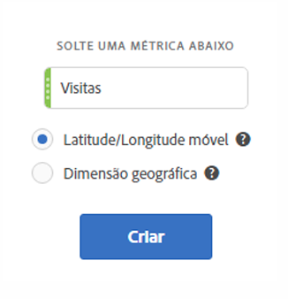
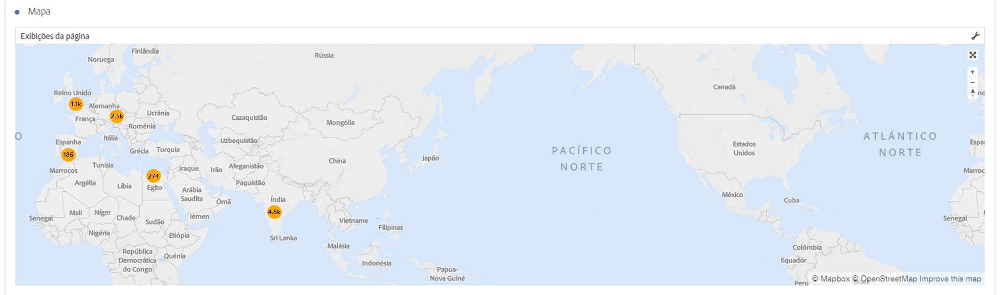
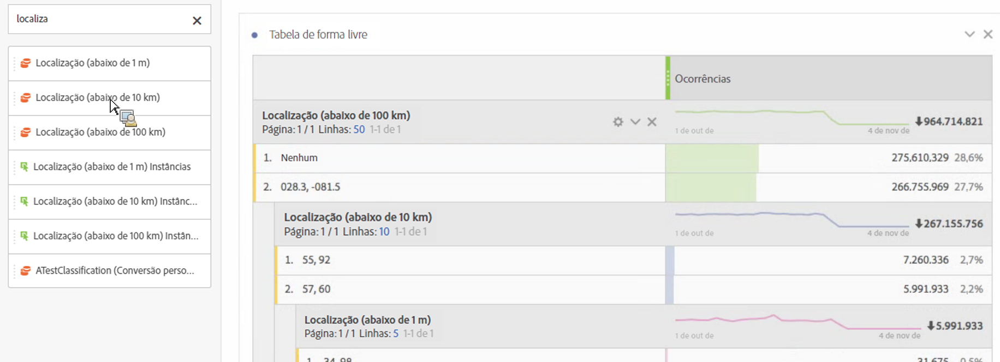
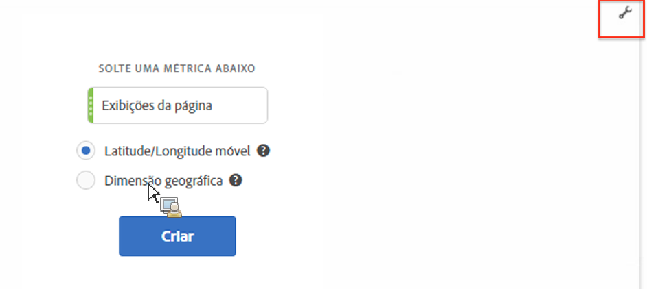

# Mapa

## Visão geral {#section_19F740FAF08D47B1AF1EF239A74FC75C}

A visualização de mapa na Analysis Workspace

* Permite criar um mapa visual de qualquer métrica (incluindo métricas calculadas).
* É útil para identificar e comparar dados de métrica em diferentes regiões geográficas.
* Pode suportar 2 fontes de dados: latitude/longitude de uso móvel ou dimensão geográfica para uso na Web.
* Suporta exportação de PDF.
* Aproveita WebGL para exibição de gráficos. Se os drivers de gráficos não suportarem a renderização de WebGL, talvez seja necessário atualizá-los.

## Build a map visualization {#section_61BBFA3A7BFD48DA8D305A69D9416299}

1. Na lista de visualizações, solte o **[!UICONTROL Mapa]em um painel de Forma livre:**

   

1. Arraste uma métrica da lista de métricas (incluindo métricas calculadas).
1. Especifique a fonte de dados da qual deseja desenhar. (Esta caixa de diálogo só será exibida se você tiver um rastreamento de localização ativado para os dados do aplicativo móvel.)

<table id="table_CD54B433464B4282A7524FB187016C47"> 
 <tbody> 
  <tr> 
   <td colname="col1"> 
<b>Lat/long móveis</b> 
 </td> 
   <td colname="col2"> 
Esta opção representa dados do aplicativo móvel. 
 
Você verá esta opção se ela estiver ativada para o conjunto de relatórios em Analytics &gt; Admin &gt; Conjuntos de relatórios &gt; &lt;selecionar conjunto de relatórios&gt; &gt; Editar configurações &gt; Gerenciamento móvel &gt; Ativar rastreamento de localização  . 
 
Esta é a configuração padrão (caso o rastreamento de localização esteja ativado). 
 </td> 
  </tr> 
  <tr> 
   <td colname="col1"> 
<b>Dimensão geográfica</b> 
 </td> 
   <td colname="col2"> 
Esta opção representa dados de segmentação geográfica sobre a localização do visitante com base no endereço IP do visitante. Esses dados são transformados em País, Região e Cidade. Observe que eles não atingem o nível de DMA ou Código Postal. 
 
Quase todos os conjuntos de relatórios têm essa dimensão ativada. Se o seu não tiver, entre em contato com o Atendimento ao cliente da Adobe para ativar os relatórios geográficos. 
 </td> 
  </tr> 
 </tbody> 
</table>

1. Clique em **[!UICONTROL Construir]**.

   A primeira exibição será uma exibição do mundo com um mapa de propagação, semelhante a este.

   

1. Agora você pode

   * **Aplicar zoom** neste mapa para aumentar determinadas áreas ao clicar duas vezes no mapa ou usar a roda de rolagem. O zoom do mapa muda conforme a localização do cursor. Por meio da interação de zoom, a dimensão necessária (país &gt; estado &gt; cidade) é automaticamente atualizada, de acordo com o nível de zoom.
   * **Comparar** duas ou mais visualizações de mapa no mesmo projeto ao colocá-las lado a lado.
   * **Mostrar comparações periódicas (anuais (year-over-year), por exemplo)**:

      * Mostrar números negativos: por exemplo, se estiver traçando uma métrica anual, o mapa pode apresentar -33% em Nova York.
      * Com métricas do tipo “percentual”, o clustering faz uma média das porcentagens.
      * Um esquema de cores verde/vermelho: Positivo/Negativo
   * **Girar** o mapa em 2D ou 3D ao manter pressionada a tecla [!UICONTROL Ctrl] e mover o mapa.

   * **Alternar** para uma exibição diferente, como mapa de calor, usando as [configurações](../../../analyze/analysis-workspace/visualizations/map-visualization.md#section_5F89C620A6AA42BC8E0955478B3A427E) descritas abaixo. Observe que a exibição de propagação é a configuração padrão.

1. **Salve** o projeto para salvar todas as configurações do mapa (coordenadas, zoom, rotação).
1. A tabela de forma livre, abaixo da visualização, pode ser preenchida ao arrastar nas métricas e dimensões de localização do painel esquerdo:

   

## Map visualization settings {#section_5F89C620A6AA42BC8E0955478B3A427E}

Existem 2 conjuntos de configurações para o Mapa:

O **ícone de chave** no lado superior direito retorna a caixa de diálogo inicial onde você pode alterar a métrica e a fonte de dados:

Se você clicar no **ícone de engrenagem**, aparecerão as configurações de visualização a seguir:

| Configuração | Descrição |
|--- |--- |
| Propagações | Faz a plotagem de eventos usando propagações. Um gráfico de propagação é um gráfico de muitas variáveis, que é um cruzamento entre um gráfico de dispersão e um gráfico de área proporcional. Esta é a exibição padrão. |
| Mapa de calor | Faz a plotagem de eventos usando um mapa de calor. Um mapa de calor é uma representação gráfica de dados onde os valores individuais contidos em uma matriz são representados como cores. |
| Estilos: Tema de cores | Mostra o esquema de cor do mapa de calor e das propagações. Você pode optar por Coral, Vermelho, Verde ou Azul. O padrão é Coral. |
| Estilos: Estilo do mapa | É possível optar por Básico, Ruas, Brilho, Claro, Escuro e Satélite. |
| Raio do cluster | Agrupa os pontos de dados que estão dentro do número especificado de pixels. O padrão é 50. |
| Valor máximo personalizado | Permite alterar o limite para o valor máximo do mapa; ajustar esse valor ajusta a escala para os valores de propagações/mapa de calor (cor e tamanho) relativos ao valor máximo personalizado definido. |