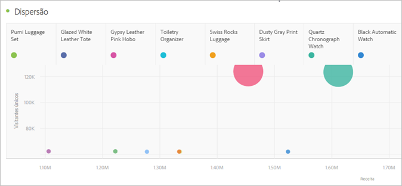

# Dispersão {#scatter}

<!-- markdownlint-disable MD034 -->

>[!CONTEXTUALHELP]
>id="workspace_scatter_button"
>title="Dispersão"
>abstract="Crie uma visualização de dispersão que mostre a relação entre itens de dimensão e até três métricas."

<!-- markdownlint-enable MD034 -->

>[!BEGINSHADEBOX]

_Este artigo documenta a exibição de Dispersão no_  _&#x200B;**Adobe Analytics**._ _Consulte [Dispersão](https://experienceleague.adobe.com/pt-br/docs/analytics-platform/using/cja-workspace/visualizations/scatterplot) para a versão_  _&#x200B;**Customer Journey Analytics** deste artigo._

>[!ENDSHADEBOX]

A visualização  **[!UICONTROL Dispersão]** ajuda a identificar correlações e padrões entre métricas diferentes em seus dados. A visualização mostra a relação entre itens de dimensão e até três métricas. A visualização requer três componentes e permite a visualização de até quatro componentes.

* O componente de linha (geralmente uma dimensão) representa cada ponto no gráfico. Linhas diferentes são exibidas como pontos coloridos distintos.
* A coluna mais à esquerda (geralmente uma métrica) representa a posição do ponto no eixo Y (vertical).
* A segunda coluna representa a posição do ponto no eixo X (horizontal).
* A terceira coluna determina o raio do ponto.
* Todas as colunas subsequentes em uma tabela de forma livre são ignoradas pela visualização do gráfico de dispersão.

>[!BEGINSHADEBOX]

Consulte  [VIsualização de dispersão](https://experienceleague.adobe.com/pt-br/docs/analytics-learn/tutorials/analysis-workspace/visualizations/scatterplot-visualization){target="_blank"} para assistir a um vídeo de demonstração.

>[!ENDSHADEBOX]

>[!NOTE]
>
>Quando você [configura a legenda para ser visível](/help/analyze/analysis-workspace/visualizations/freeform-analysis-visualizations.md#settings) na dispersão, a legenda só é exibida quando a fonte de dados contém um número limitado de itens de dimensão (selecionados).

>[!MORELIKETHIS]
>
>[Adicionar uma visualização a um painel](/help/analyze/analysis-workspace/visualizations/freeform-analysis-visualizations.md#add-visualizations-to-a-panel)
>[Configurações de visualização](/help/analyze/analysis-workspace/visualizations/freeform-analysis-visualizations.md#settings)
>[Menu de contexto da visualização](/help/analyze/analysis-workspace/visualizations/freeform-analysis-visualizations.md#context-menu)
>
