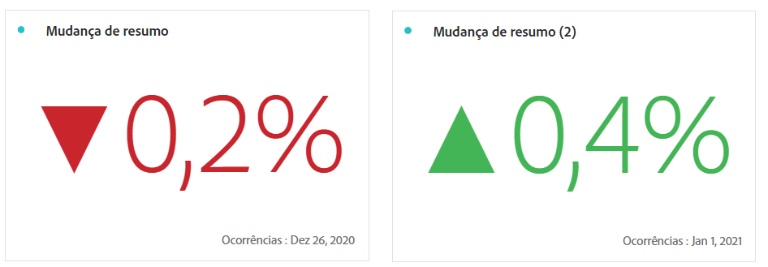

# [!UICONTROL Número do resumo] e [!UICONTROL Alteração do resumo]

_Este artigo é sobre as visualizações de número do resumo e de alteração do resumo no_  _&#x200B;**Adobe Analytics**._ _Consulte [Número do resumo e alteração do resumo](https://experienceleague.adobe.com/pt-br/docs/analytics-platform/using/cja-workspace/visualizations/summary-number-change) para ver a versão do_  _&#x200B;**Customer Journey Analytics** deste artigo._

>[!BEGINSHADEBOX]

Consulte  [Visualização de número do resumo e alteração do resumo](https://video.tv.adobe.com/v/335564/?quality=12){target=&#34;_blank&#34;} para assistir a um vídeo de demonstração.

>[!ENDSHADEBOX]

## Visualização do [!UICONTROL número do resumo] {#summary-number}

<!-- markdownlint-disable MD034 -->

>[!CONTEXTUALHELP]
>id="workspace_summarynumber_button"
>title="Número do resumo"
>abstract="Crie uma visualização que mostre totais e subtotais."

<!-- markdownlint-enable MD034 -->

Use a visualização de  **[!UICONTROL alteração do resumo]** para exibir o delta (alteração) entre dois números. <!-- This is applicable for AA, not CJA: The green and red color of the Summary Change can be controlled through [custom event polarity](https://experienceleague.adobe.com/docs/analytics/admin/admin-tools/success-events/success-event.html?lang=pt-BR) or a calculated metric's [Show Upward Trend As](https://experienceleague.adobe.com/docs/analytics/components/calculated-metrics/calcmetric-workflow/cm-build-metrics.html?lang=pt-BR) option.-->

<!--
The green and red color of the Summary Change can be controlled through [custom event polarity](https://experienceleague.adobe.com/docs/analytics/admin/admin/c-manage-report-suites/c-edit-report-suites/conversion-var-admin/c-success-events/success-event.md) or a calculated metric's [Show Upward Trend As](https://experienceleague.adobe.com/docs/analytics/components/calculated-metrics/calcmetric-workflow/cm-build-metrics.html?lang=pt-BR) option.
-->

Essa visualização se comporta das seguintes maneiras:

* Se nenhuma célula estiver selecionada, compara os dois primeiros valores de célula na coluna.
* Se uma célula estiver selecionada, exibe 0, pois compara o valor da célula a ele mesmo.
* Se duas células estiverem selecionadas, a primeira célula selecionada é tomada como o numerador e a segunda como o denominador.
* Se mais de duas células estiverem selecionadas, considera apenas as duas primeiras para comparação.
* Se um intervalo de células estiver selecionado, compara a primeira com a última célula selecionada no intervalo.
* Se a coluna estiver selecionada, compara o primeiro valor a si mesmo, mostrando uma alteração de 0.

Como parte das configurações de visualização, existem **[!UICONTROL Opções de alteração do resumo]** específicas.

| Opção | Definição |
|--- |--- |
| **[!UICONTROL Mostrar variação percentual]** | Mostrar a variação percentual entre os dois números. |
| **[!UICONTROL Mostrar diferença bruta]** | Mostrar a diferença bruta entre os dois números. Também é possível abreviar valores e mostrar até 3 casas decimais com essa opção. |
| **[!UICONTROL Abreviar valor]** | Selecione **[!UICONTROL Abreviar valor]** para abreviar de forma inteligente o valor alterado. Quando selecionado, insira um número para definir a quantidade de abreviação. Por exemplo: <table><tr><td>**Valor original**</td><td>**Valor de abreviação**</td><td>**Resultado**</td></tr><tr><td>US$ 12.011.141,25</td><td>Não selecionado</td><td  align="right">US$ 12.011.141,25</td></tr><tr><td>US$ 12.011.141,25</td><td>Selecionado e definido como `0`</td><td align="right">US$ 12 milhões</td></tr><tr><td>US$ 12.011.141,25</td><td> Selecionado e definido como `1`</td><td  align="right">US$ 12,0 milhões</td></tr><tr><td>US$ 12.011.141,25</td><td>Selecionado e definido como `2`</td><td align="right">US$ 12,01 milhões</td></tr><tr><td>US$ 12.011.141,25</td><td>Selecionado e definido como `3`</td><td align="right">US$ 12,011 milhões</td></tr></table> |

>[!MORELIKETHIS]
>
>[Adicionar uma visualização a um painel](/help/analyze/analysis-workspace/visualizations/freeform-analysis-visualizations.md#add-visualizations-to-a-panel)
>&#x200B;>[Configurações de visualização](/help/analyze/analysis-workspace/visualizations/freeform-analysis-visualizations.md#settings)
>&#x200B;>[Menu de contexto da visualização](/help/analyze/analysis-workspace/visualizations/freeform-analysis-visualizations.md#context-menu)
>
