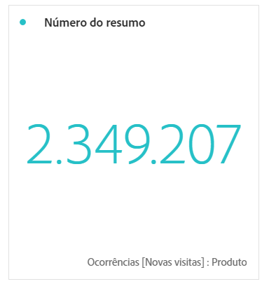

# Número do resumo e alteração do resumo

## Visualização do número de resumo

* Seleciona o total da coluna caso nenhuma célula esteja selecionada.
* Se alguma célula estiver selecionada, mostra o resumo dessa célula.
* Se mais de uma célula estiver selecionada, mostra a primeira célula selecionada.
* Se a coluna estiver selecionada, escolhe o primeiro valor de célula na coluna.

## Visualização da alteração do resumo

* Se nenhuma célula estiver selecionada, compara os dois primeiros valores de célula na coluna.
* Se uma célula estiver selecionada, exibe 0, pois compara o valor da célula a ele mesmo.
* Se duas células estiverem selecionadas, a primeira célula selecionada é tomada como o numerador e a segunda como o denominador.
* Se mais de duas células estiverem selecionadas, considera apenas as duas primeiras para comparação.
* Se um intervalo de células estiver selecionado, compara a primeira com a última célula selecionada no intervalo.
* Se a coluna estiver selecionada, compara o primeiro valor a si mesmo, mostrando uma alteração de 0.
* As cores verde e vermelho da alteração de resumo podem ser controladas por:

   * [Polaridade de evento personalizado](https://marketing.adobe.com/resources/help/pt_BR/reference/success_event.html).
   * Uma opção [Mostrar tendência ascendente como](https://marketing.adobe.com/resources/help/pt_BR/analytics/calcmetrics/cm_build_metrics.html) da métrica calculada.

## Configurações de alteração de resumo {#section_2581AC0107634FB4990AB8347E5897AA}

Clique no ícone de engrenagem próximo à visualização para definir as Configurações de resumo:

| Configuração | Definição |
|--- |--- |
| Porcentagens | Usa porcentagens em vez de números brutos. |
| Legenda visível | Mostra as métricas usadas. |
| Opções de Número de resumo: abreviar valor | É possível escolher de 0 a 3 decimais para valores abreviados. |
| Opções de Alteração de resumo: exibir alteração de percentual | Mostra a alteração, em percentual, entre os 2 números. |
| Opções de Alteração de resumo: exibir diferença bruta | Mostra a diferença bruta entre 2 números. |
