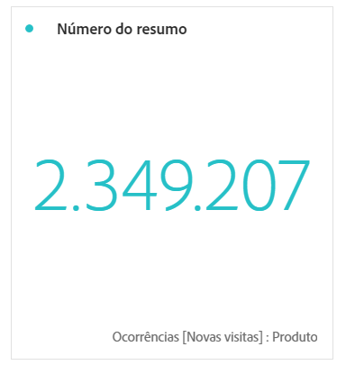
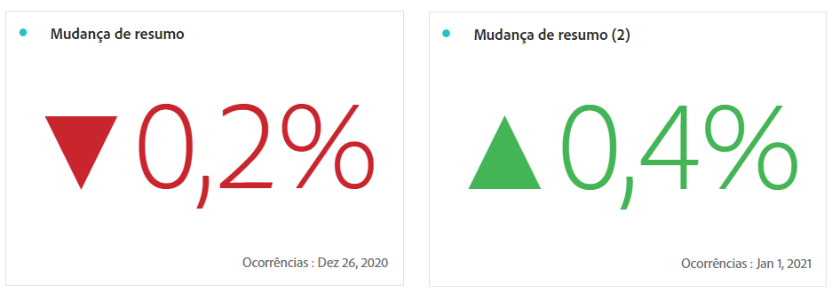

# Número do resumo e alteração

>[!BEGINSHADEBOX]

_Este artigo documenta as visualizações Número do resumo e Alteração do resumo no_  _**Adobe Analytics**._ _Consulte [Número do resumo e Alteração do resumo](https://experienceleague.adobe.com/pt-br/docs/analytics-platform/using/cja-workspace/visualizations/summary-number-change) para a versão_  _**Customer Journey Analytics** deste artigo._

>[!ENDSHADEBOX]

>[!BEGINSHADEBOX]

Consulte  [Visualização de número do resumo e alteração do resumo](https://experienceleague.adobe.com/en/docs/analytics-learn/tutorials/analysis-workspace/visualizations/summary-number-and-summary-change-visualizations-2021){target="_blank"} para assistir a um vídeo de demonstração.

>[!ENDSHADEBOX]

## Número do resumo {#summary-number}

<!-- markdownlint-disable MD034 -->

>[!CONTEXTUALHELP]
>id="workspace_summarynumber_button"
>title="Número do resumo"
>abstract="Crie uma visualização que mostre totais e subtotais."

<!-- markdownlint-enable MD034 -->

Use a visualização de   **[!UICONTROL Número do resumo]** para realçar um número grande que é importante em um projeto. Essa visualização comporta-se das seguintes maneiras, usando a fonte de dados associada:

* Seleciona o total da coluna se nenhuma célula for selecionada.
* Se uma única célula for selecionada, ela mostrará o resumo dessa célula.
* Se mais de uma célula for selecionada, ela mostrará a primeira célula selecionada.
* Se a coluna for selecionada, ela escolherá o primeiro valor de célula na coluna.

Como parte das configurações de visualização, opções específicas de número do resumo estão disponíveis.

| Opção | Definição |
|--- |--- |
| **[!UICONTROL Abreviar valor]** | Selecione **[!UICONTROL Abreviar valor]** para abreviar de forma inteligente o valor do número. Quando selecionado, insira um número para definir a quantidade de abreviação. Por exemplo: <table><tr><td>**Valor original**</td><td>**Valor de abreviação**</td><td>**Resultado**</td></tr><tr><td>$12,011,141.25</td><td>Não selecionado</td><td  align="right">$12,011,141.25</td></tr><tr><td>$12,011,141.25</td><td>Selecionado e definido como `0`</td><td align="right">US$ 12 milhões</td></tr><tr><td>$12,011,141.25</td><td> Selecionado e definido como `1`</td><td  align="right">US$ 12,0 milhões</td></tr><tr><td>$12,011,141.25</td><td>Selecionado e definido como `2`</td><td align="right">US$ 12,01 milhões</td></tr><tr><td>$12,011,141.25</td><td>Selecionado e definido como `3`</td><td align="right">US$ 12,011 milhões</td></tr></table> |
| **[!UICONTROL Resumir valor por]** | Opte por exibir o máximo, mínimo, médio, mediano ou soma para uma seleção de dados. |

## Alteração de resumo {#summary-change}

<!-- markdownlint-disable MD034 -->

>[!CONTEXTUALHELP]
>id="workspace_summarychange_button"
>title="Alteração de resumo"
>abstract="Crie uma visualização que mostre o delta (alteração) entre dois números"

<!-- markdownlint-enable MD034 -->

Use a visualização de  **[!UICONTROL Alteração do resumo]** para mostrar o delta (alteração) entre dois números. <!-- This is applicable for AA, not CJA: The green and red color of the Summary Change can be controlled through [custom event polarity](/help/admin/tools/success-events/success-event.md) or a calculated metric's [Show Upward Trend As](/help/components/calculated-metrics/workflow/cm-build-metrics.md) option.-->

<!--
The green and red color of the Summary Change can be controlled through [custom event polarity](/help/admin/tools/manage-rs/edit-settings/conversion-var-admin/c-success-events/success-event.md.md) or a calculated metric's [Show Upward Trend As](/help/components/calculated-metrics/calcmetric-workflow/cm-build-metrics.md) option.
-->

Essa visualização se comporta das seguintes maneiras:

* Se nenhuma célula for selecionada, ela comparará os dois primeiros valores da célula na coluna.
* Se uma célula for selecionada, ela mostrará 0, porque compara o valor da célula a si mesma.
* Se forem selecionadas duas células, toma-se a primeira célula selecionada como numerador e a segunda como denominador.
* Se mais de duas células forem selecionadas, ele só considerará as duas primeiras para comparação.
* Se um intervalo de células for selecionado, ele compara a primeira às últimas células selecionadas no intervalo.
* Se a coluna for selecionada, ela comparará o primeiro valor a si mesma, o que mostra uma alteração de 0.

Como parte das configurações de visualização, existem **[!UICONTROL Opções de alteração do resumo]** específicas.

| Opção | Definição |
|--- |--- |
| **[!UICONTROL Mostrar variação percentual]** | Mostrar a variação percentual entre os dois números. |
| **[!UICONTROL Mostrar diferença bruta]** | Mostrar a diferença bruta entre os dois números. Também é possível abreviar valores e mostrar até 3 casas decimais com essa opção. |
| **[!UICONTROL Abreviar valor]** | Selecione **[!UICONTROL Abreviar valor]** para abreviar de forma inteligente o valor alterado. Quando selecionado, insira um número para definir a quantidade de abreviação. Por exemplo: <table><tr><td>**Valor original**</td><td>**Valor de abreviação**</td><td>**Resultado**</td></tr><tr><td>$12,011,141.25</td><td>Não selecionado</td><td  align="right">$12,011,141.25</td></tr><tr><td>$12,011,141.25</td><td>Selecionado e definido como `0`</td><td align="right">US$ 12 milhões</td></tr><tr><td>$12,011,141.25</td><td> Selecionado e definido como `1`</td><td  align="right">US$ 12,0 milhões</td></tr><tr><td>$12,011,141.25</td><td>Selecionado e definido como `2`</td><td align="right">US$ 12,01 milhões</td></tr><tr><td>$12,011,141.25</td><td>Selecionado e definido como `3`</td><td align="right">US$ 12,011 milhões</td></tr></table> |

>[!MORELIKETHIS]
>
>[Adicionar uma visualização a um painel](/help/analyze/analysis-workspace/visualizations/freeform-analysis-visualizations.md#add-visualizations-to-a-panel)
>[Configurações de visualização](/help/analyze/analysis-workspace/visualizations/freeform-analysis-visualizations.md#settings)
>[Menu de contexto da visualização](/help/analyze/analysis-workspace/visualizations/freeform-analysis-visualizations.md#context-menu)
>
