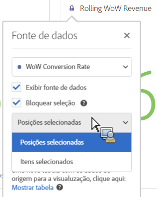

# Gerenciar fontes de dados

A sincronização de visualizações permite que você controle qual tabela de dados ou fonte de dados corresponde a uma visualização.

**Dica:** É possível saber quais visualizações estão relacionadas pela cor do ponto ao lado do título. As cores correspondentes significam que as visualizações se baseiam na mesma fonte de dados.

O gerenciamento de uma fonte de dados permite que você mostre a fonte de dados ou bloqueie a seleção. Essas configurações determinam como a visualização muda (ou não muda) quando novos dados entram.

1. [Crie um projeto](/help/analyze/analysis-workspace/build-workspace-project/t-freeform-project.md) com uma tabela de dados e uma [visualização](/help/analyze/analysis-workspace/visualizations/freeform-analysis-visualizations.md).
1. Na tabela de dados, selecione as células (fonte de dados) que você deseja associar à visualização.
1. In the visualization, click the dot next to the title to bring up the **[!UICONTROL Data Source]** dialog. Selecione **[!UICONTROL Show Data Source]** ou **[!UICONTROL Lock Selection]**.

   

   A sincronização de uma visualização em uma célula da tabela cria uma nova tabela (oculta) e codifica a cor da visualização sincronizada com essa tabela.

| Elemento | Descrição |
|--- |--- |
| Visualizações vinculadas | Se houver visualizações conectadas a uma de forma livre ou tabela de coorte, o ponto no alto à esquerda abre uma lista de visualizações conectadas com uma opção de caixa de seleção “Mostrar” para mostrar/ocultar a tabela.  Passar o mouse realça a visualização vinculada e clicar nela leva você até ela. |
| Mostrar fonte de dados | Permite mostrar (ao ativar a caixa de seleção) ou ocultar (ao desativar) a tabela de dados que corresponde à visualização. |
| Bloquear seleção | Ative essa configuração para bloquear a visualização dos dados selecionados no momento na tabela de dados correspondente. Depois de habilitado, escolha entre:  <ul><li>**Posições** selecionadas: Escolha essa opção se desejar que a visualização continue bloqueada nas posições selecionadas na tabela de dados correspondente. Essas posições continuarão a ser visualizadas, mesmo se os itens específicos nessas posições forem alterados. Por exemplo, escolha essa opção se quiser mostrar os cinco principais nomes de campanha nesta visualização o tempo todo, independentemente dos nomes de campanha que aparecerem nas cinco principais.</li> <li>**Itens** selecionados: Escolha essa opção se desejar que a visualização continue bloqueada nos itens específicos atualmente selecionados na tabela de dados correspondente. Esses itens continuarão a ser visualizados, mesmo se alterarem sua classificação entre os itens na tabela. Por exemplo, escolha essa opção se desejar mostrar os mesmos cinco nomes de campanha específicos nesta visualização o tempo todo, independentemente de onde esses nomes de campanhas sejam classificados.</li></ul> |

Essa arquitetura difere da anterior no sentido de que o Analysis Workspace já não cria uma tabela oculta duplicada que armazena a seleção bloqueada para você. Agora, a fonte de dados aponta para a tabela da qual você criou a visualização.

**Exemplo de casos de uso:**

* Você pode criar uma visualização de resumo e bloqueá-la em uma célula na tabela a partir da qual ela foi criada. Ao ativar &quot;Mostrar fonte de dados&quot;, ele mostra exatamente de onde vêm essas informações na tabela. Os dados de origem serão esmaecidos:

   >
* Você pode adicionar várias visualizações e obtê-las de diferentes células na mesma tabela, como mostrado aqui. A tabela é a mesma do exemplo acima, mas a célula de origem (e métrica) é diferente:

   >
* Você pode ver se há visualizações conectadas a uma tabela de forma livre ou de coorte clicando no ponto superior esquerdo (Configurações da fonte de dados). Passar o mouse destacará a visualização vinculada e clicar nela levará você a ela.

   >
