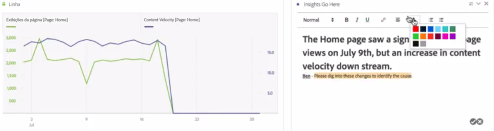
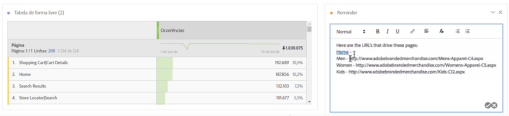

# Texto

Permite adicionar texto definido pelo usuário à Workspace.

É possível alterar as configurações de fonte (negrito, itálico e etc) e adicionar hiperlinks nas visualizações da caixa de texto e descrições do painel/visualização.

## Change font settings {#section_32727EE03FD04A8EB1D1B387DCAF6537}

Após arrastar uma visualização de texto para um painel e adicionar o texto, é possível formatá-lo adicionando níveis de cabeçalho, alterando o texto negrito/itálico/sublinhado, alterando a cor do texto etc.

## Add hyperlinks {#section_D55B857188A74A06B49006DF3511DC7C}

Destaque o texto e clique no ícone de hiperlink no menu de formatação para adicionar hiperlinks.
