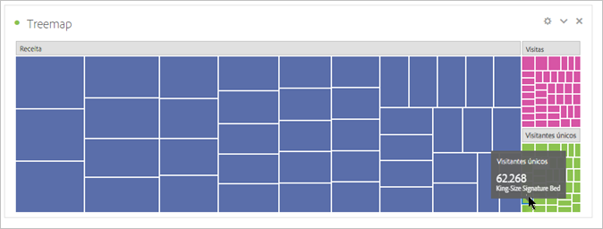

# Mapas de árvores

Exibe dados hierárquicos (estruturados em formato de árvore) como um conjunto de retângulos aninhados.

Cada galho da árvore recebe um retângulo, que é empilhado com retângulos menores representando os sub-galhos.

Quando as dimensões de cor e tamanho estão correlacionadas de alguma forma com a estrutura de árvore, é possível, frequentemente, ver padrões que seriam difíceis de enxergar de outras formas, como se determinada cor é particularmente relevante. Uma segunda vantagem dos mapas de árvore é que, por padrão, eles fazem uso eficaz do espaço.
