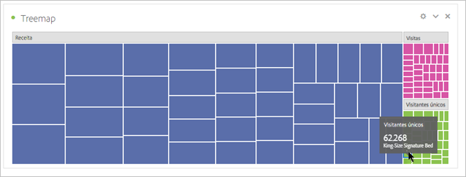

# [!UICONTROL Mapas de árvore] {#treemap}

<!-- markdownlint-disable MD034 -->

>[!CONTEXTUALHELP]
>id="workspace_treemap_button"
>title="Mapa de árvore"
>abstract="Crie uma visualização de mapa de árvore para mostrar dados hierárquicos (estruturados em árvore) com retângulos aninhados."

<!-- markdownlint-enable MD034 -->

>[!BEGINSHADEBOX]

_Este artigo documenta a visualização de Mapa de árvore no_  _&#x200B;**Adobe Analytics**._ _Consulte [Treemap](https://experienceleague.adobe.com/pt-br/docs/analytics-platform/using/cja-workspace/visualizations/treemap) para a versão_  _&#x200B;**Customer Journey Analytics** deste artigo._

>[!ENDSHADEBOX]

Use uma visualização de  **[!UICONTROL Mapa de árvore]** para exibir dados hierárquicos (estruturados em árvore) como um conjunto de retângulos aninhados.

Cada galho da árvore recebe um retângulo, que é empilhado com retângulos menores representando os sub-galhos.

Com um mapa de árvore, você pode ver padrões que seriam difíceis de detectar de outras maneiras. Usando a cor e o tamanho das dimensões, é possível descobrir como as dimensões são correlacionadas e se uma determinada dimensão é particularmente relevante. Uma segunda vantagem dos mapas de árvore é que, por padrão, eles fazem uso eficaz do espaço.

>[!BEGINSHADEBOX]

Veja  [Visualização de mapa de árvore](https://experienceleague.adobe.com/pt-br/docs/analytics-learn/tutorials/analysis-workspace/visualizations/treemap-visualization){target="_blank"} para ver um vídeo de demonstração.

>[!ENDSHADEBOX]

>[!MORELIKETHIS]
>
>[Adicionar uma visualização a um painel](/help/analyze/analysis-workspace/visualizations/freeform-analysis-visualizations.md#add-visualizations-to-a-panel)
>[Configurações de visualização](/help/analyze/analysis-workspace/visualizations/freeform-analysis-visualizations.md#settings)
>[Menu de contexto da visualização](/help/analyze/analysis-workspace/visualizations/freeform-analysis-visualizations.md#context-menu)
>
