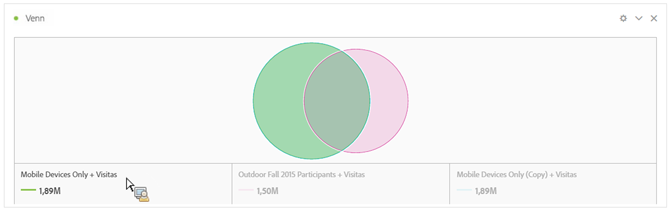
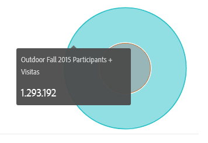
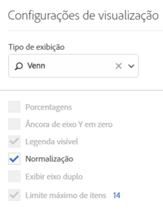

# Venn

A visualização Venn permite que você arraste até três segmentos (de Componentes) e uma métrica para criar um diagrama Venn.

Você pode passar o mouse sobre os segmentos para visualizar as porcentagens, etc.

Para transformar o diagrama de Venn em uma Tabela de forma livre, clique no ponto colorido ao lado do título **[!UICONTROL Venn]** e selecione **[!UICONTROL Gerenciar fontes de dados]** &gt; **[!UICONTROL Fontes de dados disponíveis]** &gt; **[!UICONTROL Tabela de forma livre]**.

Para normalizar o diagrama de Venn (extrair o tamanho), vá até o ícone Configurações de visualização e selecione **[!UICONTROL Normalização]**.

