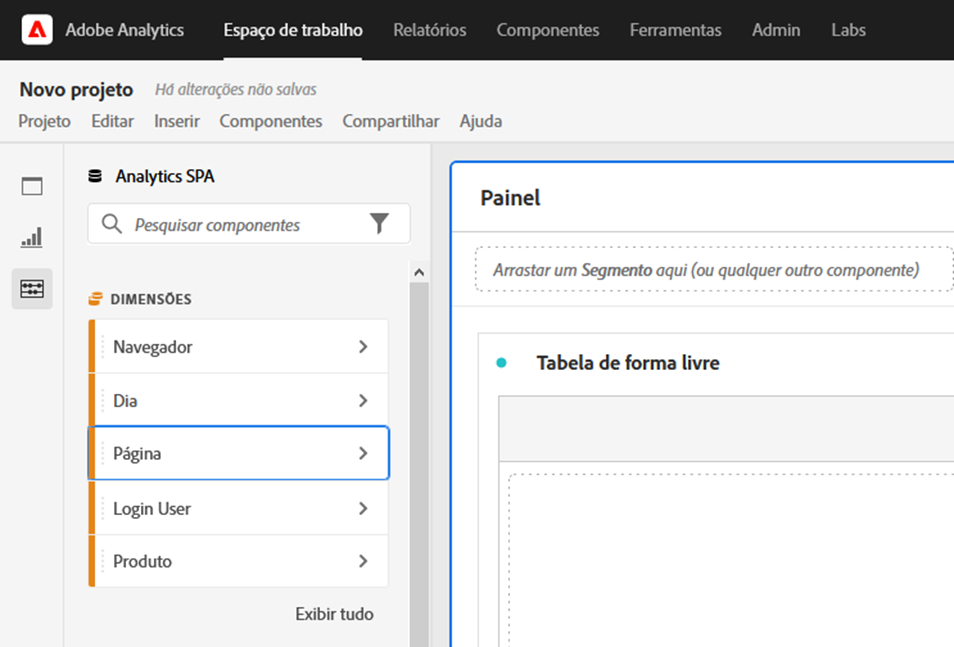
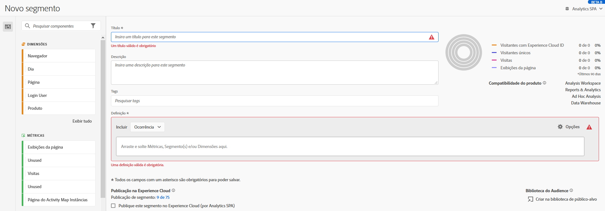

# Acessibilidade na área de trabalho da Análise

Saiba mais sobre o suporte de acessibilidade na [!UICONTROL Análise Workspace], a principal ferramenta de análise do Adobe Analytics.

Acessibilidade refere-se à utilização de produtos para pessoas com deficiências visuais, auditivas, cognitivas, motoras e outras. Exemplos de recursos de acessibilidade para produtos de software incluem suporte a leitores de tela, equivalentes de texto para gráficos, atalhos de teclado, mudança de cores de exibição para alto contraste e assim por diante.

[!UICONTROL A área de trabalho] da Análise fornece algumas ferramentas que tornam acessível para uso, incluindo:

## Navegar pelo [!UICONTROL Workspace] usando o teclado

A navegação na área de trabalho da [!UICONTROL Análise] funciona em cima > para baixo e à esquerda > à direita. Os seguintes elementos de navegação facilitam a acessibilidade:

* A `F6` tecla ativa atalhos de marcos
* A `Tab` chave se move entre elementos individuais.
* Nós aplicamos indicadores de foco para que os usuários de teclado com visão tenham uma indicação clara de qual elemento de interface do usuário tem foco no momento. O indicador é uma borda azul em torno do elemento selecionado.

   

### Navegação no teclado para interações de arrastar e soltar

[!UICONTROL A área de trabalho] da Análise é uma interface de usuário de arrastar e soltar. No entanto, os usuários podem adicionar componentes usando o teclado em vez disso:

1. Pressione para um componente no painel esquerdo.
1. Pressione `Enter` para selecionar.
1. Use as teclas de seta para navegar até a área onde deseja soltar o componente.
1. Pressione `Enter` para posicionar o componente.

### Atalhos de teclado (teclas de atalho)

[!UICONTROL Análise Workspace] oferta um conjunto avançado de atalhos [de](https://docs.adobe.com/content/help/pt-BR/analytics/analyze/analysis-workspace/build-workspace-project/fa-shortcut-keys.html) teclado para um fluxo de trabalho mais simples. Alguns atalhos comuns para navegação, criação de análises e democratização do insight estão listados abaixo.

#### Navegação

| Atalho | Ação |
|---|---|
| Alt + Shift + 1 / 2 / 3 | Ir para diferentes trilhos: [!UICONTROL Painéis], [!UICONTROL Visualizações]ou [!UICONTROL Componentes] |
| Alt + seta para a esquerda/direita | Navegar entre painéis |
| Alt + M | Recolher/expandir todos os painéis |
| Alt+ Ctrl + M | Recolher/expandir o painel ativo |
| Ctrl + / | Pesquisar painel esquerdo |

#### criação de Análises

| Atalho | Ação |
|---|---|
| Alt + 1 | Nova tabela de forma livre |
| Ctrl + Shift + C | Nova métrica calculada |
| Ctrl + Shift + D | Novo intervalo de datas |
| Ctrl + Shift + E | Novo segmento |
| Ctrl + Z | Recurso Desfazer |
| Deslocamento de retenção (na área de controle do segmento do painel) | Criar um filtro [suspenso](https://docs.adobe.com/content/help/en/analytics-learn/tutorials/analysis-workspace/using-panels/using-drop-down-filters.html) |

#### Democratização

| Atalho | Ação |
|---|---|
| Ctrl + S | Salvar |
| Ctrl + Shift + G | Preparar |
| Ctrl + G | Compartilhar |
| Alt + Shift + S | Agendar |
| Alt + L | Obter link para o projeto |
| Ctrl + Shift + B | Baixar o PDF |

## Suporte para leitores de tela e ampliadores de tela

Um leitor de tela lê o texto que aparece na tela do computador. Ele também lê informações não textuais, como rótulos de botões ou descrições de imagens no aplicativo, fornecidas em tags de acessibilidade ou atributos.

## Paletas de cores e contraste

[!UICONTROL A área de trabalho] da Análise procura conformidade com WCAG 2.1 AA, incluindo requisitos para contraste de cores.

Além disso, os usuários podem definir sua própria paleta de cores preferencial para um projeto em **[!UICONTROL Projeto]** > Configurações **** do projeto > Paleta [de cores](https://docs.adobe.com/content/help/en/analytics/analyze/analysis-workspace/build-workspace-project/color-palettes.html)do projeto.

## Validação de campo necessária nos construtores de componentes

Ao criar um componente, os campos obrigatórios são validados ao salvar. Se um campo obrigatório não passar na validação, ele será contornado em vermelho com um ícone de erro. Uma descrição escrita é exibida do problema que precisa ser corrigido.

Depois que um componente é totalmente validado, pressionar `Save` fecha o construtor.

## Suporte para recursos de acessibilidade do sistema operacional

A área de trabalho da Análise suporta recursos de acessibilidade do MS Windows e do MacOS incorporados, como modo de alto contraste, teclas adesivas e teclas lentas/teclas de filtro. Ele também fornece informações sobre a interface do usuário para o sistema operacional para permitir a interação com tecnologias de assistência, incluindo leitores de tela como VoiceOver para macOS e NVDA no Windows.