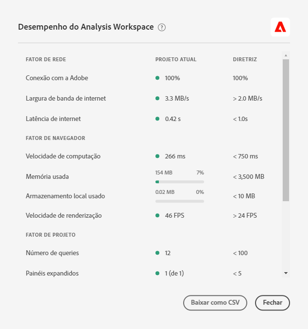

# Otimizar o desempenho do [!UICONTROL Analysis Workspace]

Vários fatores podem influenciar o desempenho de um projeto no Analysis Workspace. É importante saber quais são os contribuidores antes de iniciar a criação de um projeto, para planejar e criar o projeto da melhor maneira. Esta página inclui uma lista de fatores que afetarão o desempenho e as otimizações que você pode fazer para garantir o desempenho máximo no Analysis Workspace.

## [!UICONTROL Ajuda] > [!UICONTROL Desempenho] no Analysis Workspace

Em **Analysis Workspace > [!UICONTROL Ajuda] > [!UICONTROL Desempenho]**, você pode ver fatores que afetam o desempenho do seu projeto, incluindo fatores de rede, navegador e projeto. Para obter os resultados mais precisos, deixe o projeto carregar totalmente antes de abrir a página Desempenho.

* A coluna Projeto atual exibe os resultados do seu projeto atual e do ambiente do usuário.
* A coluna Orientação exibe o limite recomendado da Adobe para cada fator.

Além disso, você pode **Baixar como CSV** o conteúdo de desempenho para compartilhar facilmente com o Atendimento ao cliente da Adobe ou com suas equipes internas de TI.

>[!NOTE]
>
>As informações na página Desempenho variam cada vez que o modal é aberto, já que os fatores estão sujeitos a alterações. Além disso, a Adobe continuará refinando as diretrizes fornecidas à medida que mais dados estiverem disponíveis.

## Fatores de rede

Os fatores de rede [!UICONTROL Ajuda] > [!UICONTROL Desempenho] incluem:

| Fator | Definição | Influenciado por | Otimização |
| --- | --- | --- | --- |
| Conexão com a Adobe | A Adobe envia 10 chamadas de teste quando a página de desempenho é aberta. Representa a porcentagem dessas chamadas para a Adobe que tiveram sucesso. | Problemas de rede local ou problemas da Adobe afetarão esse fator. | Acesse status.adobe.com para verificar se há problemas de serviço conhecidos. Em seguida, valide a conexão de rede local. |
| Largura de banda de internet | Disponível somente para o Google Chrome. A estimativa do navegador da largura de banda no local. A diretriz é de 2,0 MB/s. | A conexão de rede local afetará esse fator. | Valide a conexão de rede local. |
| Latência de internet | A Adobe envia 10 chamadas de teste quando a página de desempenho é aberta. Representa o tempo médio necessário para cada solicitação ir para a Adobe e retornar. Em termos mais simples, é uma medida da velocidade da Internet entre a sua localização e a Adobe. A orientação é &lt; 1 segundo. | Problemas de rede local, muitas guias de navegador abertas ou problemas da Adobe afetarão esse fator. | Acesse status.adobe.com para verificar se há problemas de serviço conhecidos. Em seguida, valide a conexão de rede local e feche guias do navegador não usadas. |

## Fatores do navegador

Os fatores do navegador [!UICONTROL Ajuda] > [!UICONTROL Desempenho] incluem:

| Fator | Definição | Influenciado por | Otimização |
| --- | --- | --- | --- |
| Velocidade de computação | A velocidade com que o computador executa um teste de processamento. A orientação é &lt; 750 ms. | O hardware e programas simultâneos afetarão esse fator. | Abra o Gerenciador de Tarefas (PC) ou o Monitor de Atividades (Mac) do seu computador para determinar se é possível fechar os programas. Em seguida, feche guias de navegador ou outros programas não usados.   Se essas ações não ajudarem, discuta os detalhes de hardware com a equipe de TI. |
| Memória usada | Disponível somente para o Google Chrome. Cada guia do Workspace em um navegador Google Chrome compartilha 4 GB de memória no total. Representa a porcentagem da redução de memória que está sendo consumida pelo projeto atual. A diretriz é de 3500 MB, que é o ponto em que o Workspace começará a detectar erros de memória. | Trabalhar em várias guias ou baixar 50000 linhas de dados contribuirá para o aumento do uso da memória. | Se você receber um erro de memória, feche outras guias do Workspace e/ou execute o download de linha 50000 uma de cada vez. |
| Armazenamento local usado | Dados armazenados localmente em seu computador para uso no navegador. Cada origem (por exemplo, experience.adobe.com) tem uma alocação de 10 MB. | O Analysis Workspace usa o armazenamento local para várias funções, inclusive para armazenar projetos salvos automaticamente (existentes), configurações do usuário e sinalizadores de recursos. | Para garantir que as funções do Analysis Workspace não sejam interrompidas, limpe o armazenamento local do domínio experience.adobe.com. |
| Velocidade de renderização | FPS significa Quadros por segundo, que é quantas vezes por segundo o navegador desenha a página em sua tela. 24 FPS é normalmente o que o olho humano pode observar; se o FPS for menor que isso, você observará problemas de renderização no Workspace. | O FPS é afetado ao fazer diversas tarefas em vários projetos do Workspace de uma só vez e pelo tamanho do projeto que está sendo visualizado. Outros programas em execução no computador podem causar impacto, como streaming, scanners em segundo plano etc. Além disso, o hardware afetará esse fator. | Abra o Gerenciador de Tarefas (PC) ou o Monitor de Atividades (Mac) do seu computador para determinar se é possível fechar os programas. Em seguida, feche guias de navegador ou outros programas não usados.   Se essas ações não ajudarem, discuta os detalhes de hardware com a equipe de TI. |

## Fatores de projeto

Os fatores de projeto [!UICONTROL Ajuda] > [!UICONTROL Desempenho] incluem:

| Fator | Definição | Otimização |
| --- | --- | --- |
| Número de queries | O número total de queries (solicitações) feitos à Adobe para recuperar dados exibidos no projeto. As queries incluem solicitações classificadas para tabelas, detecção de anomalias, linhas cintilantes, componentes mostrados no painel esquerdo e muito mais. Exclui painéis e visualizações recolhidos. A orientação é 100. | Sempre que possível simplifique o projeto dividindo dados em vários projetos que atendem a uma finalidade específica ou a um grupo de participantes. Use tags para organizar projetos em temas e use [links diretos](https://docs.adobe.com/content/help/pt-BR/analytics/analyze/analysis-workspace/curate-share/shareable-links.html) para criar um sumário interno, de modo que as partes interessadas possam encontrar mais facilmente o que precisam. |
| Painéis expandidos (do total de painéis) | O número de painéis expandidos do número total de painéis no projeto. A orientação é 5. | Depois de seguir as etapas para simplificar seu projeto, recolha os painéis no projeto que não precisam ser exibidos quando carregados. Quando o projeto for aberto, somente os painéis expandidos serão processados. Os painéis recolhidos não serão processados até que o usuário os expanda. |
| Visualizações expandidas (do total de visualizações) | O número de tabelas expandidas e visualizações do total no projeto, incluindo fontes de dados ocultas. A orientação é 15. | Depois de seguir as etapas para simplificar o projeto, recolha as visualizações no projeto que não precisam ser visualizadas quando carregadas. Priorize os recursos visuais mais importantes para o consumidor do relatório e separe os recursos visuais de suporte em um painel ou projeto separado e mais detalhado, se necessário. |
| Número de células de forma livre | O número total de células da tabela de forma livre no projeto, calculado por linhas * colunas em todas as tabelas. Exclui fontes de dados ocultas. A orientação é 4000. | Reduza o número de colunas na tabela somente para os pontos de dados mais relevantes. Reduza o número de linhas na tabela ajustando o número de linhas exibidas, aplicando um filtro de tabela ou aplicando um segmento. |
| Componentes disponíveis | O número total de componentes recuperados no painel esquerdo do projeto, em todos os conjuntos de relatórios do projeto. Isso afetará a velocidade em que o painel esquerdo é carregado e a velocidade de retorno dos resultados da pesquisa. A orientação é 2000. | Fale com o administrador do produto sobre como criar um conjunto de relatórios virtuais com curadoria que tenha um conjunto de componentes mais adaptado. |
| Componentes usados | O número total de componentes usados no projeto. A orientação é 100. | O número de componentes usados não é um influenciador direto do desempenho. No entanto, a complexidade desses componentes contribuirá para o desempenho do projeto. Consulte as otimizações na seção “Fatores adicionais” abaixo. |
| Maior intervalo de datas | Esse fator exibe o intervalo de datas mais longo usado no projeto. A orientação é de 1 ano. | Quando possível, não insira mais dados do que o necessário. Restrinja o calendário do painel às datas relevantes para a sua análise ou use componentes de intervalo de datas (componentes roxos) nas tabelas de forma livre. Os intervalos de datas usados em uma tabela substituem o intervalo de datas do painel. Por exemplo, você pode adicionar mês passado, semana passada e ontem às colunas da tabela para solicitar esses intervalos de dados específicos. Para obter mais informações sobre o uso de intervalos de datas no Analysis Workspace, assista a [este vídeo](https://docs.adobe.com/content/help/en/analytics-learn/tutorials/analysis-workspace/calendar-and-date-ranges/date-ranges-and-calendar-in-analysis-workspace.html).   Além disso, minimize o número de comparações ano a ano usadas no projeto. Quando uma comparação ano a ano é calculada, ela analisa os 13 meses completos de dados entre os meses de interesse. Essa ação tem o mesmo impacto que alterar o intervalo de datas do painel para durar 13 meses. |

## Fatores adicionais

Outros fatores que não estão incluídos em Ajuda > Desempenho incluem:

| Fator | Definição | Influenciado por | Otimização |
| --- | --- | --- | --- |
| Complexidade do segmento | Segmentos intricados podem ter um impacto significativo no desempenho do projeto. | Veja a seguir alguns fatores que adicionam complexidade a um segmento (em uma ordem aproximada de impacto): <ul><li>Operadores de “contém”, “contem qualquer um de”, “corresponde”, “começa com” ou “termina com” </li><li>Segmentação sequencial, especialmente quando restrições de dimensão (Dentro/Depois de) são usadas </li><li>Número de itens de dimensão exclusivos em dimensões usadas no segmento (por exemplo, Página = “A” quando a Página tem 10 itens exclusivos será mais rápida que a Página = “A” quando a Página tiver 100000 itens exclusivos) </li><li>O número de diferentes dimensões usadas (por exemplo, Página = “Home” e Página = “Search results” será mais rápido que eVar 1 = “red” e eVar 2 = “blue”)</li><li>Muitos operadores OR (em vez de AND)</li><li>Contêineres aninhados que variam no escopo (por exemplo, “Hit” dentro de “Visit” dentro de “Visitante”)</li></ul> | Embora alguns dos fatores de complexidade não possam ser evitados, procure por oportunidades para reduzir a complexidade de seus segmentos. Em geral, quanto mais específico você puder ser com os critérios do seu segmento, melhor. Por exemplo:<ul><li>Com contêineres, usar um só contêiner na parte superior do segmento será mais rápido que uma série de contêineres aninhados.</li><li>Com operadores, “igual” será mais rápido que “contém” e “é igual a qualquer um de” será mais rápido que “contem qualquer um de”.</li><li>Com muitos critérios, operadores AND serão mais rápidos que uma série de operadores OR.</li></ul> Procure oportunidades para reduzir muitas declarações OR em uma única declaração “é igual a qualquer um de”.   [Classificações](/help/components/classifications/c-classifications.md) podem ajudar a consolidar muitos valores em grupos concisos a partir dos quais você pode criar segmentos. A segmentação nos grupos de classificação oferece benefícios de desempenho em segmentos com muitas instruções OR ou com o critério “contém”. |
| Complexidade de visualização (segmentos, métricas, filtros) | O tipo de visualização (por exemplo, fallout ou tabela de forma livre) adicionado a um projeto não influencia muito o desempenho do projeto. É a complexidade da visualização que aumentará o tempo de processamento. | Fatores que adicionam complexidade à visualização incluem:<ul><li>Intervalo de dados solicitado</li><li>Números de segmentos aplicados, por exemplo, segmentos usados como linhas de uma tabela de forma livre</li><li>Uso de segmentos complexos</li><li>Linhas ou colunas de [itens estáticas](https://docs.adobe.com/content/help/en/analytics/analyze/analysis-workspace/visualizations/freeform-table/column-row-settings/manual-vs-dynamic-rows.html) em tabelas de forma livre</li><li>Filtros aplicados a linhas em tabelas de forma livre</li><li>Número de métricas incluídas, métricas especialmente calculadas que usam segmentos</li></ul> | Se você observar que seus projetos não estão carregando rápido como gostaria, tente substituir alguns segmentos por eVars e filtros, se possível.  Se você estiver sempre usando segmentos e métricas calculadas em dados importantes para sua empresa, tente aprimorar sua implementação para capturar esses dados de forma mais direta. O uso de um gerenciador de tags como o Adobe Experience Platform Launch e das regras de processamento da Adobe facilita e agiliza as alterações na implementação. |
| Tamanho do conjunto de relatórios | A quantidade de dados coletados em seu conjunto de relatórios. | - | Consulte sua equipe de implementação ou um especialista da Adobe para determinar se há melhorias de implementação que podem ser feitas para aperfeiçoar a experiência geral no Adobe Analytics. |
