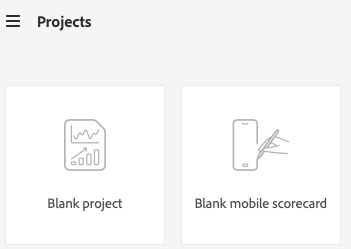
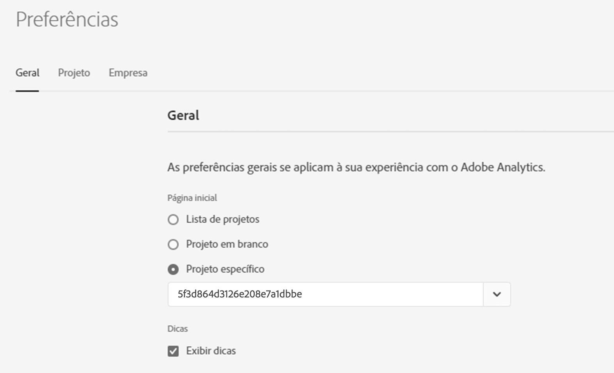

# Página de aterrissagem do Adobe Analytics

A página de aterrissagem do Adobe Analytics reúne ambos [!DNL Analysis Workspace] e [!DNL Reports & Analytics] (fim da vida útil) numa interface única e num ponto de acesso sob a [!DNL Workspace] guarda-chuva. Ela apresenta uma página inicial do gerente de projeto, um menu de relatórios atualizado com relatórios modernizados, bem como uma nova seção de aprendizado que ajuda você a começar de forma mais eficaz. Veja um vídeo com uma visão geral:

>[!VIDEO](https://video.tv.adobe.com/v/334278/?quality=12)

## Recursos da nova página de aterrissagem {#new-features}

| Recurso | Descrição | Captura de tela |
| --- | --- | --- |
| Expandir a tabela [!UICONTROL Projetos] para tela inteira | Para expandir a tabela, basta clicar no ícone de menu de hambúrguer. Essa ação recolherá as guias do painel esquerdo. |  |
| Personalizar a largura da coluna | Anteriormente, a largura da coluna era fixa. Agora é possível ajustá-la arrastando o separador de colunas. |  |
| Reordenar itens fixados | Para mover os itens fixados para cima e para baixo, clique nas reticências ao lado do item fixado e selecione **[!UICONTROL Mover para cima]** ou **[!UICONTROL Mover para baixo]**. |  |
| Novas colunas da tabela | Clique no ícone [!UICONTROL Personalizar tabela] na parte superior direita da tabela. As novas colunas da tabela incluem: <ul><li>**[!UICONTROL Agendado]**: definido como [!UICONTROL Ativado] quando um projeto estiver agendado ou [!UICONTROL Desativado] quando não estiver. Clicar no link [!UICONTROL Ativado] permite ver informações sobre o projeto agendado. Você também pode [editar o agendamento do projeto](/help/analyze/analysis-workspace/curate-share/t-schedule-report.md) se for o proprietário do projeto.</li><li>**[!UICONTROL ID do projeto]**: a ID do projeto pode ser usada para depurar projetos.</li><li>**[!UICONTROL Intervalo de datas mais longo]**: intervalos de datas mais longos aumentam a complexidade do projeto e podem aumentar os tempos de processamento e carregamento. </li><li>**[!UICONTROL Número de consultas]**: o número total de solicitações feitas no Analytics quando o projeto é carregado. Um número maior de consultas de projeto aumenta a complexidade do projeto e pode aumentar os tempos de processamento e carregamento. Esses dados só estão disponíveis depois que um projeto é carregado ou depois que um projeto agendado é enviado. </li></ul> |  |
| Clique uma vez para abrir um relatório | Anteriormente, você precisava clicar duas vezes. |  |
| Novos links para os relatórios do **[!UICONTROL Reports &amp; Analytics]** | <ul><li>**[!UICONTROL Relatórios]** > **[!UICONTROL Público]** > **[!UICONTROL Bots]**</li><li>**[!UICONTROL Relatórios]** > **[!UICONTROL Público]** > **[!UICONTROL Páginas de bot]**<li>**[!UICONTROL Relatórios]** > **[!UICONTROL Envolvimento]** > **[!UICONTROL Tempo real]**</li></ul> |  |
| Novos relatórios prontos para uso | <ul><li>**[!UICONTROL Relatórios]** > **[!UICONTROL Mais popular]** > **[!UICONTROL Próxima página]**</li><li>**[!UICONTROL Relatórios]** > **[!UICONTROL Mais popular]** > **[!UICONTROL Página anterior]**</li><li>**[!UICONTROL Relatórios]** > **[!UICONTROL Envolvimento]** > **[!UICONTROL Análise de página]** > **[!UICONTROL Resumo da página]**</li></ul>Observe que esses relatórios estão no formato do [!UICONTROL Espaço de trabalho] e precisam ser configurados e criados. A saída consiste em um painel de métricas de alto nível, dados de tendências, visualização de [!UICONTROL Fluxo] e muito mais. Você pode modificar esses relatórios e alterar dimensões, itens de dimensão etc. Esses relatórios também estão disponíveis como painéis em Painéis do Espaço de trabalho. |  |
| O modal **[!UICONTROL Criar projeto]** voltou | Ao clicar em **[!UICONTROL Criar projeto]** no Espaço de trabalho, você novamente terá a escolha entre um [!UICONTROL Projeto em branco] e um [!UICONTROL Cartão de pontuação móvel em branco]. Você também pode escolher a partir de qualquer modelo criado por sua empresa. |  |
| Também disponível no Customer Journey Analytics | Uma versão modificada dessa página de destino também está disponível no Customer Journey Analytics. |  |

{style="table-layout:auto"}

## Estrutura do menu superior {#top-menu}

* Menu principal do Analytics: a maioria dos relatórios agora se encontra no menu [!UICONTROL Relatórios] no painel esquerdo.
* O painel esquerdo tem três guias: [!UICONTROL Projetos], [!UICONTROL Relatórios] e [!UICONTROL Aprendizagem].

### Terminologia

* **[!UICONTROL Projetos]** são designs personalizados que combinam componentes de dados, tabelas e visualizações que você criou ou que outra pessoa criou e compartilhou com você. [!UICONTROL Projetos] também se refere a projetos em branco e scorecards para dispositivos móveis em branco.
* **[!UICONTROL Relatórios]** refere-se a tudo que foi pré-criado pelo Adobe, como modelos no Workspace.
* **[!UICONTROL Os modelos]** não são mais usados como termo para projetos do Espaço de trabalho pré-criados pela Adobe. Agora eles estão em [!UICONTROL Relatórios]. O termo [!UICONTROL Modelos] ainda é usado para modelos criados por sua empresa.

## Navegue até a guia [!UICONTROL Projetos] {#navigate-projects}

[!UICONTROL Os projetos] servem como página inicial do [!UICONTROL Espaço de trabalho]. A guia Projetos exibe a pasta Empresa, qualquer pasta pessoal criada, seus projetos e cartões de pontuação para dispositivos móveis. Use esta página para exibir, criar e modificar pastas, projetos e cartões de pontuação para dispositivos móveis. Para obter mais informações, consulte [Sobre pastas no Analytics](/help/analyze/analysis-workspace/build-workspace-project/workspace-folders/about-folders.md).

>[!NOTE]
>
>Várias das seguintes configurações persistem durante a sessão e entre sessões. Por exemplo, a guia selecionada, os filtros selecionados, as colunas selecionadas e a direção de classificação da coluna. Os resultados da pesquisa não são persistentes.

| Elemento da interface | Definição |
| --- | --- |
| Editar preferências | Permite [!UICONTROL Exibir Tutoriais] e [Editar preferências de usuário](/help/analyze/analysis-workspace/user-preferences.md). |
| [!UICONTROL Criar novo] | Abre o modal do projeto, onde é possível criar um projeto do Espaço de trabalho ou um Cartão de pontuação para dispositivos móveis ou abrir um modelo de empresa. |
| [!UICONTROL Mostrar menos  Mostrar mais] | Alterna entre não mostrar e mostrar o banner:  |
| [!UICONTROL Projeto do Espaço de trabalho] | Cria um [Projeto do Espaço de trabalho](https://experienceleague.adobe.com/docs/analytics/analyze/analysis-workspace/home.html?lang=pt-BR) em branco para que você desenvolva e crie. |
| [!UICONTROL Cartão de pontuação para dispositivos móveis] | Cria um [cartão de pontuação para dispositivos móveis](https://experienceleague.adobe.com/docs/analytics/analyze/mobapp/curator.html?lang=pt-BR) para que você desenvolva e crie. |
| [!UICONTROL Abrir tutorial de treinamento] | Abre o tutorial de treinamento do Espaço de trabalho que o orienta pelo processo de criação de um novo projeto inicial em um tutorial passo a passo. |
| [!UICONTROL Abrir notas de versão] | Abre a seção Adobe Analytics das notas de versão mais recentes do Adobe Experience Cloud. |
| Ícone Filtrar | Filtra por tags, conjuntos de relatórios, proprietários, tipos e outros filtros (Meus, Compartilhados comigo, Favoritos e Aprovados) |
| Barra de pesquisa | Pesquisa todas as colunas na tabela. |
| Caixa de seleção | Seleciona um ou mais projetos para exibir as ações de gerenciamento de projetos que você pode executar: **Excluir**, **Compartilhar**, **Renomear**, **Copiar**, **Remover**, **Mover para cima**, **Mover para baixo**, **Tag**, **Aprovar**, **Exportar CSV** e **Mover para**. Talvez você não tenha permissões para executar todas as ações listadas. |
| [!UICONTROL Favoritos] | Adiciona uma estrela ao lado de um projeto ou pasta favorita que pode ser usada como filtro. |
| [!UICONTROL Nome] | Identifica o nome do projeto. |
| Ícone Fixar | Fixa os itens para que eles sempre apareçam na parte superior da lista, mas você pode reajustar a ordem movendo-os para cima ou para baixo. Use o menu de opções de reticências e selecione **Mover para cima** ou **Mover para baixo** na lista. |
| Ícone Informações (i) | Exibe as seguintes informações sobre um projeto: Tipo, Função do projeto, Proprietário, Descrição e com quem ele é compartilhado. Também indica quem pode [editar ou duplicar](https://experienceleague.adobe.com/docs/analytics/analyze/analysis-workspace/curate-share/share-projects.html?lang=pt-BR) o projeto. |
| Reticências (...) | Exibe as ações de gerenciamento de projeto que você pode executar: **Excluir**, **Compartilhar**, **Renomear**, **Copiar**, **Remover**, **Mover para cima**, **Mover para baixo**, **Tag**, **Aprovar**, **Exportar CSV** e **Mover para**. Talvez você não tenha permissões para executar todas as ações listadas. |
| [!UICONTROL Tipo] | Indica se é um projeto do Espaço de trabalho, um cartão de pontuação para dispositivos móveis ou uma pasta. |
| [!UICONTROL Tags] | Marque projetos para organizá-los em grupos. |
| [!UICONTROL Função do projeto] | Identifica as funções do projeto: se você é o proprietário do projeto e se tem permissões para editar ou duplicar o projeto. |
| [!UICONTROL Conjunto de relatórios] | Identifica os Conjuntos de relatórios associados ao projeto. Tabelas e visualizações em um painel derivam dados do conjunto de relatórios selecionado na parte superior direita do painel. O conjunto de relatórios também determina quais componentes estão disponíveis no painel esquerdo. Em um projeto, você pode usar um ou vários conjuntos de relatórios dependendo dos casos de uso da análise. A lista de conjuntos de relatórios é classificada de acordo com a relevância. A Adobe define a relevância com base no quão recente e frequente é a utilização do conjunto pelo usuário atual e na frequência com que o conjunto é usado na organização. |
| [!UICONTROL Proprietário] | Identifica a pessoa que criou o projeto. |
| [!UICONTROL Aberto pela última vez] | Identifica a data em que o projeto foi aberto pela última vez. |
| Ícone Personalizar tabela | Seleciona quais colunas exibir na tabela. Para adicionar ou remover colunas da lista de projetos, clique no ícone de coluna () no canto superior direito, em seguida, selecione ou desmarque os títulos das colunas. |
| MOSTRAR: Pastas e projetos ou todos os projetos | Altera a configuração de exibição na tabela para mostrar pastas e projetos de acordo com a organização da pasta **ou** mostrar todos os seus projetos em uma lista não organizada. |
| &lt; (Botão voltar) | Retorna à configuração de página inicial mais recente em um projeto do Espaço de trabalho ou em um relatório. A configuração da página que você tinha quando saiu da página inicial persistirá quando você retornar. |

### Descontinuação da página do Gerenciador de projetos {#deprecate-pm-page}

Com o lançamento da nova página de destino, descontinuamos o Gerenciador de projetos, conforme listado no Gerenciador de componentes. A nova página de destino lida com toda a funcionalidade da antiga página do Gerenciador de projetos e muito mais.

Um caso de uso comum para a página Gerenciador de projetos era exibir todos os seus projetos.

Para exibir todos os projetos na nova página de destino usando o painel de filtros, selecione **OUTROS FILTROS** e depois selecione **Mostrar tudo**.

Se estiver na visualização “Pastas e projetos”, aparecerá um modal perguntando se você deseja alternar para a visualização “Todos os projetos”, o que facilita a visualização de todos os projetos fora de qualquer pasta em que eles possam estar organizados.   Selecione **Alternar para a exibição “Todos os projetos”** para visualizar melhor todos os projetos aos quais você tem acesso.

Outro caso de uso para administradores é gerenciar relatórios da empresa para excluir, renomear, marcar ou aprovar relatórios. Para obter informações sobre como gerenciar relatórios, consulte [Gerenciamento de relatórios da empresa](#manage-company-reports).

## Acesse a guia [!UICONTROL Relatórios] {#navigate-reports}

A guia [!UICONTROL Relatórios] consolida os seguintes conjuntos de relatórios:

* Os modelos pré-criados do [!UICONTROL Espaço de trabalho] que estavam anteriormente localizados em [!UICONTROL Espaço de trabalho] > [!UICONTROL Projeto] > [!UICONTROL Novo]. A Adobe não usa mais a palavra “modelo” neste contexto.
* A maioria dos relatórios pré-criados no menu superior de [!UICONTROL Relatórios] do Adobe Analytics anterior. Esses relatórios agora são exibidos no [Analysis Workspace](https://experienceleague.adobe.com/docs/analytics/analyze/analysis-workspace/home.html?lang=pt-BR).

>[!NOTE]
>
>Considere o seguinte ao usar relatórios:
>* Em Relatórios, uma pasta Favoritos será exibida somente se você marcar um novo relatório como favorito. Nenhum favorito preexistente do Reports &amp; Analytics é transportado.
>* Somente os relatórios mais usados que anteriormente eram agrupados no Reports &amp; Analytics estão disponíveis. Alguns relatórios raramente usados ou que não são mais relevantes não estão mais disponíveis. Consulte as [Perguntas frequentes sobre a página de destino](#landing-page-faq) abaixo para obter mais detalhes.

Para obter mais informações sobre a guia Relatórios no Analysis Workspace, incluindo a visualização e o salvamento de relatórios, consulte [Usar relatórios pré-criados](/help/analyze/analysis-workspace/reports/use-reports.md).

Para obter informações sobre como criar e gerenciar relatórios personalizados da empresa, consulte [Criar e gerenciar relatórios da empresa](/help/analyze/analysis-workspace/reports/create-company-reports.md).

## Usar a guia Aprendizagem {#navigate-learning}

A página Aprendizagem contém tours práticos em vídeo, tutoriais e links para a documentação.

Use a página Aprendizagem do Adobe Analytics para saber mais sobre recursos e casos de uso iniciantes, intermediários ou avançados no Adobe Analytics.

### Acessar a página Aprendizagem

1. No Adobe Analytics, selecione [!UICONTROL **Espaço de trabalho**] > [!UICONTROL **Aprendizagem**].

### Recursos da página Aprendizagem

* **Filtrar conteúdo:** o ícone Filtrar no painel à esquerda permite filtrar o conteúdo de aprendizagem por nível de experiência (iniciante, intermediário ou avançado) e por tipo de conteúdo (documento, vídeo ou tours e tutoriais).
* **Rastrear progresso:** após selecionar um conteúdo, uma tag **[!UICONTROL Visualizado]** é exibida. Essa tag ajuda a rastrear o progresso pelo conteúdo de aprendizagem. É possível selecionar a tag **[!UICONTROL Visualizado]** e removê-la de um conteúdo.
* **Exibir conteúdo adicional:** ao visualizar qualquer vídeo, selecione **[!UICONTROL Saiba mais]** para ver a documentação relacionada na Experience League. Ou, na página Aprendizagem, selecione uma das seguintes opções para exibir o conteúdo adicional:
   * **[!UICONTROL Visitar o YouTube]:** veja a lista de reprodução completa do Analysis Workspace no YouTube.
   * [!UICONTROL **Visitar a Experience League**]: veja o conjunto completo de documentação do Adobe Analytics na Experience League.
* **Conceitos básicos para novos usuários:** o tour [!UICONTROL Conceitos básicos do espaço de trabalho] é recomendado para novos usuários. Esse tour leva você diretamente ao espaço de trabalho e explica sobre as ações mais comuns. Esse tour também pode ser reiniciado a qualquer momento diretamente do espaço de trabalho por meio da dica de ferramenta do cabeçalho do painel.

## Definir sua página de destino {#set-landing}

Os usuários podem definir sua página de aterrissagem preferencial.

1. Vá até Analytics > [!UICONTROL Componentes] > [!UICONTROL Preferências] > [!UICONTROL Geral].
1. Marque a página de aterrissagem que você prefere:

   

## Ocultar guia Relatórios {#hide-reports}

Os administradores podem ocultar a guia Relatórios para todos os usuários em sua organização.

1. Vá até [!UICONTROL Analytics] > [!UICONTROL Componentes] > [!UICONTROL Preferências] > [!UICONTROL Empresa].
1. Marque **[!UICONTROL Ocultar guia Relatórios]**.

## Perguntas frequentes sobre a página de aterrissagem {#landing-faq}

| Pergunta | Resposta |
| --- | --- |
| Onde estão os modelos que estou acostumado a ver no [!UICONTROL Espaço de trabalho]? | Esses modelos estão agrupados na guia [!UICONTROL Relatórios] |
| O trabalho que eu realizo na interface do programa beta é transferido para a experiência do [!UICONTROL Espaço de trabalho] de produção? | Sim, qualquer trabalho realizado no beta é transferido para a experiência antiga/atual do [!UICONTROL Espaço de trabalho.] |
| Meus favoritos anteriores do Reports &amp; Analytics são transferidos? | Não, eles NÃO são transferidos. No entanto, todos os favoritos de projetos do [!UICONTROL Espaço de trabalho] são transferidos. |
| Há um número máximo de projetos que eu posso fixar? | Não, não há limite para o número de projetos que você pode fixar. |
| Os administradores podem designar essa página de aterrissagem para seus usuários? | Não, os administradores não podem designar a página de aterrissagem em nome de seus usuários. Os usuários individuais devem ativar a alternância. |
| Todos os relatórios existentes no [!DNL Reports & Analytics] ainda disponível? | Não. Os seguintes relatórios foram eliminados, com base nos dados de utilização geral: <ul><li>Quaisquer eVars/props/events/classifications personalizados<li>Meus relatórios recomendados</li><li>Visitantes únicos por hora, diários, semanais, mensais, trimestrais e anuais</li><li>Clientes únicos diários/semanais/mensais/trimestrais/anuais</li><li>Profundidade do nome da ação</li><li>Resumo do nome da ação</li><li>Adicionar painel</li><li>Idade</li><li>Suporte de áudio</li><li>Informações de faturamento</li><li>Cliques para a página</li><li>Intensidade de cor</li><li>Suporte a cookies</li><li>Cookies</li><li>Tipos de conexão</li><li>Elementos criativos</li><li>Tipo de cartão de crédito</li><li>Venda cruzada</li><li>Funis de evento personalizados</li><li>links personalizados</li><li>Customer ID</li><li>Dia da semana</li><li>Nome da ação de entrada</li><li>Sair do nome da ação</li><li>Links de saída</li><li>Fallout</li><li>Downloads de arquivos</li><li>Localizar no armazenamento</li><li>Caminhos completos</li><li>Gênero</li><li>Regra VISTA do tipo de ocorrência</li><li>Suporte de imagem</li><li>Java</li><li>JavaScript</li><li>Versão do JavaScript</li><li>Gerenciar marcadores</li><li>Gerenciar painéis</li><li>Intensidade de cor do monitor</li><li>Resoluções do Monitor</li><li>Assinaturas do boletim informativo</li><li>Nome da próxima ação</li><li>Fluxo do nome da próxima ação</li><li>Pesquisas nulas</li><li>Sistema operacional</li><li>Revisão do pedido</li><li>Página do dia</li><li>Páginas não encontradas</li><li>Pathfinder</li><li>Extensão do caminho</li><li>Nome da ação anterior</li><li>Fluxo do nome da ação anterior</li><li>Atividade do produto</li><li>Custo do produto</li><li>Departamento de produto</li><li>Categoria de inventário de produtos</li><li>Nome do produto</li><li>Resenhas do produto</li><li>Temporada de produtos</li><li>Compartilhamentos de produtos</li><li>Zooms de produtos</li><li>Recarga</li><li>Pesquisas</li><li>Servidores</li><li>Visitas em única página</li><li>Informações sobre envio</li><li>Hierarquia do site</li><li>Menções em redes sociais</li><li>Hora do dia</li><li>Tempo gasto no nome da ação</li><li>Suporte de vídeo</li><li>Estado do visitante</li></ul> |
