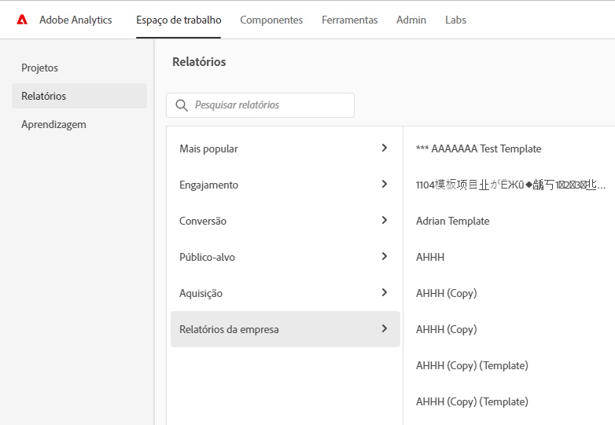

# Página de aterrissagem do Adobe Analytics

A página de aterrissagem do Adobe Analytics reúne o [!DNL Analysis Workspace] e o [!DNL Reports & Analytics] em uma única interface e ponto de acesso sob o comando do [!DNL Workspace]. Ela apresenta uma página inicial do gerente de projeto, um menu de relatórios atualizado com relatórios modernizados, bem como uma nova seção de aprendizado que ajuda você a começar de forma mais eficaz. Veja um vídeo com uma visão geral:

>[!VIDEO](https://video.tv.adobe.com/v/334278/?quality=12)

## Recursos da nova página de aterrissagem {#new-features}

| Recurso | Descrição | Captura de tela |
| --- | --- | --- |
| Expandir a tabela [!UICONTROL Projetos] para tela inteira | Para expandir a tabela, basta clicar no ícone de menu de hambúrguer. Essa ação recolherá as guias do painel esquerdo. |  |
| Personalizar a largura da coluna | Anteriormente, a largura da coluna era fixa. Agora é possível ajustá-la arrastando o separador de colunas. |  |
| Reordenar itens fixados | Para mover os itens fixados para cima e para baixo, clique nas reticências ao lado do item fixado e selecione **[!UICONTROL Mover para cima]** ou **[!UICONTROL Mover para baixo]**. |  |
| Novas colunas da tabela | Clique no ícone [!UICONTROL Personalizar tabela] na parte superior direita da tabela. As novas colunas da tabela incluem: <ul><li>**[!UICONTROL Agendado]**: definido como [!UICONTROL Ativado] quando um projeto estiver agendado ou [!UICONTROL Desativado] quando não estiver. Clicar no link [!UICONTROL Ativado] permite ver informações sobre o projeto agendado. Você também pode [editar o agendamento do projeto](/help/analyze/analysis-workspace/curate-share/t-schedule-report.md) se for o proprietário do projeto.</li><li>**[!UICONTROL ID do projeto]**: a ID do projeto pode ser usada para depurar projetos.</li><li>**[!UICONTROL Intervalo de datas mais longo]**: intervalos de datas mais longos aumentam a complexidade do projeto e podem aumentar os tempos de processamento e carregamento. </li><li>**[!UICONTROL Número de consultas]**: o número total de solicitações feitas no Analytics quando o projeto é carregado. Um número maior de consultas de projeto aumenta a complexidade do projeto e pode aumentar os tempos de processamento e carregamento. Esses dados só estão disponíveis depois que um projeto é carregado ou depois que um projeto agendado é enviado. </li></ul> |  |
| Clique uma vez para abrir um relatório | Anteriormente, você precisava clicar duas vezes. |  |
| Novos links para os relatórios do **[!UICONTROL Reports &amp; Analytics]** | <ul><li>**[!UICONTROL Relatórios]** > **[!UICONTROL Público]** > **[!UICONTROL Bots]**</li><li>**[!UICONTROL Relatórios]** > **[!UICONTROL Público]** > **[!UICONTROL Páginas de bot]**<li>**[!UICONTROL Relatórios]** > **[!UICONTROL Envolvimento]** > **[!UICONTROL Tempo real]**</li></ul> |  |
| Novos relatórios prontos para uso | <ul><li>**[!UICONTROL Relatórios]** > **[!UICONTROL Mais popular]** > **[!UICONTROL Próxima página]**</li><li>**[!UICONTROL Relatórios]** > **[!UICONTROL Mais popular]** > **[!UICONTROL Página anterior]**</li><li>**[!UICONTROL Relatórios]** > **[!UICONTROL Envolvimento]** > **[!UICONTROL Análise de página]** > **[!UICONTROL Resumo da página]**</li></ul>Observe que esses relatórios estão no formato do [!UICONTROL Espaço de trabalho] e precisam ser configurados e criados. A saída consiste em um painel de métricas de alto nível, dados de tendências, visualização de [!UICONTROL Fluxo] e muito mais. Você pode modificar esses relatórios e alterar dimensões, itens de dimensão etc. Esses relatórios também estão disponíveis como painéis em Painéis do Espaço de trabalho. |  |
| O modal **[!UICONTROL Criar novo]** voltou | Ao clicar em **[!UICONTROL Criar novo]** no Espaço de trabalho, você novamente terá a escolha entre um [!UICONTROL Projeto em branco] e um [!UICONTROL Cartão de pontuação móvel em branco]. Você também pode escolher a partir de qualquer modelo criado por sua empresa. |  |
| Também disponível no CJA | Uma versão modificada dessa página de aterrissagem também estará disponível no CJA. |  |

{style=&quot;table-layout:auto&quot;}

## Acessar a página de aterrissagem {#access-landing}

Depois de fazer logon na Adobe Experience Cloud e no Analytics, ative o botão [!UICONTROL Nova página de aterrissagem — Beta] no canto inferior esquerdo. O acesso ao botão de alternância é específico ao usuário por organização, não por empresa.

## Estrutura do menu superior {#top-menu}

* Menu principal do Analytics: a maioria dos relatórios agora se encontra no menu [!UICONTROL Relatórios] no painel esquerdo.
* O painel esquerdo tem três guias: [!UICONTROL Projetos], [!UICONTROL Relatórios] e [!UICONTROL Aprendizagem].

### Terminologia

* **[!UICONTROL Projetos]** são itens que você criou ou que outra pessoa criou e compartilhou com você. [!UICONTROL Projetos] também se refere a projetos em branco e scorecards para dispositivos móveis em branco.
* **[!UICONTROL Os relatórios]** se referem a tudo que foi pré-criado pela Adobe, como os relatórios no Reports &amp; Analytics e os modelos no Espaço de trabalho.
* **[!UICONTROL Os modelos]** não são mais usados como termo para projetos do Espaço de trabalho pré-criados pela Adobe. Agora eles estão em [!UICONTROL Relatórios]. O termo [!UICONTROL Modelos] ainda é usado para modelos criados por sua empresa.

## Navegue até a guia [!UICONTROL Projetos] {#navigate-projects}

[!UICONTROL Os projetos] servem como página inicial do [!UICONTROL Espaço de trabalho]. Qualquer projeto do Espaço de trabalho é exibido aqui, incluindo scorecards para dispositivos móveis.

>[!NOTE]
>
>Várias das seguintes configurações persistem (são lembradas) durante a sessão e entre sessões. Exemplos: em qual guia você está, quais filtros foram selecionados, quais colunas foram selecionadas e a direção da classificação da coluna. No entanto, os resultados da pesquisa não são persistentes.

| Elemento da interface | Definição |
| --- | --- |
| ... Mais | Permite [!UICONTROL Exibir Tutoriais] e [Editar preferências de usuário](/help/analyze/analysis-workspace/user-preferences.md). |
| [!UICONTROL Criar projeto] | O menu suspenso permite criar um [!UICONTROL projeto do Espaço de trabalho] ou um [!UICONTROL projeto móvel]. |
| [!UICONTROL Mostrar menos/mais] | Alterna entre não mostrar e mostrar o banner:  |
| [!UICONTROL Projeto em branco] | Cria um [projeto do Espaço de trabalho](https://experienceleague.adobe.com/docs/analytics/analyze/analysis-workspace/home.html?lang=pt-BR) em branco para que você o preencha. |
| [!UICONTROL Cartão de pontuação móvel em branco] | Cria um [cartão de pontuação móvel](https://experienceleague.adobe.com/docs/analytics/analyze/mobapp/curator.html?lang=pt-BR) em branco para que você o preencha. |
| [!UICONTROL Abrir tutorial de treinamento] | Abre o tutorial de treinamento do Espaço de trabalho que orienta novos usuários por meio da criação de um projeto passo a passo. |
| [!UICONTROL Abrir notas de versão] | Abre a seção Adobe Analytics das notas de versão mais recentes do Adobe Experience Cloud. |
| Ícone Filtrar | Você pode filtrar por tags, conjuntos de relatórios, proprietários, tipos e outros filtros (Meus, Compartilhados comigo, Favoritos e Aprovados) |
| Barra de pesquisa | A pesquisa agora inclui todas as colunas na tabela. |
| Caixa de seleção | Clicar nesta caixa ao lado de um ou mais projetos exibe as ações de gerenciamento de projetos que você pode executar: Excluir, Marcar, Fixar, Aprovar, Compartilhar, Renomear, Copiar e Exportar para CSV. Talvez você não tenha permissões para executar todas essas ações. |
| [!UICONTROL Favoritos] | Marcar um projeto como favorito coloca uma estrela junto a ele e o marca como um favorito que você pode filtrar. |
| [!UICONTROL Nome] | O nome do projeto. |
| Ícone Fixar | Agora é possível fixar itens de modo que eles *sempre* apareçam no topo da lista. |
| Ícone Informações (i) | Clicar no ícone de informações mostra as seguintes informações sobre este projeto: Tipo, Função do projeto, Proprietário, Descrição e com quem ele é compartilhado. Também indica quem pode [editar ou duplicar](https://experienceleague.adobe.com/docs/analytics/analyze/analysis-workspace/curate-share/share-projects.html?lang=pt-BR) o projeto. |
| Reticências (...) | As reticências ao lado de um projeto exibem as ações de gerenciamento de projeto que você pode executar: Excluir, Marcar, Fixar, Aprovar, Compartilhar, Renomear, Copiar e Exportar para CSV. Observe que talvez você não tenha permissões para executar todas essas ações. |
| [!UICONTROL Tipo] | Indica se é um projeto do Espaço de trabalho ou um cartão de pontuação móvel. |
| [!UICONTROL Tags] | Você pode adicionar tags aos relatórios para organizá-los em grupos. |
| [!UICONTROL Função do projeto] | As funções de projeto determinam se você é o proprietário do projeto e se você tem permissões para Editar ou Duplicar o projeto. |
| [!UICONTROL Conjunto de relatórios] | Tabelas e visualizações em um painel derivam dados do conjunto de relatórios selecionado na parte superior direita do painel. O conjunto de relatórios também determina quais componentes estão disponíveis no painel esquerdo. Em um projeto, você pode usar um ou vários conjuntos de relatórios dependendo dos casos de uso da análise. A lista de conjuntos de relatórios é classificada de acordo com a relevância. O Adobe define a relevância com base na recente e frequente utilização do conjunto pelo usuário atual e na frequência com que o conjunto é usado na organização. |
| [!UICONTROL Proprietário] | A pessoa que criou o projeto. |
| [!UICONTROL Aberto pela última vez] | Quando este projeto foi aberto pela última vez por você. |
| Ícone Personalizar tabela | (Parte superior direita) Se quiser adicionar ou remover colunas da lista de projetos, selecione-as ou desmarque-as. |
| &lt; (Botão voltar) | Esse botão em um projeto do Espaço de trabalho ou em um relatório direciona você para a configuração mais recente da página de aterrissagem. Qualquer configuração de página que você tenha ao sair da página de aterrisagem persistirá ao retornar. |

## Clique na guia [!UICONTROL Relatórios] {#navigate-reports}

A guia [!UICONTROL Relatório] consolida três conjuntos de relatórios:

* Os modelos pré-criados do [!UICONTROL Espaço de trabalho] que estavam anteriormente localizados em [!UICONTROL Espaço de trabalho] > [!UICONTROL Projeto] > [!UICONTROL Novo]. A Adobe não usa mais a palavra &quot;modelo&quot; neste contexto.
* A maioria dos relatórios pré-criados no menu superior de [!UICONTROL Relatórios] do Adobe Analytics anterior. Esses relatórios agora são exibidos no [Analysis Workspace](https://experienceleague.adobe.com/docs/analytics/analyze/analysis-workspace/home.html?lang=pt-BR).
* Tudo o que sua empresa criou para você.

>[!IMPORTANT]
>
>Em Relatórios, uma pasta Favoritos será exibida somente se você marcar um novo relatório como favorito. Nenhum favorito preexistente do Reports &amp; Analytics é transportado.

Como mencionado anteriormente, só os relatórios mais usados antes e agrupados em Reports &amp; Analytics estão disponíveis aqui. Vários relatórios raramente usados ou que não são mais relevantes não foram transferidos. Consulte as perguntas frequentes a seguir para obter mais detalhes.

### Menus e submenus {#menus}

Aqui estão os novos menus e seus submenus. Se não conseguir encontrar um relatório específico, faça uma &quot;Pesquisa na página&quot; para encontrá-lo.

| Item de menu | Relatórios neste item de menu |
| --- | --- |
| **[!UICONTROL Mais populares]** | <ul><li>Tutorial de treinamento (modelo do Workspace pré-existente)</li><li>Páginas (quais são minhas páginas principais?)</li><li>Visualizações de página (quantas visualizações de página estou gerando?)</li><li>Visitas (quantas visitas estou recebendo?)</li><li>Visitantes (quantos visitantes estou recebendo?)</li><li>Métricas principais (qual é o desempenho das minhas métricas mais importantes?)</li><li>Seções do site (quais seções do meu site geraram mais visualizações de página?)</li><li>Próxima página (quais são as próximas páginas que meus visitantes acessam?)</li><li>Página anterior (quais são as páginas anteriores que meus visitantes acessaram?)</li><li>Campanhas (que campanhas estão gerando minhas métricas principais?)</li><li>Produtos (que produtos estão acionando minhas métricas principais?)</li><li>Canal de último contato (qual canal de último contato tem melhor desempenho?</li><li>Detalhe do canal de último contato (qual canal de último contato específico está superando outros?)</li><li>Receita (como está o desempenho da minha receita?)</li><li>Pedidos (como está o desempenho dos meus pedidos?)</li><li>Unidades (quantas unidades estou vendendo?)</li></ul> |
| **[!UICONTROL Engajamento]** | <ul><li>Métricas principais (qual é o desempenho das minhas métricas mais importantes?)</li><li>Visualizações de página (quantas visualizações de página estou gerando?)</li><li>Páginas (quais são minhas páginas principais?)</li><li>Visitas (quantas visitas estou recebendo?)</li><li>Visitantes (quantos visitantes estou recebendo?)</li><li>Tempo gasto por visita (quanto tempo meus usuários gastam por visita?)</li><li>Tempo antes do evento (quanto tempo meus usuários gastam antes de um evento bem-sucedido?)</li><li>Seções do site (quais seções do meu site geraram mais visualizações de página?)</li><li>Consumo de conteúdo da Web (qual conteúdo é mais consumido e envolve os usuários?)</li><li>Consumo de conteúdo de mídia (qual conteúdo é mais consumido e envolve os usuários?)</li><li>Fluxo da página seguinte e anterior (quais são/foram os caminhos anteriores/seguintes que meus visitantes tomaram?)</li><li>Fallout (onde estou vendo fallout em minhas propriedades digitais?)</li><li>Análise entre dispositivos (usando análise entre dispositivos no Analysis Workspace)</li><li>Retenção da Web (quem são meus usuários fiéis e o que eles fazem?)</li><li>Consumo de áudio de mídia (quais são as tendências e as métricas principais do consumo de áudio?)</li><li>Recenticidade de mídia, frequência, fidelidade (quem são meus leitores fiéis?)</li><li>Análise de página > Recarregamentos (quais páginas geram mais recarregamentos?)</li><li>Análise de página > Tempo gasto na página (quanto tempo meus usuários gastam nas páginas?)</li><li>Entradas &amp; saídas > Páginas de entrada (quais são minhas páginas de entrada principais?)</li><li>Entradas &amp; saídas > Páginas de entrada originais (de qual página meu visitante veio originalmente?)</li><li>Entradas &amp; saídas > Visitas em única página (quais páginas geraram mais visitas em única página?)</li><li>Entradas &amp; saídas > Páginas de saída (quais são minhas páginas de saída principais?)</li></ul> |
| **[!UICONTROL Conversão]** | <ul><li>Produtos > Produtos (quais produtos estão impulsionando minhas métricas principais?)</li><li>Produtos > Desempenho do produto (quais produtos estão tendo o melhor desempenho?)</li><li>Produtos > Categorias (quais são minhas categorias de produtos com melhor desempenho?)</li><li>Carrinho de compras > Carrinhos (quantos usuários adicionaram um produto ao carrinho?)</li><li>Carrinho de compras > Visualizações do carrinho (quantas vezes meus visitantes visualizaram os carrinhos?)</li><li>Carrinho de compras > Adições ao carrinho (com que frequência os usuários adicionam um produto ao carrinho?)</li><li>Carrinho de compras > Remoções do carrinho (com que frequência os usuários removem um produto do carrinho?)</li><li>Compras > Receita (como minha receita está funcionando?)</li><li>Compras > Pedidos (como meus pedidos estão se saindo?)</li><li>Compras > Unidades (quantas unidades estou vendendo?)</li><li>[Magento: marketing e comércio](https://experienceleague.adobe.com/docs/analytics/analyze/analysis-workspace/build-workspace-project/starter-projects.html?lang=pt-BR#commerce)</li></ul> |
| **[!UICONTROL Público-alvo]** | <ul><li>Métrica de pessoas (quantas pessoas interagem com minha marca?)</li><li>Perfil do visitante > Visão geral de localização (quais locais estão promovendo mais uso entre os usuários)</li><li>Perfil do visitante > Geosegmentação > Geo Counties, Geo US States, Geo Regions, Geo Cities, Geo US DMA (quais regiões meus usuários estão visitando?)</li><li>Perfil do visitante > Idiomas (qual idioma meus usuários preferem?)</li><li>Perfil do visitante > Fusos horários (em quais fusos horários meus usuários estão visitando?)</li><li>Perfil do visitante > Domínios (quais ISPs meus visitantes estão usando para acessar meu site?)</li><li>Perfil do visitante > Domínios de nível superior (quais domínios estão direcionando o tráfego para meu site?)</li><li>Perfil do visitante > Tecnologia > Visão geral da tecnologia (que tecnologias as pessoas estão usando para acessar meu site?)</li><li>Perfil do visitante > Tecnologia > Navegadores, tipo de navegador, largura do navegador, altura do navegador (qual navegador da empresa, versão do navegador e sua largura e altura as pessoas estão usando para acessar meu site?)</li><li>Perfil do visitante > Tecnologia > Sistema operacional, Tipos de sistema operacional (qual SO e qual versão dele meus visitantes usam?)</li><li>Perfil do visitante > Tecnologia > Operadora de celular (quais operadoras de celular meus visitantes usam para acessar meu site?)</li><li>Retenção de visitante > Frequência de retorno (quanto tempo passa entre a visita atual do usuário e as visitas anteriores?)</li><li>Retenção de visitante > Visitas de retorno (quantas de minhas visitas são usuários recorrentes?)</li><li>Retenção de visitante > Número da visita (que contém o número da visita que direciona a maioria das minhas métricas principais)</li><li>Retenção de visitante > Ciclo de vendas > Fidelidade do cliente (a qual segmento de fidelidade meus usuários pertencem?)</li><li>Retenção de visitante > Ciclo de vendas > Dias antes da primeira compra (quantos dias se passaram entre a primeira visita de meus usuários e a primeira compra?)</li><li>Retenção de visitante > Ciclo de vendas > Dias desde a última compra (quantos dias se passaram entre a visita atual de meus usuários e a última compra? )</li><li>Retenção de visitante > Dispositivo móvel > Dispositivos e tipos de dispositivo (quais dispositivos e tipos de dispositivo meus visitantes estão usando?)</li><li>Retenção de visitante > Dispositivo móvel > Fabricante (qual fabricante de dispositivo móvel meus visitantes usam?)</li><li>Retenção de visitante > Dispositivo móvel > Tamanho da tela, Altura da tela, Largura da tela (que tamanho/altura/largura da tela móvel meus visitantes têm?)</li><li>Retenção de visitante > Dispositivo móvel > [Uso de aplicativo móvel](https://experienceleague.adobe.com/docs/analytics/analyze/analysis-workspace/build-workspace-project/starter-projects.html?lang=pt-BR#mobile)</li><li>Retenção de visitante > Dispositivo móvel > [Jornadas de aplicativo móvel](https://experienceleague.adobe.com/docs/analytics/analyze/analysis-workspace/build-workspace-project/starter-projects.html?lang=pt-BR#mobile)</li><li>Retenção de visitante > Dispositivo móvel > [Métricas de aplicativo móvel](https://experienceleague.adobe.com/docs/analytics/analyze/analysis-workspace/build-workspace-project/starter-projects.html?lang=pt-BR#mobile)</li><li>Retenção de visitante > Dispositivo móvel > [Mensagens de aplicativo móvel](https://experienceleague.adobe.com/docs/analytics/analyze/analysis-workspace/build-workspace-project/starter-projects.html?lang=pt-BR#mobile)</li><li>Retenção de visitante > Dispositivo móvel > [Desempenho do aplicativo móvel](https://experienceleague.adobe.com/docs/analytics/analyze/analysis-workspace/build-workspace-project/starter-projects.html?lang=pt-BR#mobile)</li><li>Retenção de visitante > Dispositivo móvel > [Retenção de aplicativo móvel](https://experienceleague.adobe.com/docs/analytics/analyze/analysis-workspace/build-workspace-project/starter-projects.html?lang=pt-BR#mobile)</li></ul> |
| **[!UICONTROL Aquisição]** | <ul><li>Canais de marketing > Canal de primeiro contato, Detalhes do canal de primeiro contato (qual canal de primeiro contato e qual canal de primeiro contato específico está tendo o melhor desempenho?)</li><li>Canais de marketing > Primeiro último canal, Detalhes do primeiro último canal (qual canal de último contato e qual canal de último contato específico está tendo o melhor desempenho?)</li><li>Campanhas > Campanhas (quais campanhas estão impulsionando minhas principais métricas?)</li><li>Campanhas > Desempenho da campanha (que campanhas estão gerando mais receita?)</li><li>Campanhas > Código de rastreamento (quais códigos de rastreamento de campanha têm o melhor desempenho?)</li><li>[Aquisição na web](https://experienceleague.adobe.com/docs/analytics/analyze/analysis-workspace/build-workspace-project/starter-projects.html?lang=pt-BR#web)</li><li>[Aquisição por dispositivo móvel](https://experienceleague.adobe.com/docs/analytics/analyze/analysis-workspace/build-workspace-project/starter-projects.html?lang=pt-BR#mobile)</li><li>[Advertising Analytics: pesquisa paga](https://experienceleague.adobe.com/docs/analytics/analyze/analysis-workspace/build-workspace-project/starter-projects.html?lang=pt-BR#advertising)</li><li>Palavras-chave de pesquisa — todas, pagas, naturais (quais palavras-chave de pesquisa e palavras-chave de pesquisa pagas/naturais direcionam minhas métricas principais da melhor maneira?)</li><li>Mecanismos de pesquisa — todos, pagos, naturais (quais mecanismos de pesquisa e mecanismos de pesquisa pagos/naturais direcionam minhas métricas principais da melhor maneira?)</li><li>Toda a classificação da página de pesquisa (de qual página de pesquisa meus usuários chegam?)</li><li>Domínios de referência (quais domínios estão direcionando tráfego para meu site?)</li><li>Domínios de referência originais (quais foram os primeiros usuários de domínio antes de visitar meu site?)</li><li>Referenciadores (em quais URLs meus usuários estavam antes de clicar no meu site?)</li><li>Tipos de referenciadores (a qual categoria meus URLs de referência pertencem?)</li></ul> |
| **[!UICONTROL Relatórios da empresa]** | Relatórios criados por sua empresa para uso. Consulte &quot;Criar um relatório de empresa&quot; abaixo. |

### Localização dos modelos (agora chamados de relatórios) {#templates}

| Nome do relatório (modelo) | Local do relatório |
| --- | --- |
| Tutorial de treinamento | Mais popular > Tutorial de treinamento |
| Consumo de conteúdo da web | Engajamento > Consumo de conteúdo da web |
| Consumo de conteúdo de mídia | Engajamento > Consumo de conteúdo de mídia |
| Análise entre dispositivos | Engajamento > Análise entre dispositivos |
| Retenção na web | Engajamento > Retenção na web |
| Consumo de áudio de mídia | Engajamento > Consumo de áudio de mídia |
| Recenticidade, frequência, fidelização de mídia | Engajamento > Recenticidade, frequência e fidelização de mídia |
| Impacto do ITP | Engajamento > Impacto na ITP |
| Desempenho do produto | Conversão > Produtos > Desempenho do produto |
| Magento: Marketing e Comércio | Conversão > Magento: Marketing e Comércio |
| Métrica de pessoas | Público > Métrica de pessoas |
| Visão geral da localização | Público > Perfil do visitante > Visão geral da localização |
| Visão geral da tecnologia | Público > Perfil do visitante > Tecnologia > Visão geral da tecnologia |
| Uso de aplicativos móveis | Público > Dispositivo móvel > Uso de aplicativos móveis |
| Jornadas de aplicativos móveis | Público > Dispositivo móvel > Jornadas de aplicativos móveis |
| Métricas de aplicativos móveis | Público > Dispositivo móvel > Mensagem no aplicativo móvel |
| Desempenho de aplicativo móvel | Público > Dispositivo móvel > Desempenho de aplicativo móvel |
| Retenção de aplicativo móvel | Público > Dispositivo móvel > Retenção de aplicativo móvel |
| Desempenho da campanha | Aquisição > Campanhas > Desempenho da campanha |
| Aquisição por dispositivo móvel | Aquisição > Aquisição por dispositivo móvel |
| Aquisição pela web | Aquisição > Aquisição pela web |
| Advertising Analytics: pesquisa paga | Aquisição > Advertising Analytics: pesquisa paga |

### Usar a guia Relatórios {#use-reports}

Para usuários atuais do Reports &amp; Analytics, veja a seguir uma breve introdução sobre como usar os relatórios para os quais você está acostumado e que agora são exibidos no Workspace. Os relatórios funcionam como modelos existentes: se você fizer alterações, será solicitado a salvar/descartar as alterações ao sair ou para um relatório diferente. Se você quiser salvar as alterações, ele salvará o relatório como um novo projeto.

1. Acesse a guia [!UICONTROL Relatórios]
1. Selecione o relatório que deseja visualizar. Por exemplo, em [!UICONTROL Mais popular], selecione o relatório [!UICONTROL Páginas].
1. À direita, clique em **[!UICONTROL Abrir relatório]**.

   

1. O Relatório de páginas, conforme exibido no Analysis Workspace, mostra duas [visualizações](/help/analyze/analysis-workspace/visualizations/freeform-analysis-visualizations.md) ([Gráfico de barras](/help/analyze/analysis-workspace/visualizations/bar.md) e [Número do resumo](/help/analyze/analysis-workspace/visualizations/summary-number-change.md)) e uma [Tabela de forma livre](/help/analyze/analysis-workspace/visualizations/freeform-table/freeform-table.md). A métrica usada é Ocorrências.
1. Aqui, você tem várias opções. Estas são algumas das opções:

   * Você pode usar o relatório como está.
   * Você pode arrastar um ou mais segmentos para a área de soltar Segmentos na parte superior. Por exemplo, arraste o segmento [!UICONTROL Clientes móveis] e veja os resultados mudarem.
   * Você pode alterar o intervalo de datas acessando o calendário no canto superior direito.
   * Você pode adicionar detalhamentos de dimensão, arrastar outras métricas e, em geral, personalizar o relatório da maneira que desejar.

### Criar um relatório de empresa (personalizado) {#company-report}

Os relatórios personalizados são chamados de Relatórios da empresa e são encontrados no menu Relatórios da empresa (veja abaixo). Todos os relatórios criados anteriormente e os novos estão listados aqui.

Para criar um novo Relatório de empresa,

1. Crie o Espaço de trabalho com o estado desejado.
1. Abra o menu [!UICONTROL Projeto] e clique em **[!UICONTROL Salvar como relatório da empresa...]**.

   

1. Adicione todos os campos desejados ao modal e salve-os.

   O relatório é adicionado à lista de Relatórios da empresa e está disponível para quem está na sua empresa de logon.

Mais opções de aprendizagem:

* Observe que você tem acesso a uma visão geral em vídeo de 20 minutos do Analysis Workspace na parte superior esquerda de qualquer relatório que você abrir.
* Para novos usuários, recomendamos o vídeo [Tutorial de treinamento](https://www.youtube.com/watch?v=lCH1Kl1q9Wk) que o orienta a criar um novo projeto.
* Aqui está um link para a [documentação completa do Analysis Workspace](/help/analyze/analysis-workspace/home.md).
* Esta é a [lista de reprodução completa do YouTube para Analysis Workspace](https://www.youtube.com/playlist?list=PL2tCx83mn7GuNnQdYGOtlyCu0V5mEZ8sS).

## Navegue pela guia Aprendizagem {#navigate-learning}

A página Aprendizado contém tutoriais e visitas de vídeo práticos, além de links para a documentação.

* O Tour [!UICONTROL Fundamentos do Espaço de trabalho] leva você diretamente para o Espaço de trabalho, orienta no layout e indica onde encontrar/executar as ações mais comuns. Esse Tour também pode ser reiniciado a qualquer momento diretamente no Espaço de trabalho por meio do pop-over da dica de ferramenta do cabeçalho do painel.
* Clicar em um vídeo/tour adiciona uma tag **[!UICONTROL Visualizada]**. Essa tag ajuda a rastrear o progresso pelo conteúdo de aprendizagem. Caso ainda não tenha concluído o conteúdo, você poderá clicar na tag, e ela desaparecerá.
* O botão **[!UICONTROL Saiba mais]** no modal de vídeo leva você a uma página de documentação do Adobe Experience League com mais conteúdo de ajuda relacionado ao vídeo que você acabou de assistir.  **[!UICONTROL Ver mais vídeos]** leva você à lista de reprodução completa do Analysis Workspace YouTube.

## Definir sua página de aterrissagem {#set-landing}

Os usuários podem definir sua página de aterrissagem preferencial.

1. Vá até Analytics > [!UICONTROL Componentes] > [!UICONTROL Preferências] > [!UICONTROL Geral].
1. Marque a página de aterrissagem que você prefere:

   

## Ocultar guia Relatórios {#hide-reports}

Os administradores podem ocultar a guia Relatórios para todos os usuários em sua organização.

1. Vá até [!UICONTROL Analytics] > [!UICONTROL Componentes] > [!UICONTROL Preferências] > [!UICONTROL Empresa].
1. Marque **[!UICONTROL Ocultar guia Relatórios]**.

## Perguntas frequentes sobre a página de aterrissagem {#landing-faq}

| Pergunta | Resposta |
| --- | --- |
| Onde estão os modelos que estou acostumado a ver no [!UICONTROL Espaço de trabalho]? | Esses modelos estão agrupados na guia [!UICONTROL Relatórios] |
| Posso recusar o beta? | Você pode recusar o beta a qualquer momento. |
| O trabalho que eu realizo na interface do programa beta é transferido para a experiência do [!UICONTROL Espaço de trabalho] de produção? | Sim, qualquer trabalho realizado no beta é transferido para a experiência antiga/atual do [!UICONTROL Espaço de trabalho.] |
| Meus favoritos atuais do [!DNL Reports & Analytics] são transferidos? | Não, eles NÃO são transferidos. No entanto, todos os favoritos de projetos do [!UICONTROL Espaço de trabalho] são transferidos. |
| Há um número máximo de projetos que eu posso fixar? | Não, não há limite para o número de projetos que você pode fixar. |
| Os administradores podem designar essa página de aterrissagem para seus usuários? | Não, os administradores não podem designar a página de aterrissagem em nome de seus usuários. Os usuários individuais devem ativar a alternância. |
| Todos os relatórios atualmente existentes no [!DNL Reports & Analytics] ainda estão disponíveis? | Não. Os seguintes relatórios foram eliminados, com base nos dados de utilização geral: <ul><li>Quaisquer eVars/props/events/classifications personalizados<li>Meus relatórios recomendados</li><li>Visitantes únicos por hora, diários, semanais, mensais, trimestrais e anuais</li><li>Clientes únicos diários/semanais/mensais/trimestrais/anuais</li><li>Profundidade do nome da ação</li><li>Resumo do nome da ação</li><li>Adicionar painel</li><li>Idade</li><li>Suporte de áudio</li><li>Informações de faturamento</li><li>Cliques para a página</li><li>Intensidade de cor</li><li>Suporte a cookies</li><li>Cookies</li><li>Tipos de conexão</li><li>Elementos criativos</li><li>Tipo de cartão de crédito</li><li>Venda cruzada</li><li>Funis de evento personalizados</li><li>links personalizados</li><li>Customer ID</li><li>Dia da semana</li><li>Nome da ação de entrada</li><li>Sair do nome da ação</li><li>Links de saída</li><li>Fallout</li><li>Downloads de arquivos</li><li>Localizar no armazenamento</li><li>Caminhos completos</li><li>Gênero</li><li>Regra VISTA do tipo de ocorrência</li><li>Suporte de imagem</li><li>Java</li><li>JavaScript</li><li>Versão do JavaScript</li><li>Gerenciar marcadores</li><li>Gerenciar painéis</li><li>Intensidade de cor do monitor</li><li>Resoluções do Monitor</li><li>Assinaturas do boletim informativo</li><li>Nome da próxima ação</li><li>Fluxo do nome da próxima ação</li><li>Pesquisas nulas</li><li>Sistema operacional</li><li>Revisão do pedido</li><li>Página do dia</li><li>Páginas não encontradas</li><li>Pathfinder</li><li>Extensão do caminho</li><li>Nome da ação anterior</li><li>Fluxo do nome da ação anterior</li><li>Atividade do produto</li><li>Custo do produto</li><li>Departamento de produto</li><li>Categoria de inventário de produtos</li><li>Nome do produto</li><li>Resenhas do produto</li><li>Temporada de produtos</li><li>Compartilhamentos de produtos</li><li>Zooms de produtos</li><li>Recarga</li><li>Pesquisas</li><li>Servidores</li><li>Visitas em única página</li><li>Informações sobre envio</li><li>Hierarquia do site</li><li>Menções em redes sociais</li><li>Hora do dia</li><li>Tempo gasto no nome da ação</li><li>Suporte de vídeo</li><li>Estado do visitante</li></ul> |
