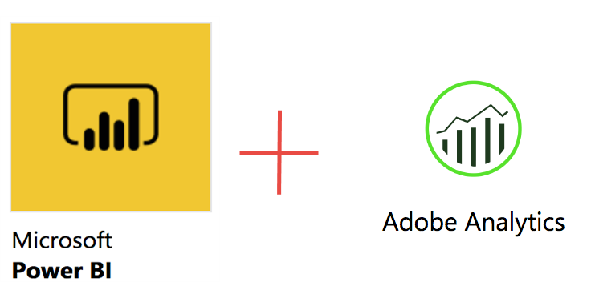

# Publicar no Power BI - Visão geral

{{legacy-arb}}

O Microsoft Power BI é um conjunto de painéis de análise comercial para analisar dados e compartilhar insights. A integração do Adobe Analytics com o Power BI permite a visualização dos dados analíticos do Report Builder dentro do Microsoft Power BI e o seu fácil compartilhamento em toda a organização.

Como analista, anteriormente você agendava a distribuição de pastas de trabalho do Report Builder usando o email ou FTP. Agora é possível fornecer o acesso às partes interessadas diretamente de suas contas do Power BI, permitindo que coletem dados precisos e atualizados em um ambiente baseado na web acessível em várias plataformas e dispositivos.

Combinar a capacidade de geração de relatórios do Report Builder com os recursos de visualização do Power BI torna as informações mais acessíveis para todos(as) na organização. Com o Power BI, você também pode integrar o Adobe Analytics com outras fontes de dados, por exemplo, como um ponto de venda ou CRM, para descobrir insights, associações e oportunidades únicas exclusivas de clientes.

## Requisitos do sistema {#section_0B71092D853446F38FA36447DAC0D32B}

* Adobe Report Builder 5.5 [instalado](/help/analyze/legacy-report-builder/setup/t-install-arb.md)
* Ative a conta da Microsoft que permite fazer logon no Power BI

## Publicar pasta de trabalho no Power BI {#section_21CA66229EC240D49594A9A7D3FBA687}

As pastas de trabalho agendadas são planilhas formatadas do Excel que são preenchidas com dados do Adobe Analytics e distribuídas regularmente.

**Publicar a pasta de trabalho no Report Builder**

1. No Report Builder, gere e salve uma pasta de trabalho.
1. Na barra de ferramentas do Report Builder, clique em **[!UICONTROL Agendamento]** > **[!UICONTROL Novo]**.

1. No Assistente Básico de Agendamento, marque a caixa ao lado de **[!UICONTROL Publicar Pasta de Trabalho no Microsoft Power BI]**.

   

1. Especifique seu email e envie imediatamente ou especifique a frequência de agendamento (por hora, dia etc.).
1. Clique em **[!UICONTROL OK]** para publicar.
1. Agora você será solicitado a fazer logon em sua conta da Microsoft. Forneça suas credenciais.
1. A pasta de trabalho do Report Builder é agendada e publicada no Power BI.

   Com cada instância agendada e após o processo de agendamento do Report Builder ter atualizado a pasta de trabalho com dados atualizados do Analytics, ela será publicada no Microsoft Power BI.

**Exibir dados da pasta de trabalho do Report Builder no Power BI**

1. No Power BI, clique duas vezes na pasta de trabalho no menu [!UICONTROL Pastas de trabalho].

   

1. Agora você pode ver os dados do painel da pasta de trabalho.  

1. Então é possível recortar uma área dessa pasta de trabalho de forma a incluí-la em qualquer um de seus painéis do Power BI.

## Publicar todas as tabelas formatadas na pasta de trabalho como tabelas de conjuntos de dados do Power BI {#section_7C54A54E75184DD6BAEF4ACCE241239A}

>[!NOTE]
>
>Se a pasta de trabalho contiver uma macro, a opção &quot;Publicar todas as tabelas formatadas na pasta de trabalho como tabelas de conjuntos de dados do Power BI&quot; estará desativada.

Em vez de importar a pasta de trabalho inteira, você pode importar somente o conteúdo de todas as tabelas formatadas dentro da pasta de trabalho.

**Caso de uso**: você tem uma pasta de trabalho do Excel que extrai dados de múltiplas solicitações do Report Builder e cria uma tabela de resumo com muitas fórmulas. Você pode importar somente a tabela de resumo para o Power BI e criar uma visualização para ela.

**Publicar uma tabela formatada no Report Builder**

1. No Report Builder, gere uma tabela de dados que inclua um linha de cabeçalho, seguida de uma linha de dados.
1. Selecione a tabela e selecione **[!UICONTROL Formatar como tabela]** no menu [!UICONTROL Início]. A tabela é nomeada por padrão (Tabela 1, Tabela 2, etc.), mas é possível alterar o nome no menu [!UICONTROL Design].

1. Na barra de ferramentas do Report Builder, clique em **[!UICONTROL Agendamento]** > **[!UICONTROL Novo]**.

1. No Assistente básico de agendamento, clique em **[!UICONTROL Opções de agendamento avançadas]**.
1. No [!UICONTROL Assistente de programação- Avançado], na guia **[!UICONTROL Opções de publicação]**, marque a caixa próxima a **[!UICONTROL Publicar todas as tabelas formatadas como tabelas de conjunto de dados do Power BI]**.

   

1. (Opcional) É possível personalizar o nome do ativo publicado no Power BI. Isso pode ser útil se você usar o controle de versão como parte do nome da pasta de trabalho (por exemplo, myworkbook_v1.1.xlsx) e não quiser que o número da versão seja exibido no nome do ativo do Power BI publicado. Ela tem a vantagem adicional de que o ativo publicado não será alterado se o número da versão for alterado. (Veja [especificações](/help/analyze/legacy-report-builder/c-publish-power-bi/specifications-limits.md) aqui.)

**Exibir os dados da tabela no Power BI**

1. No Power BI, vá para o menu **[!UICONTROL Espaços de trabalho]** > **[!UICONTROL Conjuntos de dados]**.

   

1. Selecione o conjunto de dados publicado e clique no ícone [!UICONTROL Criar relatório] ao lado dele. Observe que as tabelas serão exibidas como Campos.

   

1. Selecione uma tabela e suas colunas associadas.

   

1. No menu [!UICONTROL Visualizações], você pode selecionar como visualizar uma tabela no Power BI. Por exemplo, você pode optar por apresentar seus dados como um gráfico de linhas:

   

1. Aqui é possível criar visualizações dessa tabela de conjunto de dados.

## Publicar todas as solicitações do Report Builder como tabelas de conjuntos de dados do Power BI {#section_0C26057C7DBB4068A643FDD688F6E463}

É possível transformar todas as suas solicitações em tabelas de conjuntos de dados e construir visualizações a partir delas.

>[!IMPORTANT]
>
>Se a pasta de trabalho contiver mais de 100 solicitações, apenas as primeiras 100 serão publicadas no Power BI. Além disso, para cada solicitação publicada no Power BI, somente as primeiras 10.000 linhas de dados serão publicadas. Portanto, embora essas solicitações sejam entregues com êxito por meio de agendamento, o escopo de publicação no Power BI é limitado.

1. No Report Builder, abra ou crie uma pasta de trabalho com solicitações do Report Builder.
1. Na barra de ferramentas do Report Builder, clique em **[!UICONTROL Agendamento]** > **[!UICONTROL Novo]**.

1. No Assistente básico de agendamento, clique em **[!UICONTROL Opções de agendamento avançadas]**.
1. No [!UICONTROL Assistente de agendamentos - Avançado], na guia **[!UICONTROL Opções de publicação]**, marque a caixa ao lado de **[!UICONTROL Publicar todas as solicitações do Report Builder como tabelas de conjunto de dados do Power BI]** 

1. Clique em **[!UICONTROL OK]**.

**Exibir os dados das solicitações no Power BI**

Cada solicitação agendada do Report Builder será publicada como uma tabela no conjunto de dados. Cada tabela de solicitação é nomeada após a dimensão principal na solicitação e tem um [!UICONTROL Conjunto de relatórios] e uma coluna [!UICONTROL Segmentos].

1. No Power BI, vá para o menu **[!UICONTROL Espaços de trabalho]** > **[!UICONTROL Conjuntos de dados]**.

1. Selecione a solicitação publicada e clique no ícone [!UICONTROL Criar relatório] ao lado dela.

   Observe que as solicitações são exibidas como tabelas no menu [!UICONTROL Campos].

   

   >[!NOTE]
   >
   >Não importa como você configurou sua solicitação do Report Builder para aparecer na planilha (layout dinâmico, layout personalizado, algumas colunas invisíveis), o Report Builder sempre publicará sua solicitação no mesmo formato bidimensional com apenas uma linha de cabeçalho: Data, Dimensões, Métricas, Conjuntos de relatórios, Segmentos.

1. Observe também que há uma tabela adicional chamada **[!UICONTROL Legenda]**. Caso retire uma solicitação do contexto do Report Builder, pode ser difícil se lembrar o que cada solicitação significa. A finalidade da tabela Legenda é, por exemplo, mostrar o nome de cada solicitação em ID de tabela. Você também pode adicionar as outras colunas da Legenda para obter uma exibição completa da solicitação.

   
