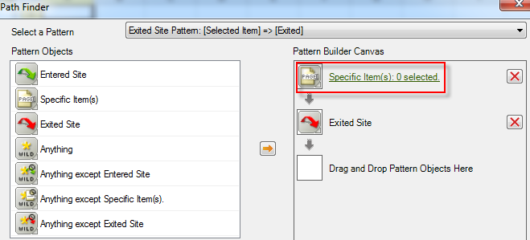

# Filtrar relatório de caminho com o Assistente de solicitação

{{legacy-arb}}

Descreve as etapas envolvidas na aplicação de filtros para um relatório de definição de caminho.

Esse exemplo usa Caminhos de seção do site.

1. No Report Builder da Adobe, clique em **[!UICONTROL Criar]** para abrir o Assistente de solicitação.
1. Selecione o conjunto de relatórios apropriado.
1. Na visualização de árvore, selecione **[!UICONTROL Caminhos]** > **[!UICONTROL Seções do site]** > **[!UICONTROL Caminhos de seção do site]**.

   

1. Especifique as datas apropriadas.

1. Clique em **[!UICONTROL Próximo]**.

1. Na Etapa 2 do Assistente, em **[!UICONTROL Etiquetas de linha]**, clique no link **[!UICONTROL 1-10 principais (padrão aplicado)]**. Em um relatório de caminho, um padrão é aplicado por padrão.

   

1. Selecione a opção **[!UICONTROL Filtrar]**.

   

1. Na caixa de diálogo **[!UICONTROL Definir padrão de caminho &#39;Caminhos de seção do site&#39;]**, você pode especificar
   * A classificação inicial do primeiro relatório.
   * O número de entradas que você deseja exibir neste relatório.
1. Clique em **[!UICONTROL Editar]** para definir um padrão de caminho.

1. Se você deseja um padrão personalizado, arraste e solte quaisquer **[!UICONTROL Objetos de padrão]** da lista à esquerda na **[!UICONTROL Tela de construção de padrão]** à direta.

   

1. Você também pode selecionar um padrão predefinido da lista suspensa **[!UICONTROL Selecionar um padrão]** e modificá-lo. Estes são os padrões disponíveis:

   

   Alguns desses padrões são específicos do Report Builder: Padrão de Próximo Item do Caminho de Entrada, Padrão de Próximo Item do Caminho de Saída, Padrão do Próximo Item.

## Para editar um padrão predefinido

É possível editar um padrão predefinido depois de selecionar um padrão.

1. Continuando nas etapas acima, selecione o padrão. Por exemplo, selecione o **[!UICONTROL Padrão de saída de site]**:

   

1. Defina o caminho de seção do site que o usuário segue antes de sair. Clique em **[!UICONTROL Itens específicos: 0 selecionados]**. Você pode definir esse caminho ao selecionar entre várias células se estiver editando uma solicitação existente, ou ao selecionar a partir de uma lista de seções.

1. Para selecionar de várias células de uma solicitação anterior, selecione **[!UICONTROL De várias células]** e clique no ícone seletor de células. Em seguida, escolha as células no relatório.

   

1. Para selecionar de uma lista com seções do site, selecione **[!UICONTROL Da lista]** e clique em **[!UICONTROL Adicionar]**.

1. Mova elementos da coluna **[!UICONTROL Elementos disponíveis]** para a coluna **[!UICONTROL Elementos selecionados]** ao selecioná-los e clicando na seta laranja. Clique em **[!UICONTROL OK]**.

   

1. Para salvar o padrão estabelecido, clique em **[!UICONTROL Salvar]**.

1. Clique em **[!UICONTROL OK]** três vezes e em **[!UICONTROL Concluir]** para gerar o caminho filtrado.
