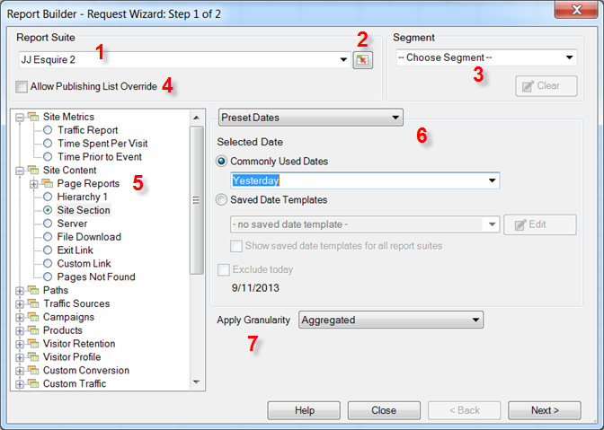

# Solicitação de dados - Etapa 1 do assistente de solicitações

{{legacy-arb}}

No Assistente de solicitações: etapa 1, selecione o conjunto de relatórios, o tipo de relatório, os segmentos e configure as datas.

1. **[!UICONTROL Conjunto de relatórios]**: A lista de conjuntos de relatórios disponíveis para você, com base em suas credenciais de logon. Consulte [Selecionar Conjuntos de Relatórios](/help/analyze/legacy-report-builder/data-requests/selecting-report-suites/t-select-report-suites.md).

1. **Seletor de intervalo**: Permite selecionar uma ID de conjunto de relatórios a partir de uma célula no Excel. Consulte [Selecionar Conjuntos de Relatórios](/help/analyze/legacy-report-builder/data-requests/selecting-report-suites/t-select-report-suites.md).

1. **Segmento**: Segmentos são subconjuntos personalizados de dados, ou dados filtrados por regras criadas por você. Segmentos têm por base acessos, visitas e visitantes. Consulte o [Guia de segmentação do Analytics](/help/components/segmentation/seg-home.md) para obter mais informações sobre segmentos.

   Por exemplo, você pode executar um [!UICONTROL Relatório de páginas] e, em seguida, aplicar um segmento de Visitantes em primeira visita.

1. **Permitir substituições da lista de publicação**: as listas de publicação eram um recurso do Reports &amp; Analytics, que foi [encerrado](https://new.express.adobe.com/webpage/WFCyq7w8kijmB?).

1. **Tipo de relatório:** Especifica o relatório básico que você deseja executar em sua solicitação de dados. Você executa um relatório para cada solicitação, que pode ter dimensões e métricas de um para muitos. As métricas e dimensões para um tipo de relatório são exibidas na interface do [!UICONTROL Assistente de solicitações: etapa 2]. Consulte [Selecionar Tipos De Relatório](/help/analyze/legacy-report-builder/data-requests/c-report-types/select-report-types.md).

1. **Intervalos de data:** Define o período coberto pela solicitação. Vários tipos de períodos de solicitação estão disponíveis, como predefinido, fixo e acumulado. O número máximo de períodos é 366. Você também pode escolher um intervalo de datas especificado por uma célula e salvar intervalos de dados como modelos para uso futuro.  Consulte [Configuração de datas de relatório](/help/analyze/legacy-report-builder/data-requests/configuring-report-dates/custom-calendar.md)

1. **Aplicar granularidade:** Especifica o nível de detalhes baseados em tempo a serem incluídos no relatório. Consulte [Granularidade](/help/analyze/legacy-report-builder/data-requests/configuring-report-dates/granularity.md).

## Solução de problemas

Às vezes, o assistente de solicitações aparece fora da tela, especialmente para usuários que se movem entre as configurações do monitor. Por exemplo, você usa uma base de encaixe no trabalho e a tela do laptop em casa. Se você clicar em “Criar” novamente enquanto um assistente de solicitações já estiver aberto, aparecerá o seguinte erro:

“Primeiro, é necessário concluir o processo do assistente de solicitações antes de iniciar um novo.”

A reativação do assistente de solicitações na tela resolve esse problema.

1. Abra o Microsoft Excel e faça logon no Report Builder.
2. Clique em [!UICONTROL Criar] para abrir o assistente de solicitações fora da tela.
3. Pressione `[Alt]` + `[Space]`.
4. Pressione `[M]`.
5. Pressione qualquer uma das teclas de seta.
6. Mova o mouse para anexar o assistente de solicitações ao cursor
7. Clique no mouse para liberar o assistente de solicitações na tela.
