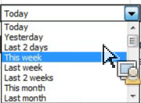
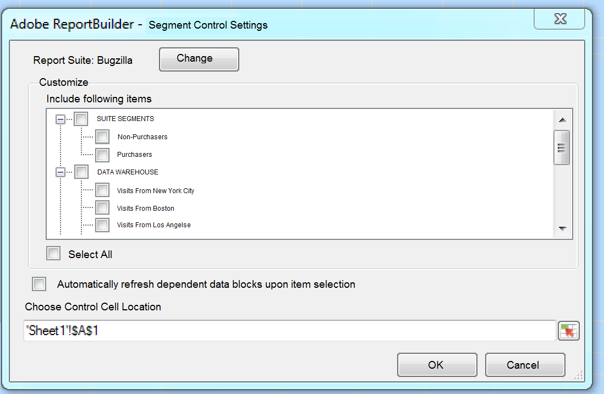

# Controles interativos

{{legacy-arb}}

Os Controles interativos permitem que você edite segmentos e intervalos de datas para uma ou mais solicitações diretamente da planilha. Isso proporciona mais flexibilidade ao atualizar solicitações do Report Builder.

Os controles interativos foram criados em resposta a um fluxo de trabalho comum, no qual os analistas criam pastas de trabalho e as compartilham com a organização de marketing. Os controles interativos oferecem aos profissionais de marketing a capacidade de modificar e atualizar solicitações sem precisar de um conhecimento profundo sobre como o Report Builder funciona. (Observe que para atualizar uma solicitação, o destinatário da pasta de trabalho deve ser um usuário do Report Builder.) Esses controles funcionam dentro de pastas de trabalho programadas. Dois tipos de controles interativos estão disponíveis atualmente:

* Intervalo de datas do acumulado
* Segmentos

>[!IMPORTANT]
>
>Você deve ter o Report Builder v5.0 instalado para que os controles interativos funcionem. >
>* Se você estiver executando o Microsoft Excel no Windows, mas uma versão anterior do Report Builder, ou se não tiver o Report Builder instalado: é possível alterar o valor no controle interativo, mas isso não atualizará a solicitação associada, nem atualizará os parâmetros associados da solicitação.
>* Se você estiver executando o Excel no Mac, a alteração do valor no controle resultará na seguinte mensagem: &quot;Não é possível encontrar a macro &quot;Adobe.ReportBuilder.Bridge.FormControlClick.Event&quot;&quot;.
>

>[!WARNING]
>
>Não altere o nome do controle. (Para visualizar o nome, definir o foco no controle e o nome do controle aparece depois do grid do Excel, no canto superior esquerdo).

## Implementar controle de intervalo de datas interativo {#section_39B228F2D2C44985863D31424C953280}

1. Na Etapa 1 da seleção do Assistente de solicitações, por exemplo, o relatório **[!UICONTROL Página]**.
1. Ao lado do menu suspenso **[!UICONTROL Datas utilizadas mais comuns]**, clique no ícone **[!UICONTROL Configurações de controle]**:

   

1. Na caixa de diálogo Configurações de controle, selecione todos os itens do intervalo de datas que você deseja exibir no controle interativo. Além disso, especifique o local da célula superior esquerda do controle.

   

1. Observe a opção de &quot;Atualizar automaticamente solicitações vinculadas após a seleção do item&quot;.

   * Se marcado, todas as solicitações que usam esse controle serão atualizadas.
   * Se não estiver marcada, os parâmetros de solicitação associados são atualizados, mas a solicitação não é atualizada.

1. Clique em **[!UICONTROL OK]**. O controle aparece no local da célula especificado:

1. Agora você pode alterar o intervalo de datas, e a solicitação será atualizada com esse intervalo de datas.

   

1. Você também pode copiar a solicitação e clicar com o botão direito do mouse para usar uma das duas opções Colar solicitação:

   * **[!UICONTROL Colar Solicitação]** > **[!UICONTROL Usar Célula De Entrada Absoluta]**. Isso significa que a solicitação copiada apontará para o mesmo controle de intervalo de datas interativo que a solicitação original.

   * **[!UICONTROL Colar solicitação]** > **[!UICONTROL Usar célula de entrada relativa]**. Isso significa que a solicitação copiada apontará para seu próprio controle.

     >[!NOTE]
     >
     >Você pode usar a função de controle Cortar/Copiar/Colar nativa do Microsoft Excel. O Report Builder reconhece automaticamente os controles recém adicionados.

## Implementar o controle interativo de segmentos {#section_5003D3F724644280BF1BCD6E1B0CB784}

A implementação do controle interativo de segmentos é semelhante à implementação do controle de intervalo de datas.

1. Na Etapa 1 do Assistente de solicitações, ao lado da lista suspensa **[!UICONTROL Segmento]**, selecione o ícone Configurações de controle de segmento:

   

1. Na caixa de diálogo Configurações de controle do segmento, selecione os segmentos que você deseja incluir no menu suspenso. Além disso, especifique o local da célula superior esquerda do controle.

   

1. O novo controle interativo aparecerá na pasta de trabalho:

   
