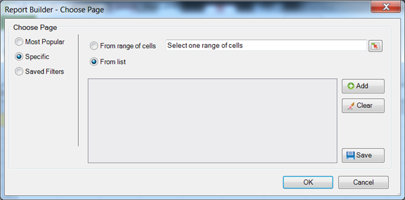

# Filtros específicos

{{legacy-arb}}

Filtros que aplicam termos de dimensões específicos.

Você pode pesquisar por itens de dimensão específicos criando um filtro que corresponda a critérios exatos. Por exemplo, você pode criar o seguinte tipo de filtro: página em [!DNL homepage.htm], [!DNL contact_us.html], [!DNL corporate_info.html].

**Para criar um filtro Específico**

1. Crie ou edite uma solicitação e então acesse o [!UICONTROL Assistente de solicitações: etapa 2].

   

1. No [!UICONTROL Assistente de solicitações: etapa 2], clique no link ao lado da dimensão na grade e, em seguida, escolha **[!UICONTROL Filtro]**.

1. Habilitar **[!UICONTROL Específico]**.

   

1. Ative uma das seguintes opções Específicas:

   * **De Intervalo de Células:** Permite selecionar dados de células. Você pode selecionar:
      * **Todas as células do intervalo:** Permite mapear cada célula para o intervalo. Texto descritivo explica quantos grupos de células precisam ser selecionados. Para mapear mais de um grupo de células, pressione a tecla ctrl enquanto faz as seleções sucessivas. Se o intervalo que deve ser mapeado contiver apenas uma célula, esta será a única opção disponível
      * **Primeira Célula do Intervalo:** Você só precisa selecionar a célula superior esquerda do intervalo e escolher uma direção para os dados. Além disso, se a solicitação tiver vários períodos, você escolhe a direção dos períodos e escolhe se deseja ignorar um número definido de células entre períodos.
   * **Da Lista:** Permite selecionar dados de uma lista à qual você pode adicionar dados.
1. Se você habilitar **[!UICONTROL A partir da lista]**, selecione quaisquer itens listados disponíveis ou clique em **[!UICONTROL Adicionar]**.

   Ao clicar em **[!UICONTROL Adicionar]**, o formulário [!UICONTROL Selecionar a partir da lista] exibe uma lista de itens de dimensão disponíveis para o intervalo de dados da solicitação atual, limitado aos primeiros 10.000 itens. Você pode pesquisar nesses itens ou clicar em **[!UICONTROL Mais...]** para exibir o [!UICONTROL Formulário Pesquisar], que permite criar uma pesquisa mais detalhada das dimensões.
1. Em [!UICONTROL Selecionar da lista], clique em **[!UICONTROL OK]**.
1. No formulário [!UICONTROL Escolher página], salve seu filtro Específico se desejar e, em seguida, clique em **[!UICONTROL OK]**.
