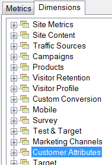

# Atributos do cliente

{{legacy-arb}}

Os atributos do cliente são armazenados em um novo tipo de elemento chamado VisAttr, que pode ser configurado como uma dimensão ou uma métrica.

Para obter informações detalhadas sobre como fazer upload dos atributos do cliente, consulte a [ajuda do CX Enterprise](https://experienceleague.adobe.com/docs/core-services/interface/customer-attributes/attributes.html?lang=pt-BR).

* Se for configurada como métrica, a VisAttr é exposta como métrica e &quot;dimensão&quot;.

   

* Comporta o mesmo detalhamento que uma eVar (qualquer item pode ser detalhado por qualquer coisa).
* A VisAttr é compatível com todas as métricas do eVar.
* A VisAttr como uma métrica suporta a &quot;compartimentalização&quot; (como Tempo no site: 0 a 30, 31 a 60…)
* A VisAttr está disponível como uma dimensão de segmentação.
