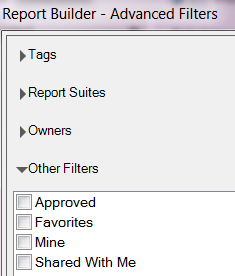

# Métricas calculadas

{{legacy-arb}}

O Report Builder 5.2 e superior oferece suporte às métricas calculadas do Adobe Analytics. Todas as métricas calculadas agora têm uma ID global: elas não estão mais restritas a um conjunto de relatórios.

>[!NOTE]
>
>As pastas de trabalho atuais talvez indiquem solicitações com as IDs da métrica herdada. Ao usar o Report Builder 5.2, essas IDs da métrica herdada serão convertidas para a nova ID global. Se você compartilhar essa pasta de trabalho com um usuário do Report Builder v5.1 ou anterior, ele não conseguirá visualizar as métricas calculadas.

Para saber mais sobre como criar e gerenciar métricas calculadas com o novo Construtor e Gerenciador de Métricas Calculadas, consulte o Guia de [Métricas Calculadas](/help/components/calculated-metrics/cm-overview.md).

Na Etapa 2 do Assistente de solicitações, você pode filtrar e aplicar métricas calculadas.

## Filtrar métricas calculadas {#section_376E986D3E684999A7CDB08E53854159}

**Filtre** métricas calculadas clicando no ícone Filtrar: 

A caixa de diálogo Filtros avançados é preenchida com métricas padrão e calculadas.

Os filtros disponíveis são:

| Nome do filtro | Descrição |
|---|---|
| Tags | Permite filtrar métricas calculadas com tags específicas. Observe que os filtros de tags usam o operador AND. Se você marcar duas marcas, o painel direito mostrará métricas que foram marcadas com **ambas** marcas. |
| Conjuntos de relatórios | Se você aplicar o filtro &quot;Somente o *nome do conjunto de relatórios*&quot; no Construtor de métricas calculadas em [!DNL Adobe Analytics] e, em seguida, exibir o filtro Avançado no [!DNL Report Builder], o filtro Avançado exibirá as métricas calculadas somente para o conjunto de relatórios selecionados. |
| Proprietários | Permite filtrar as métricas por proprietário. Observe que os filtros Proprietários usam o operador OR. Se você marcar dois proprietários, o painel direito mostrará as métricas pertencentes ao proprietário **qualquer**. |
| Outros filtros > Aprovado | Mostra todas as métricas aprovadas oficialmente. |
| Outros filtros > Favoritos | Mostra todas as métricas que você marcou como Favoritos. |
| Outros filtros > Meus | Mostra todas as métricas que você possui. |
| Outros filtros > Compartilhados comigo | Mostra todas as métricas que outras pessoas compartilharam com você. |

## Aplicar métricas calculadas {#section_DF5CF349460A45FDA4B6E6BB8B52F18E}

Após selecionar os filtros, clique em **[!UICONTROL Aplicar]** para aplicá-los à sua solicitação. As métricas selecionadas agora são adicionadas ao layout do relatório.

