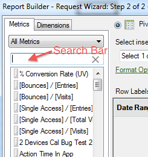

# Adicionar métricas e dimensões

{{legacy-arb}}

Etapas para adicionar métricas e dimensões a uma solicitação.

1. Use o formulário [!UICONTROL Assistente de Solicitações: Etapa 1] para [Criar a solicitação de dados](/help/analyze/legacy-report-builder/data-requests/data-requests.md) e clique em **[!UICONTROL Avançar]**.
1. No formulário [!UICONTROL Assistente de solicitações: etapa 2], clique duas vezes em métricas ou arraste-as para a posição desejada.

   

   Ao adicionar métricas, elas não são removidas da guia [!UICONTROL Métricas], pois você pode exibir métricas várias vezes em uma solicitação. Por exemplo, você pode exibir o subtotal da métrica além de cada valor. No entanto, a lista de métricas disponíveis muda sempre que você adiciona ou remove uma dimensão.

   É possível adicionar métricas somente à seção de layout [!UICONTROL Métricas]. As métricas foram adicionadas ao layout [!UICONTROL Rótulo da Coluna] como um [!UICONTROL Cabeçalho de Métrica]. Se você mover um [!UICONTROL Cabeçalho de Métrica] do [!UICONTROL Layout da Coluna] para o [!UICONTROL Layout da Linha], ele será exibido lá e usado como uma métrica de detalhamento.

   Observe que uma barra de Pesquisa é exibida na guia Métricas, logo acima da lista Métrica.

   

## Diretrizes

Considere as diretrizes a seguir ao adicionar métricas e dimensões.

* Quando você insere um termo de pesquisa, a lista é atualizada automaticamente para exibir métricas com rótulos que correspondem ao termo de pesquisa.
* A correspondência não diferencia maiúsculas de minúsculas e é equivalente a uma pesquisa *contém*.
* Pesquisas por palavras completas e outros sinalizadores de pesquisa especiais (começa com, termina com, E, OU etc.) não são compatíveis.

O termo de pesquisa será limpo se você sair do Assistente de solicitações quando clicar em [!UICONTROL Concluir] ou [!UICONTROL Cancelar], voltar para a Etapa 1 do Assistente de solicitações ou alterar a categoria Métrica.

O termo de pesquisa não é limpo:

* Ao arrastar e soltar (ou clicar duas vezes) um item de métrica da lista para que ele seja adicionado ao Painel Layout dinâmico/Métricas de layout personalizadas.
* Ao remover itens de métrica do Painel Layout dinâmico/Métrica de layout personalizado.
* Ao clicar na guia Dimension, retorne à guia Métrica.
* Ao chamar outros subformulários (modal ou não modal) que ao sair retornarão para a Etapa 2 do assistente de solicitações. Exemplos desses formulários são

   * Dimension Filter Forms
   * Forms de formatação de intervalo de datas
   * Formulário de Opções de Formato
   * Prefixar-Incluir Formulário de Texto
   * Formulário de localização do intervalo de saída

## Classificar uma solicitação por métrica

Opcionalmente, você pode classificar uma solicitação por métrica.

Para classificar uma solicitação por métrica

1. Clique no rótulo da métrica.
1. Adicionar dimensões. Adicione dimensões da mesma forma que adiciona métricas. Consulte as Etapas 1 e 2 acima.

   Na guia [!UICONTROL Dimensões], o sistema exibe dimensões que se quebram ou que sejam uma classificação de qualquer relatório básico selecionado no [!UICONTROL Assistente de solicitações: Etapa 1] e na configuração do conjunto de relatórios. Quando você solta uma dimensão nas grades do layout, ela é removida da exibição em árvore e recalcula a lista de dimensões disponíveis restantes.

   A dimensão [!UICONTROL Data] é adicionada automaticamente. As dimensões de data disponíveis mudam, dependendo da granularidade selecionada no [!UICONTROL Assistente de solicitações: etapa 1]. Os valores válidos são:

   * Hora
   * Dia
   * Semana
   * Mês
   * Ano
   * Intervalo de datas (quando nenhuma granularidade é especificada)

1. Modifique métricas e dimensões configurando opções e filtros de [formato](/help/analyze/legacy-report-builder/layout/t-format-display-headers.md).
1. Clique em **[!UICONTROL Concluir]**.
No exemplo a seguir, dimensões estão relacionadas à métrica [!UICONTROL Página]. A dimensão [!UICONTROL Domínio de Referência] cria um relatório de detalhamento entre [!UICONTROL Página] e [!UICONTROL Domínio de Referência]. A guia [!UICONTROL Dimension] é atualizada somente com dimensões que você pode adicionar a um relatório de detalhamento.

   
