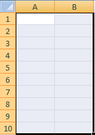

# Mapear métricas e dimensões para células

{{legacy-arb}}

Antes de começar a mapear itens para a planilha, certifique-se de que sua planilha não esteja protegida. Se o esquema de proteção da sua planilha impedir quaisquer ações do usuário, você não conseguirá selecionar células na planilha. Primeiro, desproteja a planilha e, em seguida, adicione o mapeamento de células.

O número de áreas e células a serem mapeadas difere de acordo com a métrica selecionada, a granularidade, o intervalo de datas e os filtros definidos. Por exemplo, se você selecionar [!UICONTROL Métrica do site] > [!UICONTROL Relatório de tráfego], definir a granularidade de [!UICONTROL Semana] e o intervalo de datas para [!UICONTROL Últimas 2 Semanas], será solicitado a mapear três células (ao usar o [!UICONTROL Layout Personalizado]) no [!UICONTROL Assistente de solicitações: Etapa 2]. A solicitação recupera dados para a semana um e dados para a semana dois, onde cada valor de ponto de dados é igual ao valor de uma exibição de página. A terceira célula serve como título de linha, que você pode configurar usando [!UICONTROL Opções de formato].

Se, por engano, você mapear locais incompatíveis na planilha, o Report Builder emitirá um erro.

Para obter mais informações, consulte as seguintes seções:

* [Selecionar um intervalo de células ](/help/analyze/legacy-report-builder/layout/map-metrics-and-dimensions-to-cells.md#section_1E37FB46DA194FB7A1050B8833A48AC6)
* [Técnicas para selecionar células ](/help/analyze/legacy-report-builder/layout/map-metrics-and-dimensions-to-cells.md#section_760421C3D7F84D67A639174710C93B22)
* [Problemas ao mapear](/help/analyze/legacy-report-builder/layout/map-metrics-and-dimensions-to-cells.md#section_CC1BCF841291447EB3A994EB08F3A099)

## Selecionar um intervalo de células {#section_1E37FB46DA194FB7A1050B8833A48AC6}

No [!UICONTROL Assistente de solicitações: etapa 2], quando você ativa o [!UICONTROL Layout personalizado] para uma solicitação com detecção de tendência, pode mapear a solicitação para um intervalo de células.

Clique no **[!UICONTROL Seletor de Intervalo]**  ao lado do item que você deseja mapear.

* **Todas as células em um intervalo:** Exige que você selecione um grupo de células para uma solicitação com estilo de [!UICONTROL Layout personalizado].
* **Primeira célula do intervalo:** Permite selecionar a célula de cima à esquerda do intervalo, e exibe a Orientação do [!UICONTROL Intervalo] para especificar a orientação horizontal ou vertical das células de entrada e saída (coluna ou linha). Use essa opção para que o Report Builder selecione as células para você.
* **Orientação do intervalo:** Permite orientar os intervalos de células como colunas ou linhas.
* **Selecionar o canto superior da célula do intervalo:** Exibe as referências da célula.

## Técnicas para selecionar células {#section_760421C3D7F84D67A639174710C93B22}

Você seleciona os dados clicando no ícone **[!UICONTROL Seleção de intervalo]**  

e arrastando com um clique sobre o intervalo de células desejado da planilha. Uma seleção contínua é contornada com uma borda preta.

As linhas selecionadas separadas têm uma borda branca fina ao redor de cada linha.

Para mapear linhas separadas em uma solicitação, use a tecla [!UICONTROL Ctrl] e, em seguida, clique e arraste o cursor sobre as células desejadas. Isto serviria se sua solicitação exigisse quatro áreas com dez células cada, em vez de uma área contínua com 40 células juntas.

Depois de selecionar as células, clique no **[!UICONTROL Seletor de intervalo]** novamente no formulário [!UICONTROL Seleção de intervalo] para voltar ao [!UICONTROL Assistente de solicitações: etapa 2].

## Solução de problemas de mapeamento{#section_CC1BCF841291447EB3A994EB08F3A099}

Se, por engano, você optar por mapear para uma célula que já tem um mapeamento ativo, nenhuma referência de célula será exibida na caixa de texto ao lado do ícone do seletor de intervalo. Ao clicar em [!UICONTROL OK], o Report Builder exibe o erro, *O intervalo selecionado faz interseção com o intervalo de outra solicitação. Altere sua seleção.*

* Se você ainda precisar usar a célula, clique com o botão direito do mouse nas células desejadas e selecione **[!UICONTROL Excluir solicitação]**.

Se quiser evitar essa mensagem, você pode adotar duas abordagens:

* Planeje o formato do relatório adicionando formatação às células que têm solicitações e mapeamentos
* Teste as áreas da planilha que contêm mapeamentos

Para testar as áreas com solicitações incorporadas, você pode:

* Iniciar o [!UICONTROL Gerenciador de solicitações] e clicar em solicitações individuais listadas na tabela. Ao clicar na solicitação, você realça as células da planilha onde a solicitação está mapeada.
* Selecione células na planilha que você deseja usar para um novo mapeamento e clicar em [!UICONTROL Da planilha]. O [!UICONTROL Gerenciador de solicitações] seleciona a solicitação na lista que tem um item de saída que faz interseção com a célula selecionada. Se nenhuma solicitação for selecionada, a célula estará disponível.
* Selecione células na planilha, clique com o botão direito do mouse no menu de contexto e verifique se [!UICONTROL Editar solicitação] está disponível. Se estiver, há uma solicitação associada a essas células.
