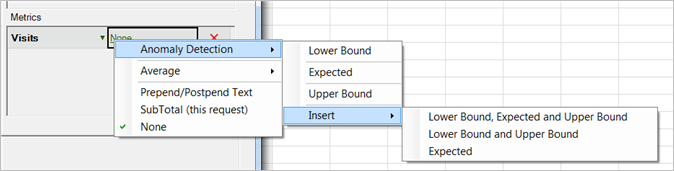

# Configurar uma solicitação de detecção de anomalias

{{legacy-arb}}

Para criar uma solicitação de detecção de anomalias no Report Builder:

1. Selecione um relatório de tendências, como um **[!UICONTROL relatório de Métricas do site]** > **[!UICONTROL Relatório de]** tráfego.
1. No menu [!UICONTROL Aplicar granularidade], selecione **[!UICONTROL Dia]**.

   >[!NOTE]
   >
   >O menu [!UICONTROL Detecção de anomalias] estará disponível somente após a seleção da granularidade do dia. Os 30 dias anteriores de dados são utilizados como dados estatísticos durante o período de treinamento, qualquer que seja o intervalo de datas selecionado.

1. Após configurar os intervalos de datas, clique em **[!UICONTROL Próximo]**.

   Adicione uma métrica à etapa 2 de 2 do assistente de solicitações, como **[!UICONTROL Visitas]**.

   Para a métrica adicionada, clique no link **[!UICONTROL Nenhum]**.

   

1. Selecione **[!UICONTROL Detecção de anomalias]** > **[!UICONTROL `<selection>`]**.

   

   Ao selecionar uma destas opções, o sistema cria cópias da detecção de anomalias da métrica original. Por exemplo, para a métrica Visitas, uma métrica de Visitas de limite inferior é adicionada ao grupo [!UICONTROL Métrica].
1. Clique em **[!UICONTROL Concluir]** e selecione a célula para saída em Excel.

   Consulte [Detecção de anomalias](/help/analyze/analysis-workspace/c-anomaly-detection/anomaly-detection.md) para definições.
