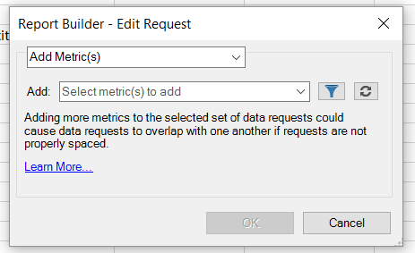

# Editar métricas em várias solicitações

{{legacy-arb}}

Adicionar, remover ou substituir métricas em uma solicitação pré-existente ou em um grupo de solicitações.

## Adicionar métricas {#section_3FBDA9668039404895059618D70FCBCD}

Ao adicionar métricas, considere as seguintes diretrizes:

* Métricas podem ser adicionadas somente a solicitações de Layout dinâmico.
Se algumas das solicitações selecionadas forem Layouts personalizados, as métricas não poderão ser adicionadas. Se o layout for personalizado, o Report Builder não saberá onde colocar a nova métrica na planilha.
* Se você selecionar somente solicitações de Layout personalizado, a opção **[!UICONTROL Adicionar métricas]** não estará disponível.
* A adição de métricas aumenta o tamanho de uma solicitação e pode fazer com que seja sobreposta a outra solicitação. Verifique se a solicitação tem espaço suficiente para a adição de métricas.
* Se a métrica adicionada já estiver presente em uma das solicitações selecionadas, ela não será adicionada a essa solicitação.

Para adicionar uma ou mais métricas

1. Selecione uma ou mais solicitações no Excel e clique com o botão direito do mouse para selecionar **[!UICONTROL Editar métricas]**. (Ou clique em **[!UICONTROL Gerenciar]** > **[!UICONTROL Editar várias]** > `<choose metric>` > **[!UICONTROL Editar grupo]** para selecionar o grupo de solicitações a serem modificadas.)
1. Selecione **[!UICONTROL Adicionar métricas]** e selecione as métricas a serem adicionadas.

   

1. Atualize a solicitação para ver os dados reais. Os dados offline serão exibidos até você atualizar os dados.

## Substituir métricas

Ao substituir métricas, considere as seguintes diretrizes:

* Somente 1:1 substituições são permitidas. 1:many ou muitos:1 não são permitidos.
* Se a métrica selecionada não estiver presente em uma das solicitações selecionadas, a solicitação será deixada inalterada.
* A nova métrica é colocada no mesmo local que a métrica substituída.

   * **Em um Layout Dinâmico**, se uma solicitação de layout dinâmico gerar datas, visitas, visitantes, dados exclusivos diários e *visitantes* for substituída por *receitas*, o layout atualizado da solicitação será: data, visita, receita e dados exclusivos diários.
   * **Em um Layout Personalizado**, se a métrica *visitantes* foi gerada na célula F11, o layout de solicitação atualizado mostrará *receita* na mesma célula F11.

* Se a métrica substituída tiver alguma operação aplicada a ela (média, texto pré-pendente, texto pós-pendente, micrográfico), essas operações também serão aplicadas à nova métrica.

Para substituir uma métrica

1. Selecione uma ou mais solicitações no Excel e clique com o botão direito do mouse para selecionar **[!UICONTROL Editar métricas]**. Como alternativa, você pode clicar em **[!UICONTROL Gerenciar]** > **[!UICONTROL Editar Várias]** > **`<choose metric>`** > **[!UICONTROL Editar Grupo]** para selecionar o grupo de solicitações a serem modificadas.

1. Selecione **[!UICONTROL Substituir métrica]**.

   

1. Selecione a métrica que deseja substituir e a métrica de substituição.
1. Atualize a solicitação. Os dados offline serão exibidos até você atualizar os dados.

## Remover métricas {#section_D3CD5BAC7670416593B633B2B8423C60}

Ao remover métricas, considere as seguintes diretrizes:

* Se alguma das métricas selecionadas para remoção não estiver presente em uma das solicitações selecionadas, a solicitação será deixada inalterada.
* Em um layout de tabela dinâmica, a remoção de uma métrica faz com que o layout mude para métricas localizadas após a métrica removida. Por exemplo, se uma solicitação de layout de tabela dinâmica gerar data, visitas, visitantes e informações exclusivas diárias, e você remover *visitas*, o layout atualizado da solicitação mostrará: data, visitantes e informações exclusivas diárias.

Para remover métricas

1. Selecione uma ou mais solicitações no Excel e clique com o botão direito do mouse para selecionar **[!UICONTROL Editar métricas]**. Como alternativa, clique em **[!UICONTROL Gerenciar]** > **[!UICONTROL Editar Vários]** > **`<choose metric>`** > **[!UICONTROL Editar Grupo]** para selecionar o grupo de solicitações a serem modificadas.

1. Selecione **[!UICONTROL Remover métrica(s)]**.

   

1. Selecione uma ou mais métricas para remover da solicitação.
1. Atualize a solicitação. Até a atualização, você verá dados offline.
