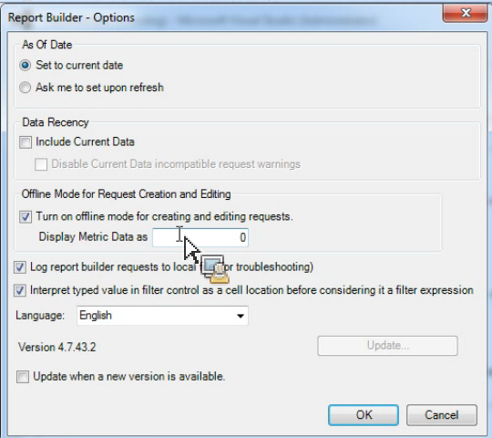

# Modo offline para criação e edição de solicitações

{{legacy-arb}}

O modo offline retorna dados de espaço reservado para acelerar o processo de criação e edição de solicitações.

Ao criar ou editar uma nova solicitação, são feitas chamadas da API de relatório para recuperar a resposta. Às vezes, essas chamadas retardam o processo de criação de solicitações, pois é necessário aguardar o retorno dos dados antes de seguir para a próxima etapa. O modo offline retorna somente dados de espaço reservado e a API não é criada.

Para ativar o modo offline

1. Clique em **[!UICONTROL Opções]** no menu do Report Builder.

   

1. Marque a caixa de seleção ao lado de **[!UICONTROL Ativar modo offline para criar e editar solicitações]**.
1. No campo **[!UICONTROL Exibir Dados de Métrica como]**, insira os dados de espaço reservado que você deseja retornar na solicitação. Por exemplo, digite &quot;1&quot;.
1. Clique em **[!UICONTROL OK]**.
1. Crie e execute sua solicitação no modo off-line usando o Assistente de solicitação. A captura de tela a seguir mostra um exemplo de uma solicitação com &quot;1&quot; como os dados de espaço reservado.

   

   >[!IMPORTANT]
   >
   >Certifique-se de desativar o Modo offline antes de executar suas solicitações com dados reais.
