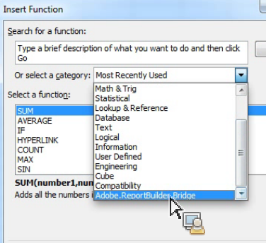
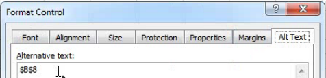

# Usar funções Report Builder com o Microsoft Excel

Você pode usar funções Report Builder para acessar a funcionalidade sem acessar a interface do usuário Report Builder.

Por exemplo, para atualizar automaticamente solicitações de Report Builder com filtros de entrada baseados em dados extraídos de outras fontes para o Excel, use a sequência RefreshRequestsInCellsRange(..) . Todas as chamadas são assíncronas, retornam imediatamente e não aguardam a execução completa.

**Requisitos**

* É necessário o Report Builder 5.0 (ou posterior).

A tabela a seguir lista as funções expostas.

| Nome da função | Tipo | Descrição |
|:---| --- | ---|
| AsyncRefreshAll() | string | Atualiza todas as solicitações do Report Builder presentes em uma pasta de trabalho. |
| AsyncRefreshRange(string rangeAddressInA1Format) | string | Atualiza todas as solicitações do Report Builder presentes no endereço do intervalo de células especificado (uma expressão da sequência de caracteres que representa um intervalo de células no formato A1, por exemplo &quot;Sheet1!A2:A10&quot;). |
| AsyncRefreshRangeAltTextParam() | string | Atualiza todas as solicitações do Report Builder presentes no intervalo de células especificado que é passado para Texto alternativo do Controle de formulários da Ms. |
| AsyncRefreshActiveWorksheet() | string | Atualiza todas as solicitações do Report Builder presentes na planilha ativa. |
| AsyncRefreshWorksheet(string worksheetName) | string | Atualiza todas as solicitações do Report Builder presentes na planilha especificada (o nome da planilha como aparece na guia). |
| AsyncRefreshWorksheetAltTextParam(); | string | Atualiza todas as solicitações do Report Builder presentes no nome da planilha específica que foi passada para Texto alternativo do Controle de formulários da Ms |
| string GetLastRunStatus() | string | Retorna uma sequência de caracteres que descreve o status da última execução. |

Para acessar as funções Report Builder, vá para **[!UICONTROL Fórmulas]** > **[!UICONTROL Inserir função]**. Use o campo de pesquisa para procurar uma função ou selecione uma categoria para listar as funções nessa categoria.



## Exemplo {#section_034311081C8D4D7AA9275C1435A087CD}

O exemplo a seguir mostra *Se o valor na célula P5 for texto ou estiver em branco, atualize o intervalo na célula P9*.

```
=IF(OR(ISTEXT(P5),ISBLANK(P5)),AsyncRefreshRange("P9"),"")
```

## Usar funções Report Builder com controle de formato {#section_26123090B5BD49748C8D8ED7A1C5ED84}

Você pode atribuir uma macro a um controle criado e esse controle pode ser uma função que atualiza uma solicitação da pasta de trabalho. Por exemplo, a função AsyncRefreshActiveWorksheet atualizará todas as solicitações em uma pasta de trabalho. No entanto, às vezes, convém atualizar apenas determinadas solicitações.

1. Definir o parâmetro da macro.
1. Clique com o botão direito no controle e selecione **[!UICONTROL Atribuir macro]**.
1. Insira o nome da função Report Builder (sem parâmetros ou parênteses).


## Passar parâmetros para funções Report Builder usando controle de formato {#section_ECCA1F4990D244619DFD79138064CEF0}

Duas funções que usam um parâmetro podem ser usadas com o Controle de formato. Você deve usar o campo **Texto alternativo:**:

* AsyncRefreshRange(string rangeAddressInA1Format)
* AsyncRefreshWorksheet(string worksheetName)

Para passar parâmetros para funções Report Builder usando controle de formato

1. Clique com o botão direito no controle e selecione **[!UICONTROL Controle de formato]**.

   

1. Clique na guia **[!UICONTROL Texto alternativo]**.

   

1. Em **[!UICONTROL Texto alternativo]**, insira o intervalo de células que você deseja atualizar.
1. Abra a lista de parâmetros Report Builder em **[!UICONTROL Fórmulas]** > **[!UICONTROL Inserir Função]**> **[!UICONTROL Adobe.ReportBuilder.Bridge]**.

1. Selecione uma das duas funções que terminam com AltTextParam e clique em **[!UICONTROL OK]**.
