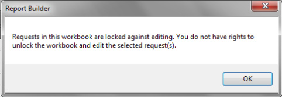

# Bloquear e desbloquear pastas de trabalho

{{legacy-arb}}

Você pode proteger todas as solicitações em uma pasta de trabalho em comparação a adicionar e editar solicitações ao bloquear a pasta de trabalho. Isso permite editar pastas de trabalho offline, pausando todas as solicitações de relatório para obter uma edição mais eficiente.

Como um analista, o bloqueio de uma pasta de trabalho permite que você proteja suas solicitações de pasta de trabalho contra adulterações por outros usuários na organização. Ao mesmo tempo, esses usuários ainda podem atualizar as solicitações na pasta de trabalho.

Para proteger uma pasta de trabalho contra edição, clique em **[!UICONTROL Bloqueado]** na barra de ferramentas do Report Builder ( ).

Para desbloquear uma pasta de trabalho, clique em **[!UICONTROL Desbloqueado]** ( ).

É possível desbloquear uma pasta de trabalho bloqueada se você tiver uma das seguintes permissões:

* Você é um administrador ou
* Você é a pessoa que inicialmente bloqueou a pasta de trabalho. Nesse caso, não é necessário ser um administrador.

>[!NOTE]
>
>Não é possível adicionar uma solicitação a uma pasta de trabalho protegida, a menos que você tenha permissões para desbloquear a pasta de trabalho.

Quando uma pasta de trabalho é bloqueada contra edição de solicitação,

* Os usuários não podem criar e adicionar solicitações.
* Os usuários não podem editar solicitações por meio do Assistente de solicitações.
* Os usuários não podem editar solicitações por meio dos recursos Editar várias solicitações.
* Os usuários não podem cortar, copiar ou colar solicitações. No entanto, os usuários ainda podem usar o menu de contexto nativo do Excel Recortar/Copiar/Colar para recortar/copiar/colar o conteúdo da(s) solicitação(ões).
* Os usuários podem atualizar solicitações individualmente ou como parte de um grupo.
* Se a solicitação usar valores de entrada de células (intervalo de datas, segmento, filtros), os usuários poderão alterar esses valores nas células e, portanto, editar indiretamente as solicitações, atualizando-as.

Se você tentar editar uma pasta de trabalho protegida por meio do menu de contexto, ou **[!UICONTROL Gerenciador de Solicitações]**, ou **[!UICONTROL Editar Várias Solicitações]**, poderá ou não ter permissão para fazer isso:

* Se você não tiver permissões para desbloquear uma solicitação, verá uma mensagem indicando que não tem os direitos para desbloquear e editar a pasta de trabalho.

  

## Fluxo de trabalho {#section_260D05FF632B41DB97DB43E2ADBE2E75}

Considere que a pasta de trabalho A tem uma solicitação que está em um estado bloqueado e foi criada pelo usuário A.

**Exemplo 1: usuário administrador (ou Usuário A)**

1. O usuário entra no Report Builder e abre uma pasta de trabalho.
1. A pasta de trabalho A está bloqueada no momento, portanto, o botão &quot;Criar solicitação&quot; está desativado na barra de ferramentas, juntamente com o resto dos botões cuja funcionalidade está desativada por bloqueio.
1. Se o usuário tentar usar um dos botões desativados, será exibida uma mensagem informando que a pasta de trabalho está bloqueada no momento.
1. O usuário pode desbloquear a pasta de trabalho, o que permite a funcionalidade de edição completa.
1. Após o desbloqueio, a pasta de trabalho permanece desbloqueada até ser explicitamente rebloqueada.

**Exemplo 2: usuário não administrador (Usuário B)**

1. O usuário entra no Report Builder e abre uma pasta de trabalho.
1. O usuário não pode adicionar/editar a solicitação.
1. O usuário não pode desbloquear a pasta de trabalho.
